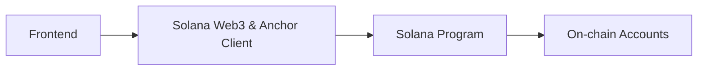

# Solana:

Solana framework: This meas a collection of tools and architectures used to build applications on the Solana
blockchain. 

How Solana works to how developers build on it.

## Solana: 

### 1. What is Solana?

Solana is a high-performance blockchain platform that focuses on scalability and speed. 
It’s designed to support decentralized applications (dApps) and cryptocurrency transactions in a way that 
is faster and cheaper than some other blockchains like Ethereum.

High performance blockchain designed to be:
- Very fast ( thousands of transactions per second )
- Low Cost 
- Scalable for real-world applications ( DeFi, NFTs, games )
- Proof of History ( PoH ): Key feature of solana is PoH which is a way to sequence transactions
  efficiently. This allows Solana to process transactions faster then blockchain that rely on traditional
  proof of Work or Proof os Stake. 

### 2. Core Idea behind Solana ( how it works )

#### a. Proof of History (PoH)

This is Solana's key innovation:
- **PoH** is a cryptographic clock.
- It timestamps transactions before consensus.
- This lets validators agree on order without waiting.

=> This results in much faster processing.

#### b. Proof of Stake (PoS)

- Validators stake SOL Tokens.
- They Validate blocks and earn rewards.
- Works together with PoH for security + speed.

#### c. Parallel execution ( Sealevel )

Most blockchains run smart contracts one at a time.
Solana runs many at the same time. 

- Use **sealevel runtime** 
- Transactions declare which accounts they use. 
- Non-Conflicting transactions run in parallel. 

=> Result: High throughput.

### 3. Solana Prgoramming model ( ** very Important ** )

#### a. Programs ( Smart Contracts )
- Called programs in Solana 
- Usually written in Rust 
- Deployed once and then reused by many users. 

=> Programs are stateless
They don't store data themselves. 

#### b. Accounts ( State & Data )

All data lives in Accounts:

- Wallets
- Program Data 
- Token balance 

Each account:
- Has an owner ( program )
- Holds data + SOL 
- Must pay rent ( or be rent-exempt )

### 4. Solana Framework & Tools ( What developer use )

#### a. Anchor Framework ( most popular )
Anchor is like Solana's main development framework. 

It provides:
    - Easier Smart Contract writing 
    - Automatic account validation 
    - IDL ( Interface Definition Language )
    - Better security 

An Anchor can be thought as :
    => Solana's version of Hardhat + Solidity tools 

#### b. Solana CLI:

Command line tool:
- Create Wallets 
- Deploy programs 
- Interact with the blockchain 

#### c. Web3.js / Solana SDKs 

Used for frontend apps:
- JavaScript/TypeScript 
- Connect Wallets ( Phantom, Solflare )
- Call Solana Programs

### 5. Typical Solana Application architecture:

### 6. What is Solana used for? 

- DeFi ( DEXs like Serum )
- NFTs 
- Blockchain games 
- Web3 Apps 
- High-speed payment systems

### 7. What Solana is different

- Very fast.
- Very Cheep transactions.
- Parallel execution 
More Complex programming model  ( Not Good )
Network outages ( historically )  ( Not Good )

## Rust: and Solana

Rust is used to write **smart contracts** ( called programs in Solana ) that runs on the Solana blockchain. 
Solana developers specifically choosed Rust for:
- Performance 
- Safety 
- Efficiency 

### Smart Contracts: 
- Self executing contracts where the terms are written directly into code.  In Solana, Smart contracts are
  written directly in Rust. Allowing them to run very quickly and securely. 

- Rust makes it easier for developers to create decentralized apps ( `dApps` ) that are optimized for
  Solana's high speed network. 

=> Solana is a blockchain that uses Rust to enable fast transactions and decentralized applications. 

