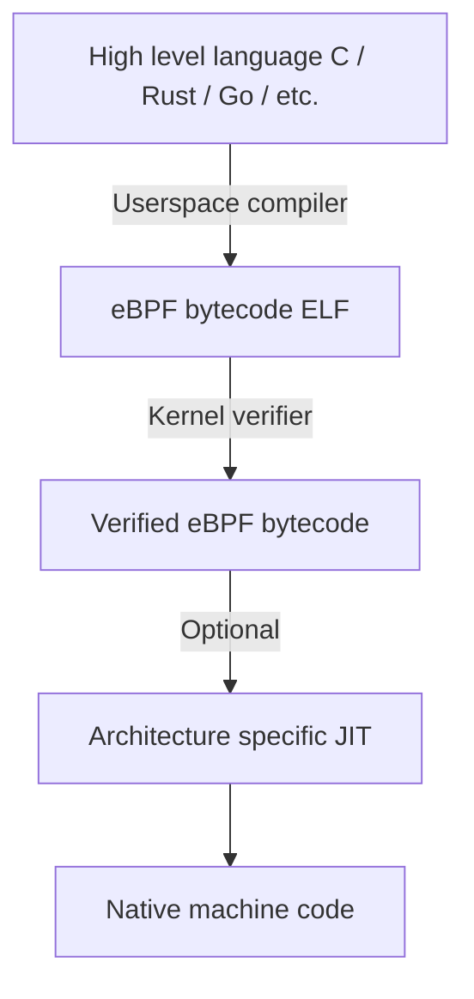
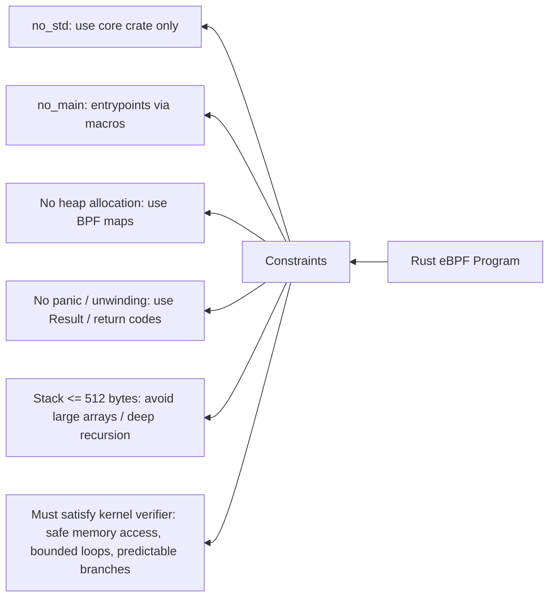
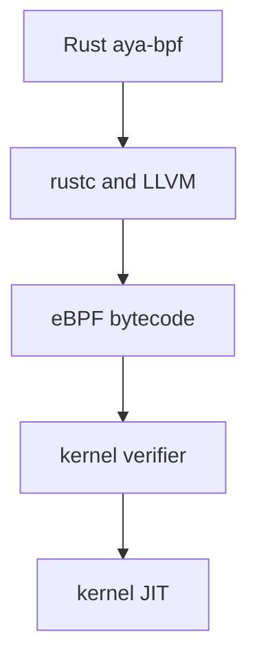
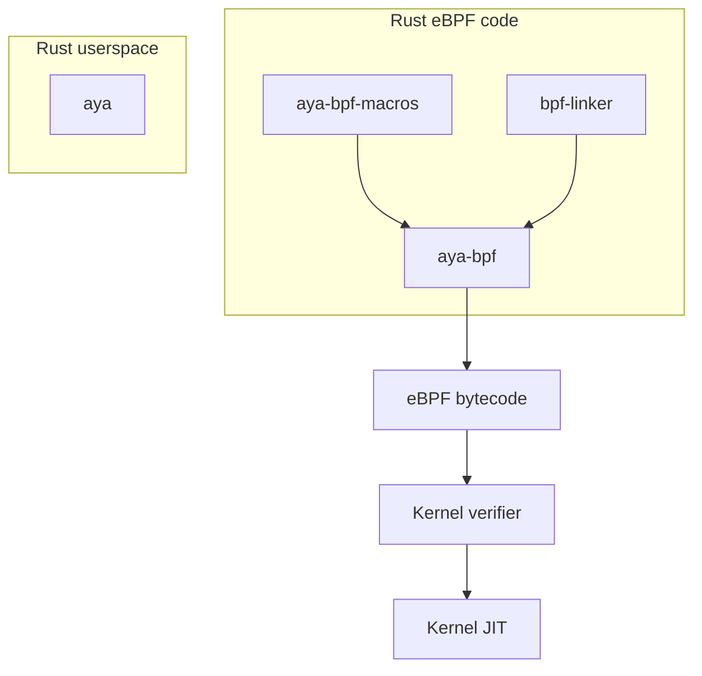

# eBPF programming with Rust:



Rust supports cross compilation to eBPF bytecode via LLVM ( similar to C/clang )
Typical target arch:
-   bpfel-unknown-none
-   bpfeb-unknown-none

The resulting output is an **ELFi** file containing **eBPF bytecode** which the kernel can **load**,
**verify**, and **JIT**. 

Like in with other approached using BCC, bpftrace, libbpf the eBPF programs in Rust are restricted in 
features in order to run in kernel space. 

## How Rust eBPF works ( applying the key constrains as with C eBPF ):

Rust based eBPF Program and constrains that apply:


- **`#![no_std]`** : kernel program do not have access to standard "std" crate or library. 

- **`#![no_main]`**: `eBPF` programs do not have `main()` function as kernel calls a specific entry 
  function for each program type. In **aya** these entry points are declared using procedural macro 
  **attributes** such as **`#[tracepoint]`**,**`#[kprobe]`** ) 

  ---
  Note: Procedural macro attributes are responsible for compile time code generation and in Aya they are 
  responsible for:
    - generate ELF section 
    - define ABI entry points 
    - Wire kernel context types. 
  ---

- **No heap allocation** : can not allocate `Vec`, `Box` types which allocate mem dynamically. ( must use
  stack/maps for persistent storage (BPF maps) 

- **No Panic**: We must define a `panic_handelr` since rust runtime is absent.

- **No unwinding** : Always handle erros with `Result` or return codes. Since unwinding is forbidden in 
  kernel verifier.

- **Strict stack limit** (512 bytes: eBPF verifier enforces a fixed stack usage of 512 bytes. Prevent large
  local array allocation and deeply nested function calls. ( always prefer maps for storing large data )

- must satisfy kernel verifier:
    * all memory access are safe.
    * No invalid pts dereferences 
    * Loops are bounded ( or eliminated  )
    * all branches are predictable 

- **No heap/safe memory access**: eBPF programs cannot allocate dynamically and must satisfy the kernel
  verifier. Any call to kernel helpers or raw memory access must be enclosed in `unsafe {}` blocks.
  Since these operations are not checked by the Rust compiler for memory safety. Without the `unsafe` Rust
  will reject the call. 
  => The verifier ensures safety at runtime, but rust still enforces compile-time correctness. 
  ```rust 
  unsafe {
    let value = bpf_map_lookup_elem(&test_map, &key);
  }
  ```




### Rust crate ecosystem to support the requirements:

1. redbpf: (older and less active ) collection of tools and libraries to build eBPF programs using Rust.

    - *redbpf*: user-space crate used to load eBPF programs or access eBPF maps. 
    - *redbpf-probes*: Rust API to write eBPF programs that can be loaded into kernel.
    - *redbpf-macros*: companion crates to *redbpf-probes* which provided convenient procedural macros
      useful to write eBPF programs for example:
      * #[maps] to define map, 
      * #[kprobe] for defining BPF programs that can be attached to kernel functions. 
    - *cargo-bpf*: a cargo subcommand for creating, building and debugging eBPF programs.

    Offers: 

    - BPF maps ( hash, perf, Tc, Stack, ProgramArray, SockMap, StreamParser, ...)

    - BPF program types (KProbe, KRetProbe, UProbe, URetProbe, SocketFilter, XDP, StreamParser,
      TaskIter,...) 

- Requirements: 
    - Older LLVM 13 or 11
    - Kernel Headers or `vmlinux`, ( use **KERNEL_SOURCE** variable) 

2. Aya: ( popular )

    - Pure Rust ( no *libbpf* nor *bcc* dependencies ) Build from the groundup in Rust, the only uses
      *libc* crate to execute syscalls. 
    - 100% CO-RE support : Full BTF support ( when linked with *musl* it give a true CO-RE with single
      contained executable that can run on many linux distributions and kernel versions ) 
    - Support the **BPF Type Format** (BTF) : Its transparently enabled when supported by the target
      kernel. ( this helps in compile once and preventing recompilation on different kernel versions).
    - Support for function call relocation and global data maps which allows eBPF programs to make
      **function calls** and use the **global variables and initializers**.
    - **Async support**: use of *tokyo* and *async-std*. 
    - Actively maintained 



3. libbpf based crates: Rust bindings for libbpf, 

    - libbpf-rs: Rust wrapper around libbpf, typically to write loaders in Rust.
    - libbpf-cargo: Help build/develop BPF programs with standard rust tooling. 
    - xsk-rs: Rust interface for linux AF_XDP socket using libxdp 
    - afxdp-rs: Rust interface for AF_XDP which wraps libbpf and libbpf-sys crates 


NOTE: Unlike GO, Rust can compile eBPF programs directly yo eBPF bytecode. 
Where as Go mostly provides wrappers/loaders not kernel-side eBPF programs. 
Go wrappers also help intact with maps, perf buffers, ring buffers and manage lifecycle of eBPF programs.
( `cilium/ebpf` and `libbpfgo`.
Go's compiler does not target eBPF, and its runtime is incompatible with eBPF, even the stripped-down Go
requires:
- stack growth
- runtime helpers
- garbage collection 
- function calls not verifier safe 
- Even trivial Go code explodes into too many instructions and branches/control flows which the kernel
  verifier rejects it.

All this are forbidden in eBPF. 

This puts Rust as first-class `eBPF` language like `C`.

## Aya crate ecosystem:

Provides all the core components required to write:
- `eBPF` programs in Rust 
- A fully Rust based userspace loader/controller.

With few external tools like `bpf-linker` and `cargo xtask` to complete a workflow. 

That is Aya provides a complete end-to-end workflow:

- Kernel side:
    * `aya-ebpf`
    * `aya-ebpf-macros` : boilerplate 

Capabilities: 
    - Rust => LLVM => eBPF bytecode 
    - Map definitions 
    - Program types ( kprobe, tracepoint XDP ...)
    - CO-RE support 
    - Verifier-safe abstractions 
    - No `C` of `libbpf` required 

- User-space: 
    * `aya`: 
    * `aya-log` (optional) 

Capabilities: 
    - Load `eBPF ELF` objects
    - Attach programs
    - Manage maps 
    - Handle perf/ring buffers 
    - No `libbpf` dependency 
    - Pure rust userspace 
    - `async` and thread support. 

Tooling: Non runtime dependencies.
    * `bpf-linker` : required for only compiling Rust eBPF programs. 
        Custom linker for `eBPF` targets 
        requires as `ld.lld` is insufficient for BPF. 
        Handles BPF relocoations correctly. 

    * `cargo xtask` ( not a dependency ) used only for orchestrate: 
        - cross-compilation 
        - BTF generation 
        - build pipelines 
        - embedding artifacts 


## Aya Overview: 


Aya provides an end-to-end, pure-Rust solution for writing, loading, and running eBPF programs.
Other components like `aya-tool`, `aya-log-ebpf`, `bpf-linker`, `cargo xtask` are optional
or situational, not fundamental gaps. 

### Core Aya crates (the “must-have” set)

#### 1. `aya-ebpf`

**Kernel-side eBPF programs**

* Rust → LLVM → eBPF bytecode
* Program types (`kprobe`, `tracepoint`, `XDP`, `TC`, `LSM`, etc.)
* Maps, helpers, CO-RE support
* `no_std`, verifier-safe abstractions

This crate is required (mandatory)

#### 2. `aya-ebpf-macros`

**Procedural macros**

* `#[tracepoint]`, `#[kprobe]`, `#[xdp]`, etc.
* Generates:

  * ELF sections
  * ABI entrypoints
  * Context wiring

This crate is required (mandatory)

#### 3. `aya`

**User-space loader & runtime**

* Loads eBPF programs
* Attaches them
* Manages maps
* Handles perf / ring buffers
* Pure Rust (no libbpf)

This crate is required (mandatory)


### Build-time tooling (common but not “Aya itself”)

#### `bpf-linker`

* Custom linker for eBPF targets
* Required because standard `ld.lld` is insufficient
* Used only at **build time**

This tool is required (mandatory)

#### `cargo xtask`

* Build orchestration pattern
* Commonly used to:

  * build eBPF + userspace together
  * generate BTF
  * embed artifacts

### Optional Aya ecosystem tools

#### `aya-tool` (singular, not “aya-tools”)

* CLI utility
* Inspect maps and programs
* Debugging and introspection
* Similar role to `bpftool`, but Rust-native


#### `aya-log` / `aya-log-ebpf`

* Logging from eBPF → userspace
* Safer alternative to `bpf_trace_printk`
* Structured logging support

These crates are optional but recommended for debugging 

All of the above do not require `libbpf`, `clang / C` toolchain, `bpftool`, `Go/Python` loaders.

### Environment prerequisites (outside Aya)

Rust nightly toolchain required. 
Kernel with 
  * eBPF enabled
  * BTF available (for CO-RE)

* LLVM version compatible with your Rust toolchain
* `rustup` target:

```text  
$ rustup show
installed toolchains
--------------------
stable-x86_64-unknown-linux-gnu (active, default)
nightly-x86_64-unknown-linux-gnu

active toolchain
----------------
name: stable-x86_64-unknown-linux-gnu
active because: it's the default toolchain
installed targets:
  aarch64-unknown-linux-musl
  x86_64-unknown-linux-gnu
```

### Complete ecosystem map 



---
Optional tools:

* aya-log
* aya-tool
* cargo xtask


---

TODO:

What you’re missing is *not basics*, but **structure, flow, and depth in the right places**.

Below is a **focused roadmap of missing topics**, organized so you can expand **without getting distracted**. Think of this as a **table of contents + writing guide** tailored specifically to:

> **eBPF with Rust + Aya (kernel + userspace)**

I’ll do three things:

1. ✅ Acknowledge what you already cover well
2. 🧭 Identify *what’s missing* (grouped logically)
3. 🗺️ Propose a **roadmap you can follow linearly**

---

# 1️⃣ What You Already Cover Well (No Changes Needed)

You already do an excellent job on:

✔ eBPF compilation pipeline
✔ Rust → LLVM → eBPF constraints
✔ Verifier rules and limitations
✔ Comparison of Rust vs Go vs C
✔ Aya vs redbpf vs libbpf
✔ Aya crate ecosystem & tooling
✔ Kernel vs user space separation

These sections are **solid and technically correct**. Don’t rewrite them — just *anchor future sections to them*.

---

# 2️⃣ What’s Missing (High-Level View)

Your document currently answers:

> **“What is eBPF + Aya?”**

But it does **not yet answer**:

> ❌ *How do I actually design, write, load, debug, and evolve real eBPF programs using Aya?*

The missing topics fall into **6 major gaps**:

| Gap | Description                            |
| --- | -------------------------------------- |
| A   | Execution & lifecycle model            |
| B   | Program types & attach points          |
| C   | Maps & data exchange (deep dive)       |
| D   | Userspace runtime patterns             |
| E   | Debugging, testing, troubleshooting    |
| F   | Real-world architecture & case studies |

---

# 3️⃣ Detailed Roadmap of Missing Topics

## 🧭 A. Execution Model & Lifecycle (**Foundational Gap**)

You explain *what exists*, but not **how things flow at runtime**.

### Missing topics

Add a section like:

### **eBPF Program Lifecycle (Aya)**

Cover:

1. Compilation
2. Loading ELF
3. Verifier pass/fail
4. Map creation
5. Program attachment
6. Event-triggered execution
7. Cleanup / detach

Include:

* Difference between **load vs attach**
* When maps are created
* What lives longer: program vs process
* What happens on process crash

👉 This grounds everything else.

---

## 🧭 B. Program Types & Attach Points (**Core Content Missing**)

You *name* program types, but don’t explain them.

### Missing sections (one per type, even briefly):

* **kprobe / kretprobe**
* **tracepoint**
* **uprobes**
* **XDP**
* **TC**
* **LSM** (important for security audience)

For each:

* When it runs
* Context struct
* Typical use cases
* Aya macro used
* Common pitfalls

This turns your doc from *reference* → *learning guide*.

---

## 🧭 C. Maps & User ↔ Kernel Communication (**Biggest Gap**)

Maps are mentioned, but **not explained deeply enough**.

### Missing subsections

Add a dedicated chapter:

### **BPF Maps in Aya**

Cover:

* Map lifecycle
* Ownership (kernel vs userspace)
* Map pinning
* Global data maps
* CO-RE map relocation

### **Communication Patterns**

Explain *when to use what*:

* Hash/Array maps → state
* Perf buffer → events
* Ring buffer → high-throughput telemetry

Include:

* One-to-one vs one-to-many
* Control plane vs data plane
* Backpressure & drops

This ties directly to the diagram you refined earlier.

---

## 🧭 D. Userspace Runtime Design (**Missing Aya Strength**)

You list Aya features, but don’t show **how userspace code should be structured**.

### Missing topics

Add:

* Loader architecture
* Async vs sync
* Multi-program orchestration
* Graceful shutdown
* Signal handling

Explain:

* Why async matters
* When to spawn threads
* How perf buffers integrate with Tokio

This is **Aya’s differentiator** — it deserves its own section.

---

## 🧭 E. Debugging, Testing & Failure Modes (**Very Important, Missing**)

Right now, the doc feels “happy path only”.

### Missing sections

Add:

* Verifier error interpretation
* Common Rust eBPF mistakes
* Logging with `aya-log`
* bpftool vs aya-tool
* How to debug attach failures
* Kernel log inspection

Optional but valuable:

* Unit testing userspace logic
* Integration testing with VM or CI

---

## 🧭 F. Real-World Architecture & Case Studies (**Final Layer**)

This is what makes the document *valuable long-term*.

### Missing examples

At least 2–3:

* **Observability tool** (tracepoint + ring buffer)
* **Network counter** (XDP + maps)
* **Security example** (LSM or kprobe)

Show:

* Kernel code
* Userspace code
* Data flow
* Performance considerations

---

# 4️⃣ Suggested Writing Order (Anti-Distraction Plan)

Follow this order **strictly** to avoid scope creep:

1. Execution model & lifecycle
2. Program types & attach points
3. Maps & communication
4. Userspace runtime patterns
5. Debugging & testing
6. Case studies

➡️ Do **not** jump ahead. Each section builds on the previous one.

---

# 5️⃣ Optional Advanced Topics (Later)

Only add *after* core sections are done:

* Tail calls
* CO-RE internals
* BTF generation details
* Performance tuning
* Security implications
* Deployment & packaging

---

# 6️⃣ One-Sentence Positioning (You Should Add Early)

I strongly recommend adding this near the top:

> *“This document focuses on understanding the full lifecycle and architecture of eBPF programs written in Rust using the Aya ecosystem, covering both kernel-space execution and user-space control planes.”*

This sets expectations and prevents distraction.

---

## ✅ Next Steps (I Can Help Further)

If you want, I can:

* Generate a **full table of contents** in Markdown
* Write the **next missing section** for you (execution model)
* Turn this into a **book-style outline**
* Review your next revision incrementally

Just tell me how you’d like to proceed.
