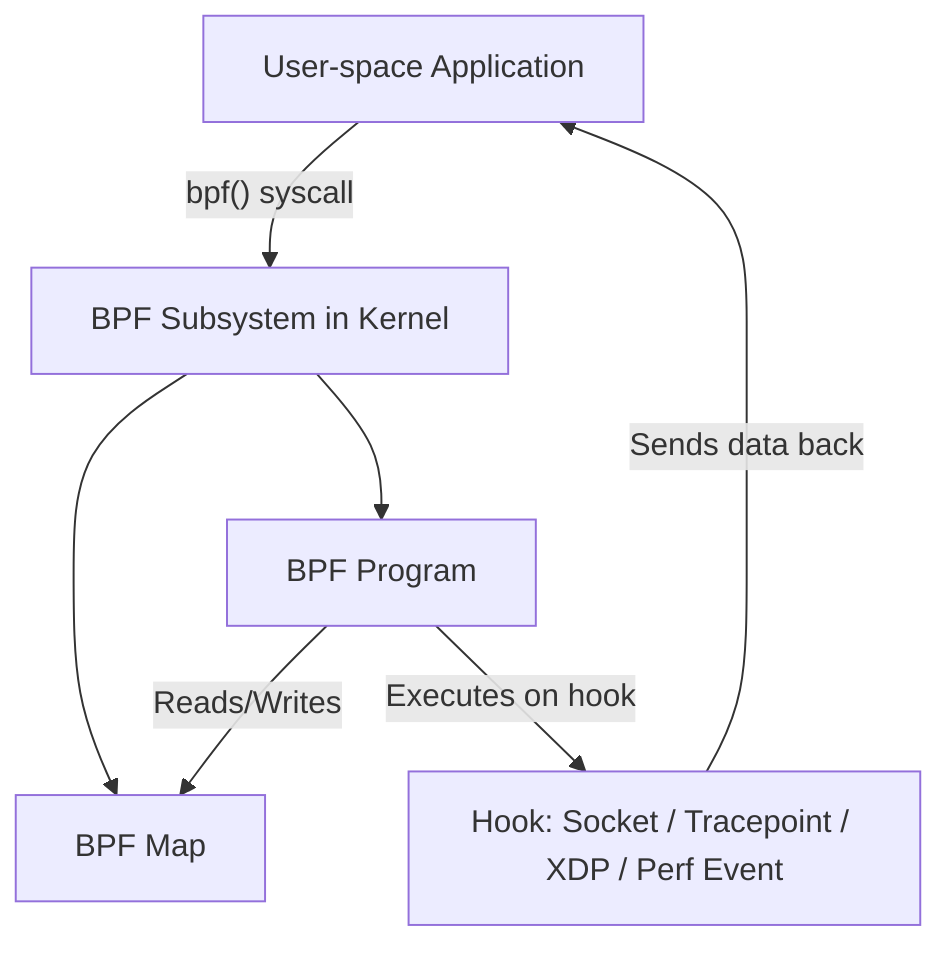
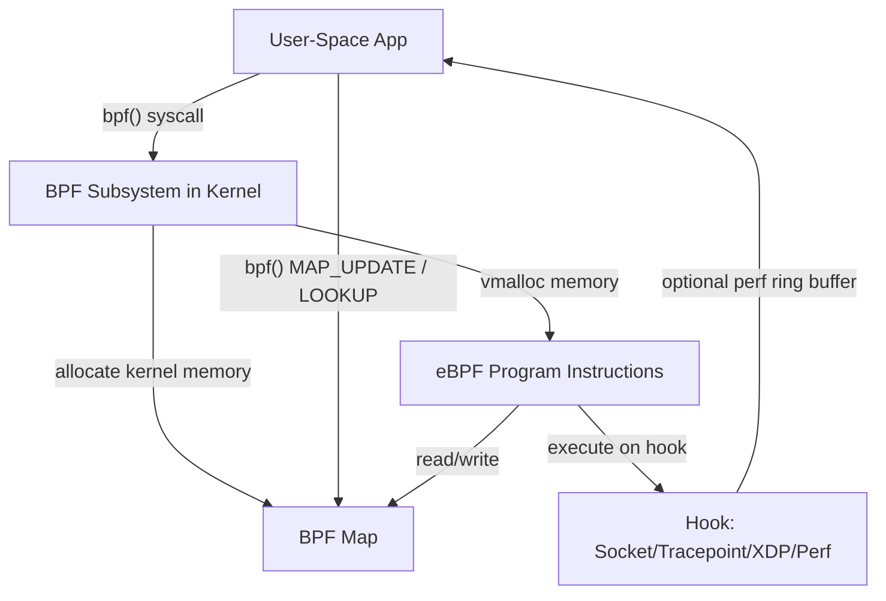
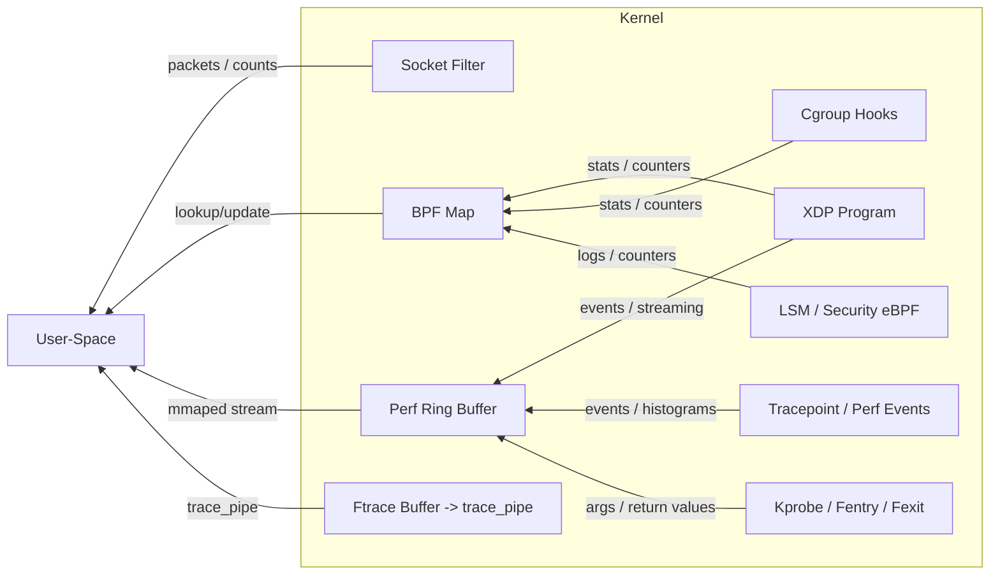
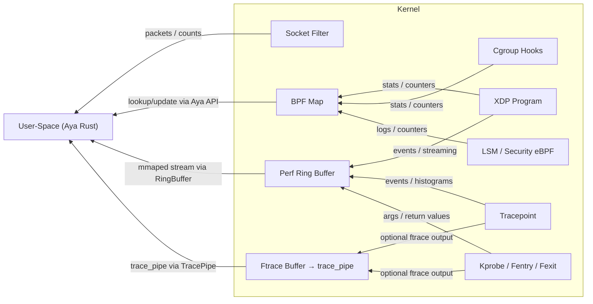
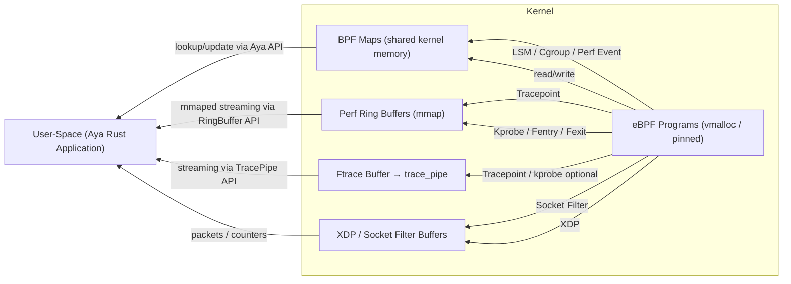

# Syscall `bpf()`

---

## 1. What is `bpf()`?

The `bpf()` syscall is a **general-purpose interface for the Berkeley Packet Filter (BPF)** framework. 
It allows user-space programs to **interact with the kernel’s BPF subsystem**, which can be used for:

* Packet filtering (classic use)
* Tracing and monitoring kernel functions
* Performance analysis
* Security enforcement (via seccomp)
* Network traffic control (tc)

**Reference:**
`man 2 bpf` describes it as:

> `int bpf(int cmd, union bpf_attr *attr, unsigned int size);`

* **cmd** → The specific BPF operation (e.g., load a program, attach a program, manage maps)
* **attr** → Pointer to a structure with command-specific parameters
* **size** → Size of the attribute structure

---

## 2. Key Concepts

1. **BPF Programs**

   * Tiny programs that run in the kernel safely.
   * Can be attached to sockets, tracepoints, or networking hooks.

2. **BPF Maps**

   * Kernel-space data structures shared between kernel and user-space.
   * Types: hash map, array map, LRU map, etc.

3. **BPF Commands**
   Some common `cmd` values:

| cmd                   | Purpose                                                   |
| --------------------- | --------------------------------------------------------- |
| `BPF_MAP_CREATE`      | Create a new BPF map                                      |
| `BPF_MAP_UPDATE_ELEM` | Insert or update an element in a map                      |
| `BPF_MAP_LOOKUP_ELEM` | Lookup an element in a map                                |
| `BPF_PROG_LOAD`       | Load a BPF program into the kernel                        |
| `BPF_PROG_ATTACH`     | Attach a BPF program to a hook (e.g., socket, tracepoint) |
| `BPF_PROG_DETACH`     | Detach a BPF program                                      |

---

## 3. Examples

### **a) Creating a BPF map (hash map)**

```c
#include <linux/bpf.h>
#include <bpf/bpf.h>

struct bpf_attr attr = {
    .map_type = BPF_MAP_TYPE_HASH,
    .key_size = sizeof(int),
    .value_size = sizeof(long),
    .max_entries = 100,
};

int map_fd = bpf(BPF_MAP_CREATE, &attr, sizeof(attr));
if (map_fd < 0) {
    perror("bpf(BPF_MAP_CREATE)");
}
```

This creates a **hash map** in the kernel that can hold 100 integer → long entries.

---

### **b) Loading a BPF program (e.g., socket filter)**

```c
struct bpf_insn prog[] = {
    { BPF_LD  | BPF_W | BPF_ABS, 0, 0, 0 }, // example instruction
    { BPF_RET | BPF_K, 0, 0, 0xFFFFFFFF }  // return all packets
};

struct bpf_attr attr = {
    .prog_type = BPF_PROG_TYPE_SOCKET_FILTER,
    .insns = (uint64_t)prog,
    .insn_cnt = sizeof(prog)/sizeof(prog[0]),
    .license = (uint64_t)"GPL",
};

int prog_fd = bpf(BPF_PROG_LOAD, &attr, sizeof(attr));
if (prog_fd < 0) {
    perror("bpf(BPF_PROG_LOAD)");
}
```

This **loads a simple BPF program** that could filter packets.

---

### **c) Updating a BPF map element**

```c
int key = 1;
long value = 42;
struct bpf_attr attr = {
    .map_fd = map_fd,
    .key = (uint64_t)&key,
    .value = (uint64_t)&value,
    .flags = BPF_ANY,
};

bpf(BPF_MAP_UPDATE_ELEM, &attr, sizeof(attr));
```

This inserts or updates an entry in the BPF hash map.

---

### **d) Attaching BPF program to a tracepoint**

```c
struct bpf_attr attr = {
    .target_fd = tracepoint_fd,
    .attach_bpf_fd = prog_fd,
    .attach_type = BPF_TRACEPOINT,
};

bpf(BPF_PROG_ATTACH, &attr, sizeof(attr));
```

Now the program runs whenever the tracepoint is hit.

---

## **4. Key Notes**

* `bpf()` is **low-level**. Most people use **libbpf** or tools like `bpftool` and `bcc` to simplify this.
* Modern Linux uses **eBPF** (extended BPF), which is much more powerful than classic packet filters.
* eBPF programs **run in kernel space safely**, with verification for loops, memory, and safety.

---


---

## 1. Where are eBPF programs loaded in memory? Who decides this?

### How eBPF programs are loaded:

1. **User-space call**: You call `bpf(BPF_PROG_LOAD, ...)` or use **libbpf**.
2. **Kernel receives instructions**:

   * The kernel verifies the program:

     * Check instruction safety (loops, memory access, etc.)
     * Check bounds (no unsafe pointer dereference)
   * Kernel JITs it (optional) to native CPU instructions.
3. **Memory placement**:

   * eBPF programs live in **kernel memory**, in a region managed by the **kernel BPF subsystem**.
   * Specifically, they are stored in **vmalloc-ed kernel memory**, pinned to prevent swapping.
   * The exact memory address is **opaque to user-space**. User-space only gets a **file descriptor (fd)** 
     that represents the loaded program.

**Summary Table:**

| Aspect            | Detail                                |
| ----------------- | ------------------------------------- |
| Location          | Kernel memory (vmalloc, pinned)       |
| Controlled by     | Kernel BPF subsystem / memory manager |
| User-space access | Only via fd; no direct pointers       |
| Lifespan          | Tied to fd or program detach/unload   |

> **Key point:** User-space cannot directly access program instructions; the kernel controls execution and 
memory.

---

## 2. How are BPF maps stored and what are the limits?

### Maps Overview:

* **BPF maps** are **kernel data structures** for storing key/value pairs.
* User-space can read/write via **bpf() syscalls**, **libbpf**, or `/sys/fs/bpf` (pinned maps).

### Memory and sharing:

1. **Kernel allocates map memory**:

   * When you do `BPF_MAP_CREATE`, kernel allocates the map in **kernel memory**.
   * The **type** determines storage:

     * Hash, array, LRU, per-CPU array, stack trace map, etc.
   * The **size** (max entries) and **key/value sizes** are decided by user-space at creation.

2. **Sharing with user-space**:

   * User-space accesses maps using **file descriptors** (fd returned by `bpf()`).
   * Maps can also be **pinned to BPF filesystem (`/sys/fs/bpf`)**, allowing multiple processes to share.

3. **Limits**:

   * Controlled by kernel constants or cgroup limits, e.g.:

     * `ulimit -n` (fd limit)
     * `/proc/sys/net/core/bpf_jit_limit` (for JIT memory)
     * `BPF_MAP_MAX_ENTRIES` (compile-time or runtime limit)
   * Large maps consume kernel memory; per-CPU maps multiply memory by the number of CPUs.

**Key Concept:** BPF maps are **shared via file descriptors and the kernel**, not direct memory mapping.

---

## 3. How data moves between user-space and kernel-space?

### Mechanisms:

| Mechanism                                | Use in BPF                                       | Notes                                              |
| ---------------------------------------- | ------------------------------------------------ | -------------------------------------------------- |
| `bpf(BPF_MAP_LOOKUP_ELEM / UPDATE_ELEM)` | Direct key/value access                          | Standard syscall, kernel mediates copy             |
| `perf_event` buffer                      | Streaming events from eBPF program to user-space | Uses **ring buffers**, mmaped by user-space        |
| `BPF_PROG_TYPE_SOCKET_FILTER`            | Packet data through sockets                      | `sendmsg`/`recvmsg` + eBPF filter                  |
| **Netlink sockets**                      | Used by `bpftool` and some libbpf                | Allows enumeration of programs/maps                |
| `/sys/fs/bpf` (BPF filesystem)           | Maps pinned for sharing                          | User-space opens fd, then uses `bpf()` to interact |

### Kernel/User-space memory copy:

1. For map operations:

   * Kernel copies data **safely** via `copy_from_user()` / `copy_to_user()` internally.
2. For perf buffers (streaming):

   * Kernel writes to mmaped **ring buffer**, user-space reads without additional syscalls.
3. For `bpf()` itself:

   * All attributes are **copied from user-space** into kernel before use.

> There is **no new IPC**; Linux reuses existing mechanisms:
>
> * Syscalls (`bpf()`)
> * File descriptors (`/dev` or pinned maps)
> * Netlink (for introspection)
> * Memory-mapped ring buffers (for streaming, low latency)

**Important note:** This avoids **unsafe pointers**: user-space never gets kernel pointers; 
kernel never trusts user-space pointers.

---

### **Visual Summary of eBPF Memory & Data Flow**



---

✅ **Key Takeaways**

1. eBPF programs live **entirely in kernel memory**, managed by the kernel. User-space only sees a **fd**.
2. Maps are **kernel memory** structures, shared via **fd** or **BPF filesystem**, with configurable size.
3. Data transfer is via **bpf() syscalls, mmaped buffers, and netlink**, **no special IPC** is required.
4. Safety is guaranteed: **no direct pointer sharing**. All copies are mediated by the kernel.

---

**Table showing all eBPF program types and how they communicate with user-space**, which is super useful to
see the difference between sockets, tracing, XDP, and perf events.

| eBPF Program Type                   | Hook / Where it Runs                               | User-Space Communication          | Mechanism                               | Notes                                                             |
| ----------------------------------- | -------------------------------------------------- | --------------------------------- | --------------------------------------- | ----------------------------------------------------------------- |
| **Socket Filter** (`SOCKET_FILTER`) | Attached to a socket (classic BPF)                 | Packets filtered or counted       | Standard sockets (`recvmsg`, `sendmsg`) | Runs in kernel on incoming packets; limited to socket buffer data |
| **XDP** (`XDP`)                     | Network driver level, very early packet processing | Minimal; via maps or perf buffers | BPF maps / perf ring buffer             | Ultra-low-latency; can't block; usually sends stats to user-space |
| **Tracepoint** (`TRACEPOINT`)       | Kernel tracepoints                                 | Events / stats                    | Perf event ring buffer, BPF maps        | Good for performance monitoring; streaming via mmaped buffer      |
| **kprobe / kretprobe**              | Arbitrary kernel functions                         | Function arguments, return values | Perf ring buffer, BPF maps              | Can track function calls; controlled via verifier                 |
| **fentry / fexit**                  | Kernel function entry / exit                       | Stats, args                       | Perf ring buffer, BPF maps              | Modern replacement for kprobes; more efficient                    |
| **cgroup_skb / cgroup_sock**        | Network filtering at cgroup level                  | Statistics, counters              | BPF maps                                | Can implement custom network policies per cgroup                  |
| **sock_ops / sock_addr**            | TCP/UDP connection events                          | Stats, connection control         | BPF maps                                | Mostly for connection-level metrics                               |
| **LSM / Security eBPF**             | Security hooks in kernel                           | Logs, counters                    | BPF maps                                | Seccomp and security auditing; user-space can query via maps      |
| **Perf Event eBPF** (`PERF_EVENT`)  | Hardware/performance events                        | Counters, histograms              | Perf event mmap                         | High-precision hardware counters; streamed efficiently            |
| **cgroup_device**                   | Device access                                      | Counters                          | BPF maps                                | Controls device access in cgroups                                 |

---

### **Summary of Mechanisms**

1. **BPF maps**

   * Used everywhere for **shared state** between kernel and user-space.
   * Accessed via `bpf(BPF_MAP_LOOKUP_ELEM / UPDATE_ELEM)` syscalls.

2. **Perf ring buffer**

   * Streaming data from kernel to user-space **without extra syscalls**.
   * mmaped by user-space for low-latency access.

3. **Sockets / XDP / packet buffers**

   * Only for network programs (classic socket filter or XDP).

4. **Pinned BPF filesystem** (`/sys/fs/bpf`)

   * Allows maps or programs to be **shared between processes**.

> **Key takeaway:**
>
> * **Maps are universal** for all types.
> * **Ring buffers** are preferred for high-throughput streaming.
> * **Sockets/XDP** are for packet data, not general-purpose stats.

---


---

# Rust based approach:

## 1. Loading eBPF programs in Aya (memory considerations)

* **Where programs live:** 
    Same as vanilla eBPF — kernel memory, pinned, managed by the kernel.

* **Aya approach:**

  ```rust
  let mut bpf = Bpf::load_file("program.o")?;
  ```

  * Aya handles the **`bpf(BPF_PROG_LOAD)` syscall** internally.
  * User-space never sees kernel pointers; you only get **program handles** in Rust.

* **JIT memory:** Controlled by kernel (`/proc/sys/net/core/bpf_jit_limit`). Aya does not change this.

**Summary:** Aya abstracts loading, validation, and program FD management in safe Rust types.

---

## 2. BPF maps in Aya

* Aya provides **Rust types** for interacting with maps:

  ```rust
  // user space snippet 
  let mut map: HashMap<_, u32, u64> = HashMap::try_from(bpf.map_mut("my_map")?)?;
  map.insert(1, 42, 0)?;
  let value = map.get(&1, 0)?;
  ```

* Map memory is **kernel-managed**, shared via FDs.

* Aya provides **safe abstractions**:

  * `HashMap` → kernel hash map
  * `Array` → array map
  * `PerCpuArray` → per-CPU map
  * `RingBuffer` → perf ring buffer
  * `SockMap` / `XskMap` → network maps

* **Limits:**

  * Max entries, value size, per-CPU replication same as vanilla BPF
  * Controlled at creation (`max_entries`)
  * Kernel enforces memory usage (and `bpf_jit_limit` for program memory)

---

## 3. User-space communication in Aya

| Mechanism            | Aya Rust API                      | Notes                                                                             |
| -------------------- | --------------------------------- | --------------------------------------------------------------------------------- |
| **BPF maps**         | `HashMap`, `Array`, `PerCpuArray` | Standard key/value access                                                         |
| **Perf ring buffer** | `RingBuffer::new()`               | Stream events; Aya provides safe iterator                                         |
| **Tracepipe**        | `TracePipe::new()`                | Reads ftrace/tracing events; supports programs attached to tracepoints or kprobes |
| **Pinned maps**      | `PinnedMap::load()`               | Share maps between programs or processes                                          |
| **Sockets/XDP**      | `Xdp` type, `SocketFilter`        | Can attach eBPF network programs to NIC or sockets                                |

> Aya wraps the low-level syscalls in **safe Rust types** with **lifetimes and type safety**, avoiding unsafe memory operations.

---

## 4. eBPF Program Types with Aya support

| Program Type        | Kernel Hook           | Aya Type / API                              | Communication             |
| ------------------- | --------------------- | ------------------------------------------- | ------------------------- |
| Socket Filter       | Socket                | `SocketFilter`                              | User-space via socket fd  |
| XDP                 | NIC / driver          | `Xdp`                                       | Maps or ring buffer       |
| Tracepoint          | Kernel tracepoints    | `TracePoint`                                | Ring buffer or trace_pipe |
| kprobe / kretprobe  | Kernel functions      | `KProbe`, `KRetProbe`                       | Ring buffer or trace_pipe |
| fentry / fexit      | Kernel functions      | `FEntry`, `FExit`                           | Ring buffer or trace_pipe |
| Cgroup (sock / skb) | Network cgroup        | `CgroupSock`, `CgroupSockAddr`, `CgroupSkb` | Maps                      |
| LSM / Security      | Kernel security hooks | `Lsm`                                       | Maps (logs, counters)     |
| Perf Event          | Hardware/perf         | `PerfEvent`                                 | Ring buffer               |
| Pinned Maps         | All                   | `PinnedMap`                                 | Shared between processes  |

---

## 5. Communication diagram updated for Aya



---

### 6. Key Aya Advantages

1. **Safe Rust abstractions** for maps, programs, and buffers.
2. **Automatic FD management** — no need to call `bpf()` directly.
3. **Type-safe access** to keys/values in maps.
4. **Support for trace_pipe** and perf ring buffer for tracing.
5. Compatible with all major eBPF program types: network, tracing, security, and perf events.

---

✅ Summary

* Aya **does not change the kernel behavior** of memory allocation or sharing.
* It **wraps BPF programs, maps, and ring buffers in Rust types**, making user-space communication 
  **safe and ergonomic**.
* All the previous mechanisms (**maps, perf buffers, trace_pipe, sockets**) are fully supported via Aya.

---

If you want, I can make a **full “Aya Rust + eBPF user-space flow diagram”** that also **shows memory areas, map sharing, and kernel-user-space bridges**, like a complete reference diagram for teaching or documentation.

Do you want me to make that?

## Full Aya + eBPF memory & communication diagram:

* Where **programs live in kernel memory**
* Where **maps are allocated and shared**
* How **user-space interacts via Aya Rust API**
* Communication paths: **perf ring buffer**, **trace_pipe**, **maps**, **sockets/XDP**

Here’s a **Mermaid flowchart** suitable for Markdown:



---

### Legend / Notes for Aya

1. **Aya Rust handles all kernel interactions** safely:

   * Loading programs → `Bpf::load_file()`
   * Attaching programs → `program.attach_*()`
   * Accessing maps → `HashMap`, `Array`, `PerCpuArray`, `PinnedMap`
   * Streaming events → `RingBuffer::new()`
   * Reading trace_pipe → `TracePipe::new()`

2. **Memory**:

   * Programs → **kernel vmalloc, pinned**
   * Maps → **kernel memory, shared via FD**
   * Ring buffer → **mmaped to user-space**

3. **Communication paths**:

   * **Maps** → key/value access
   * **Ring buffers** → high-throughput events
   * **Trace_pipe** → ftrace/tracepoint output
   * **Sockets/XDP** → packet data

4. **Safety**:

   * Aya ensures **no unsafe pointer sharing**, all accesses go through safe Rust abstractions.

---

## Rust based logging ( tracing for debugging )


Mechanism to see what is happening with Aya operations for instance what happens during program load,
( this mechanism is a bit specific). 

### 1. RUST_LOG=trace vs Aya internal logging

* `RUST_LOG=trace` or `debug` **only works if there are log statements** in the Rust code and if a logger 
  is initialized (like `env_logger`).
* Aya itself does **not automatically output internal eBPF loading debug** unless logging is enabled via 
  the `aya-log` crate or the standard `tracing` infrastructure.

---

## 2. Using `aya-log` / `tracing` with Aya

Aya provides **optional logging features** via **`aya-log`** or integration with **`tracing`**. 
This can log:
    * Syscalls like `bpf(BPF_PROG_LOAD)`
    * Map creation and updates
    * Program attachment
    * Errors returned by the kernel verifier


#### Example setup:

```toml
# Cargo.toml
[dependencies]
aya = { version = "0.20", features = ["log"] }
tracing-subscriber = "0.3"
```

```rust
use tracing_subscriber;

fn main() -> anyhow::Result<()> {
    // Initialize tracing subscriber
    tracing_subscriber::fmt()
        .with_env_filter(tracing_subscriber::EnvFilter::from_default_env())
        .init();

    // Load eBPF program
    let mut bpf = aya::Bpf::load_file("program.o")?;
    Ok(())
}
```

* Then you can run your program with:

```bash
RUST_LOG=trace cargo run
```

* Output will include Aya’s internal debug logs (e.g., **loading program, map creation, verifier output**).

---

## 3. Verifier logs (kernel eBPF logs)

* The **kernel verifier** produces detailed logs when you load programs.
* Aya exposes these via the **`load_file_with_log`** method:

```rust
let mut bpf = Bpf::load_file_with_log("program.o", 1024 * 1024)?; // 1 MB log buffer
```

* The second argument is the **size of the verifier log buffer**.
* If verification fails, Aya will **return the log** in the error.
* This is **separate from RUST_LOG**, it comes from the **kernel itself**.

---

### Summary

| Feature                 | How to enable                                                                                  |
| ----------------------- | ---------------------------------------------------------------------------------------------- |
| Rust/Aya debug logs     | `tracing_subscriber` + `RUST_LOG=trace`                                                        |
| Kernel verifier logs    | `Bpf::load_file_with_log("program.o", log_size)`                                               |
| Low-level syscall trace | Aya itself does not provide full syscall tracing; you can use `strace` or `bpftrace` if needed |

**Tip:** Combine both:

```rust
let mut bpf = Bpf::load_file_with_log("program.o", 1024*1024)?;
```

and

```bash
RUST_LOG=trace cargo run
```

→ You see **both kernel verification logs and Aya internal debug**.

---

**Rust snippet** that:

1. Loads an eBPF program from a `.o` file
2. Captures **kernel verifier logs**
3. Uses **`tracing` + `RUST_LOG=trace`** for Aya debug logs
4. Initializes **aya-log** for eBPF program `bpf_trace_printk` logging

This is a complete template you can adapt for your ring buffer program.

---
```bash 
cargo add tracing 
```

```rust
use aya::programs::KProbe;
use aya::{maps::RingBuf, Bpf};
use tracing::{debug, info, warn};
use tokio::io::unix::AsyncFd;
use tokio::signal;
use std::ptr;

#[repr(C)]
#[derive(Clone, Copy)]
struct Event {
    pid: u32,
    gtid: u32,
    comm: [u8; 16],
}

#[tokio::main]
async fn main() -> anyhow::Result<()> {
    // -------------------------------
    // 1. Initialize tracing subscriber
    // -------------------------------
    tracing_subscriber::fmt()
        .with_env_filter(tracing_subscriber::EnvFilter::from_default_env())
        .init();
    info!("Tracing subscriber initialized");

    // -------------------------------
    // 2. Bump memlock rlimit
    // -------------------------------
    let rlim = libc::rlimit {
        rlim_cur: libc::RLIM_INFINITY,
        rlim_max: libc::RLIM_INFINITY,
    };
    let ret = unsafe { libc::setrlimit(libc::RLIMIT_MEMLOCK, &rlim) };
    if ret != 0 {
        warn!("Failed to remove memlock limit: {}", ret);
    } else {
        info!("Locked memory limit removed");
    }

    // -------------------------------
    // 3. Load eBPF program with verifier log
    // -------------------------------
    // Specify a buffer for the kernel verifier log
    let log_buf_size = 1024 * 1024; // 1 MB
    let mut bpf = match Bpf::load_file_with_log("program.o", log_buf_size) {
        Ok(prog) => {
            info!("eBPF program loaded successfully");
            prog
        }
        Err(e) => {
            warn!("Failed to load eBPF program: {e}");
            // If verifier log is present, print it
            if let Some(log) = e.verifier_log() {
                println!("=== Kernel Verifier Log ===\n{log}\n===========================");
            }
            return Err(e.into());
        }
    };

    // -------------------------------
    // 4. Initialize aya-log for bpf_trace_printk
    // -------------------------------
    match aya_log::EbpfLogger::init(&mut bpf) {
        Ok(logger) => {
            info!("Aya eBPF logger initialized");
            let mut logger = AsyncFd::new(logger)?;
            tokio::spawn(async move {
                loop {
                    let mut guard = logger.readable_mut().await.unwrap();
                    guard.get_inner_mut().flush();
                    guard.clear_ready();
                }
            });
        }
        Err(e) => warn!("Aya eBPF logger failed: {e}"),
    }

    // -------------------------------
    // 5. Attach KProbe
    // -------------------------------
    let program: &mut KProbe = bpf.program_mut("ringbuffer_map").unwrap().try_into()?;
    program.load()?;
    program.attach("do_sys_openat2", 0)?;
    info!("KProbe attached to do_sys_openat2");

    // -------------------------------
    // 6. Take ring buffer map
    // -------------------------------
    let ring_buf_map = bpf.take_map("MYEVENTS").expect("map MYEVENTS not found");
    let ring_buf = RingBuf::try_from(ring_buf_map)?;
    let mut async_rb = AsyncFd::new(ring_buf)?;

    tokio::spawn(async move {
        info!("Waiting for events...");
        loop {
            let mut guard = match async_rb.readable_mut().await {
                Ok(g) => g,
                Err(e) => {
                    warn!("Ring buffer error: {e}");
                    break;
                }
            };

            let rb = guard.get_inner_mut();

            while let Some(item) = rb.next() {
                let event = unsafe { ptr::read_unaligned(item.as_ptr() as *const Event) };
                let comm = String::from_utf8_lossy(&event.comm)
                    .trim_end_matches('\0')
                    .to_string();
                println!("PID: {:<8} | COMM: {}", event.pid, comm);
            }

            guard.clear_ready();
        }
    });

    println!("Waiting for Ctrl-C...");
    signal::ctrl_c().await?;
    println!("Exiting...");

    Ok(())
}
```

---

### **Key Features in this Snippet**

1. **Tracing subscriber**:

   * Use `RUST_LOG=trace` to get Aya debug logs.
   * Replaces `env_logger`.

2. **Kernel verifier logs**:

   * `Bpf::load_file_with_log()` captures verifier output if program fails.
   * Printed automatically in case of error.

3. **Aya-log integration**:

   * Streams `bpf_trace_printk` messages asynchronously.

4. **Ring buffer events**:

   * Async handling using `AsyncFd` with safe Rust iteration.

---

### **Run example with verbose logs**

```bash
RUST_LOG=trace cargo run
```

* See Aya debug logs (program load, map creation, attachment).
* Kernel verifier logs will appear **if the program fails to load**.
* bpf_trace_printk messages will stream via Aya-log.

---

I can also make a **version that prints verifier logs **even if loading succeeds**, which is extremely useful for debugging optimizations or map sizing in Aya.

Do you want me to do that?
