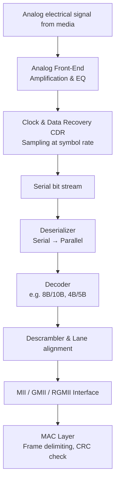
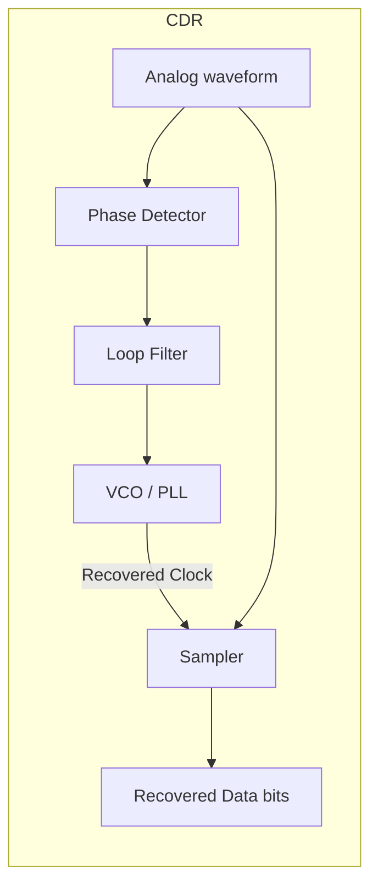
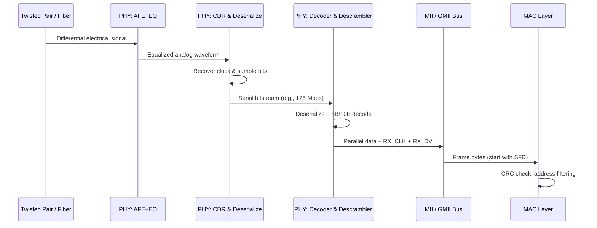

# NIC Phy:

- **Network Interface Card (NIC)::PHY**   
	- When an electrical signal (representing a packet) arrives at the **PHY (Physical Layer)** and is eventually handed over to the **MAC (Media Access Control) layer**.

---

## 1. High-Level Stages (PHY → MAC)

When a differential electrical signal (e.g., from an Ethernet cable) hits the PHY:

1. **Analog Front-End (AFE)** – Amplification & equalization  
2. **Clock & Data Recovery (CDR)** – Extracting bit clock and sampling bits  
3. **Deserialization** – Converting serial bits to parallel bytes  
4. **Symbol decoding** – e.g., MLT-3, PAM-5, 4B/5B, 8B/10B decoding  
5. **Lane alignment / de-scrambling** (for Gigabit+)  
6. **MII interface** (GMII/RGMII/SGMII) transfer to MAC  

> **Note**: The MAC layer then reassembles bytes into frames, checks FCS (CRC), filters addresses, and DMA’s to host memory.

---

## 2. Signal Processing Stages

---

## 3. Detailed Stage Explanation

### Stage 1 – Analog Front-End (AFE)
- **What arrives**: Weak, noisy, distorted differential signal (e.g., ±1V MLT-3 for 100BASE-TX, or PAM-5 for 1000BASE-T).
- **PHY does**:
  - **Amplification**: Boost signal level.
  - **Equalization**: Cancel channel losses (ISI – inter-symbol interference) using adaptive filters.
  - **Baseline wander correction** (for twisted pair).
- **Output**: Clean enough analog waveform for clock recovery.

### Stage 2 – Clock and Data Recovery (CDR)
- **Problem**: No separate clock wire – must recover clock from data transitions.
- **PHY uses**: PLL (Phase-Locked Loop) or DLL.
- **CDR concept**:

- Sampler decides ‘0’ or ‘1’ at each clock edge.

### Stage 3 – Deserialization
- Serial bits from CDR are too fast for MAC (e.g., 1.25 Gbps for GbE).
- **Deserializer** converts to parallel words:
  - 10-bit parallel for GbE (8B/10B → 125 MHz parallel clock).
  - 4-bit for 100 Mbps MII (25 MHz).

### Stage 4 – Decoding (Line code removal)
| Ethernet speed | Line code | Decoding done |
|----------------|-----------|----------------|
| 10BASE-T | Manchester | Bit-level |
| 100BASE-TX | MLT-3 + 4B/5B | 4B/5B table lookup |
| 1000BASE-T | PAM-5 + 4D-PAM5 + 8B/10B | 8B/10B DC-balanced decode |
| 10GBASE-R | 64B/66B | Scrambling + block sync |

- **Purpose**: Remove DC bias, recover original data bytes.

### Stage 5 – Descrambling & Lane alignment (Gigabit+)
- **Descrambler**: Reverses self-synchronizing scrambler used to reduce EMI.
- **Lane alignment** (for multi-lane PHY like 10GBASE-T or backplane): aligns data from different twisted pairs (e.g., 4 lanes for 1000BASE-T).

### Stage 6 – MII Interface to MAC
- After decoding, data is presented on **MII / GMII / RGMII / SGMII**:
  - **TX_CLK / RX_CLK** – recovered clock (or local reference for MAC).
  - **TXD[3:0] / RXD[3:0]** – 4-bit nibbles (MII) or 8-bit bytes (GMII).
  - **RX_DV** – Data valid signal indicates frame start.
  - **RX_ER** – Error flag if PHY detected invalid symbols.

MAC then:
- Delineates frame (detect SFD – Start Frame Delimiter).
- Checks FCS (CRC-32).
- Removes preamble/SFD.
- Passes to host via DMA.

---

## 4. Complete PHY → MAC Data Flow 

---

## 5. Real-World Example – 1000BASE-T (Gigabit over copper)
- Signal: **4D-PAM5** on 4 pairs (125 MBaud each).
- PHY performs:
  1. Echo cancellation (full duplex on same pair).
  2. NEXT/FEXT cancellation (crosstalk between pairs).
  3. Viterbi decoding (trellis coded modulation).
  4. 8B/10B decode → 8-bit parallel → GMII.
- Latency ~1-2 microseconds from wire to MAC.

---

## 6. Summary Table

| Stage | Function | Key challenge |
|-------|----------|----------------|
| AFE | Amplify & equalize | ISI, noise |
| CDR | Clock recovery | Long runs of 0/1 |
| Deserialize | Serial → parallel | Timing alignment |
| Decode | 4B/5B, 8B/10B, etc. | DC balance |
| Descramble | Remove spectral shaping | Self-sync |
| MII Tx | Parallel data + control | Setup/hold timing |

After handing to MAC, the **packet is not yet in memory** – MAC must still validate and DMA it.
