# Packet flow:

Tracing a packet's journey from the physical wire to the Linux network stack give a "Basics" understanding
of kernel networking. 

Assuming there is no *XDP* intervention, the packet follows a traditional, interrupt-driven path.

---

## 1. The Hardware Stage (PHY & NIC)

**Signal Processing Stages:**

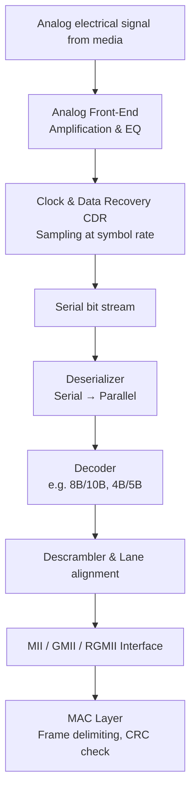

---

### 1. Signal Reception and Analog Conditioning:

When electrical or optical signals arrive at the **Physical Layer (PHY)** The signal is rarely perfect
square, its often distorted by noise, attenuation ( loss of signal ) and crosstalk. 

- *Isolation Transformers: Signal first passes through transformer to protect the NIC from voltage spikes
  and static.

- *Signal Conditioning & preamble detection*: PHY Constantly monitors the line, when it detects a
  alternating pattern (the preamble), it synchronizes its internal clock with the incoming signal. 

- *ADC*: PHY uses a high speed *ADC* to convert the voltage fluctuations (on copper or light pulses) into a
  raw digital values.

- *Adaptive Equalization*  : PHY applies digital filters to cleanup the signal, compensating for the
  physical degradations the cable introduced. 

### 2. Clock and Data Recovery (CDR) 

- The NIC does not know exactly when the sending device clock ticked. It must "lock onto" the incoming
  stream. As there is no separate clock wire, PHY must recover clock from data transitions:
  - PHY Looks at the transitions in the electrical signal to synchronize its internal clock with the
    sender's.
  - PHY uses PLL (phase-locked loop) or DLL.
  - Once synchronized it can accurately distinguish where one bit ends and next begins.

    ```mermaid 
    flowchart LR
        subgraph CDR
            A[Analog waveform] --> B[Phase Detector]
            B --> C[Loop Filter]
            C --> D[VCO / PLL]
            D -->|Recovered Clock| E[Sampler]
            A --> E
            E --> F[Recovered Data bits]
        end
    ```

- As there is no shared clock wire between two computers( like i2c, SPI ), PHY does have its own internal
  local oscillator, and the magic happens through a process called **Clock and Data Recovery (CDR)**. 

- How the PHY "locks" onto a stream without a shared clock wire: 
    - Internal clock vs Reference clock: Every NIC has a local crystal oscillator (25,125 MHx), this is the
      reference clock.
    - As no two oscillators are same, senders clock can misread a bit. To fix this PHY uses `PLL`
        1. PHY listens to the edges of the internal electrical signal. 
        2. It Compares the timing of these edges to its own internal clock. 
        3. It micro-adjusts its internal clock's phase and frequency to match the sender's timing perfectly. 

    - The typical time taken for this locking is in microseconds or milliseconds depending on Ethernet
      standards. 
    - Transitions: ( Encoding ): If sender sent a long string of zeros (`00000...`) there would be no
      electrical transitions. The receiver's PHY would lost the beat and clock would drift. To precent this
      Ethernet uses Line Encoding to force transitions even when the data is quite: 
      - 10Base-T: uses Manchester Encoding ( every bit has a transition in the middle )
      - 100Base-Tx: uses 4B5B Encoding. ( mapping 4 bits of data to a 5-bit code that guarantees enough 1s
        for transitions.)
      - 1000BASE-T: Uses 8B10B or complex PAM-5 signaling to ensure the wire is never "electrically still."

### 3. De-Serialization:

- Serial bits after clock and data recovery are too fast for MAC (e.g 1.25 Bbps for GbE), and processing
  these bits would overwhelm the main CPU. To handle this PHY performs a process called De-Serialization and
  Word Alignment. 
- *DeSerializer*: Converts to parallel words:
  - 10-bit for GbE (8B/10B -> 125 MHz parallel clock)
  - 4bit for 100 Mbps MII (25 MHz)
  - Serial Input => A parallel Bus.

- The "Comma" or "K-Code" (Finding the Start): If bits are just a stream, then how do we know where it
  starts. ( Ethernet uses a special bit pattern called *Commas* or *K-Codec* ) Which are specific sequence
  ( like `001111110` in some protocol) that never appear in normal data. PHY HW logic is constantly scanning
  the incoming bits for this specific pattern, and snaps its word boundaries to that position, And it knows
  10 bits starting from that is a *new word*.
- In Gigabit Ethernet, we don't actually send 8-bit bytes. We send 10-bit symbols.
- Using 10 bits to represent 8 bits of data, ensures there are always enough transitions (0-to-1 or 1-to-0)
  to keep the clock locked.

### 4. Decoding: ( Language of the Wire )

Convert serial bits to parallel bytes:

- Data isn't sent as raw 1's and 0's over the wire because long strings of zeros would make the clock lose
  sync. Instead, it's encoded. The PHY must reverse this:
  - *Line Decoding*: If its 1000Base-T (Gigabit) it decodes **PAM-5** (Pulse amplitude modulation). For
    10/100 Mbps, it might decode **Manchester** or **4B/5B** encoding.
- Purpose of this stage is to recover original data bytes.


| Ethernet speed | Line code | Decoding done |
|----------------|-----------|----------------|
| 10BASE-T | Manchester | Bit-level |
| 100BASE-TX | MLT-3 + 4B/5B | 4B/5B table lookup |
| 1000BASE-T | PAM-5 + 4D-PAM5 + 8B/10B | 8B/10B DC-balanced decode |
| 10GBASE-R | 64B/66B | Scrambling + block sync |


### 5. Descrambling and Line alignment (Gigabit+)

- *Descrambling*: To spread out electromagnetic energy and prevent interference, the data is often 
  "Scrambled" at the source. The PHY uses a feedback shift register to descramble the bits back into their
  original sequence.

- *Lane alignment* (for multi-lane PHY like 10GBASE-T or backplane): aligns data from different twisted
  pairs (e.g., 4 lanes for 1000BASE-T).

Before MAC can understand the data, the PHY needs to find the "start" of the frame.

- *Preamble Detection*: The PHY looks for a specific pattern ( in Ethernet, this is a series of alternating
  1's and 0's ending in `10101011`).

- *PCS (physical coding sublayer)*: This sub-layer handles the alignment. Once the "start of Frame
  Delimiter" (SFD) is found, the PHY knows that the very next bit is the beginning of the actual Ethernet
  header. 


### 6. MII interfacec to MAC:

Finally, the data is ready to leave the PHY. It is passed to the MAC layer via a standardized interface 
called the MII (Media Independent Interface)—or its faster cousins, RMII, GMII, or SGMII.

- *Parallelization*: The PHY usually sends the data to the MAC in small chunks (4-bit "nibbles" or 8-bit
  bytes) rather than a single serial stream.

- *Status Signals*: Along with the data, the PHY toggles specific pins like RX_DV (Receive Data Valid) to
  tell the MAC, "Hey, I'm sending you actual data now, not just wire noise."

- After decoding, data is presented on **MII / GMII / RGMII / SGMII**:
  - **TX_CLK / RX_CLK** – recovered clock (or local reference for MAC).
  - **TXD[3:0] / RXD[3:0]** – 4-bit nibbles (MII) or 8-bit bytes (GMII).
  - **RX_DV** – Data valid signal indicates frame start.
  - **RX_ER** – Error flag if PHY detected invalid symbols.


| Stage            | Action          | Purpose                                                |
|------------------|-----------------|--------------------------------------------------------|
| Analog Front End | Filtering & ADC | Turns electricity into raw digital samples.            |
| CDR              | Clock Recovery  | "Syncs the NIC's ""heartbeat"" with the incoming data."|
| Decoder          | Line Decoding   | Translates physical symbols (like PAM-5) into bits.    |
| PCS              | Alignment       | Finds the start of the packet (SFD).                   | 
| MII Interface    | Data Transfer   | Hands the byte-aligned data to the MAC layer.          |

MAC then:
- Delineates frame (detect SFD – Start Frame Delimiter).
- Checks FCS (CRC-32).
- Removes preamble/SFD.
- Passes to host via DMA.

**Complete PHY -> MAC Data Flow :**

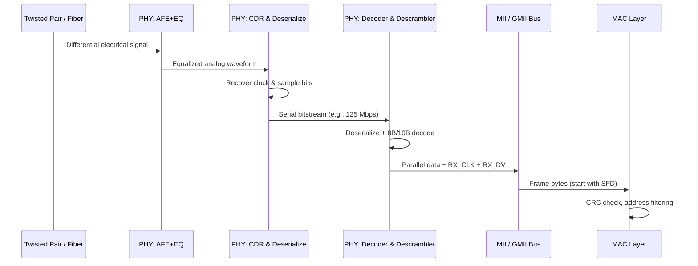

### 7. Summary:


| Stage | Function | Key challenge |
|-------|----------|----------------|
| AFE | Amplify & equalize | ISI, noise |
| CDR | Clock recovery | Long runs of 0/1 |
| Deserialize | Serial → parallel | Timing alignment |
| Decode | 4B/5B, 8B/10B, etc. | DC balance |
| Descramble | Remove spectral shaping | Self-sync |
| MII Tx | Parallel data + control | Setup/hold timing |


=> After handing to MAC, the **packet is not yet in memory** – MAC must still validate and DMA it. <=

NOTE:

- At PHY level the HW is essentially "autonomous translator" It does not know what the OS is and it does'nt
  care about CPU's state.

- It operates entirely in the domain of **HW Logic** and **Digital Signal Processing (DSP)**.

- PHY's Job is purely reactive, If electrons move on the wire, the PHY logic gates start flipping. It does
  not take permission to decode a signal, its hard-wired to do so the moment it detects a carrier wave. 

- Speed Disparity: PHY operates at nanosecond scales, if it had to wait for a CPU interrupt just to handle
  bits, the buffer would overflow instantly. 

- While PHY does the heavy lifting of signal processing independently, the CPU Does have a "remote control"
  over it for setup:
  - Auto-Negotiation: CPU can tell PHY try connect at 1Gbps, but if the other sidfe cant do it drops to
    100Mbps.
  - Power State: OS tells PHY to go to low-power mode if the cable is unplugged. 
  - Diagnostics: CPU can ask the PHY for "telemetry" like Noise on the line, TDR (time domain reflextometry)

---

## MII: (Rx Path)

MII is is not just a passive bus, it has specific roles: 
- It acts as a universal bridge so that any MAC can talk to any PHY ( copper/fiber transceiver )
- clock domains ( PHY clock vs MAC clock)
- Data alignment & control signal decoding 
- Nibble/Byte packing ( depending on MII, GMII, RGMII, SGMII)
- Error Propagation (RX_ER, RX_DV encoding).

### 1. Clock Synchronization:

- The MII includes a dedicated clock line provided by the PHY. 
- Latch data on correct clock edge (rising/falling for RGMII, Both edges for DDR).
- This ensures that even if the PHY's speed drifts slightly due to temperature or cable length, the data is
  handed over with perfect timing.

### 2. Control Signal decoding:

- While the PHY is hearing "noise" or "silence" on the wire, it keeps the `RX_DV` line Low.
- The moment the PHY detects the Start Frame Delimiter (SFD) it flips the RX_DV pin to **High**.
- This acts as a "wake up" call to the MAC, telling it: "Everything I’m about to send you on the data pins
  is a real packet. Start recording."

- Interpret `RX_DV` (Data Valid) and `RX_ER` (Error).

### 3. Data width Conversion: 

- In standard MII, the 125 MHz serial stream from the `PHY` is broken into **4-bit nibbles**.
- In GMII (Gigabit MII), it is broken into 8-bit bytes.
-  e.g., 4-bit nibbles (MII) → 8-bit bytes (for MAC internal bus).

- This slows down the "clock speed" of the signals being sent to the MAC, making it easier for the MAC's 
  digital logic to process the data without overheating or losing sync.


### 4. RGMII-specific 

- DDR to SDR conversion, clock skew adjustment.

### 5. SGMII-specific 

- Serialize/de-serialize, auto-negotiation pass-through.

### 6. Error flag generation 

If the PHY detects an electrical anomaly that violates the rules of the physical medium (like an "illegal" 
symbol in the line coding), it will toggle the Receive Error pin. 
This allows the MAC to immediately know that the packet is "poisoned" before it even finishes receiving it.

- Map PHY errors to MAC-internal error bits.

--- 

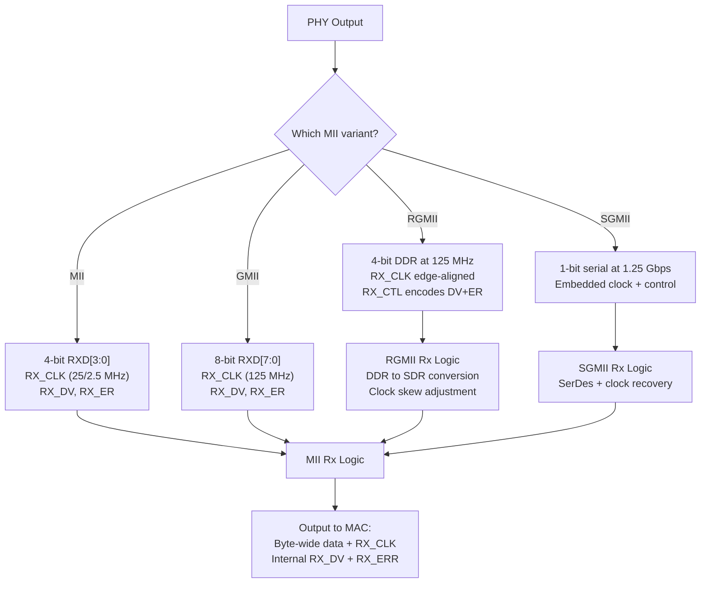

**The MII layer ensures the MAC sees a clean, byte-aligned stream with valid/invalid indicators, regardless
of the underlying PHY type.**

### The Handover Summary

At the MII, the packet is no longer an "electrical wave." It is now a **stream of digital chunks** 
accompanied by a "Valid" signal and a "Clock" signal. 

The MAC is now standing by, ready to take these chunks and assemble them into a full Ethernet frame in its 
memory.

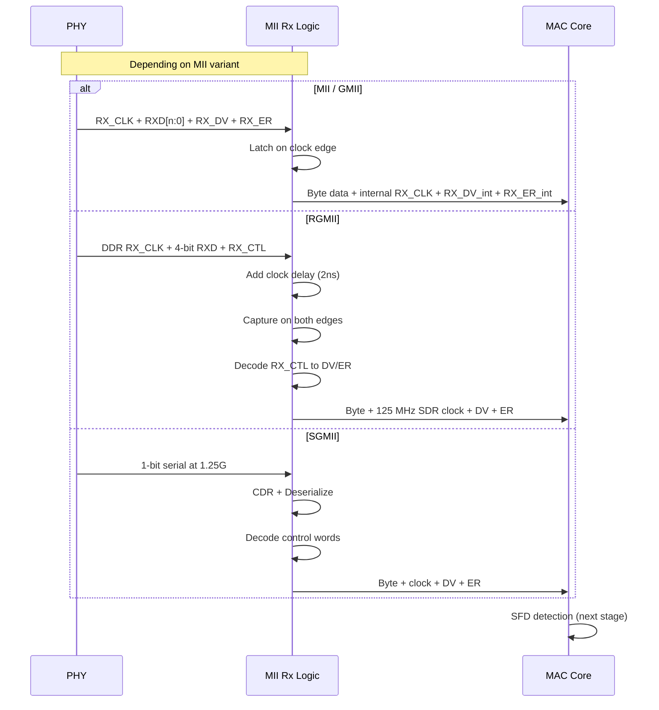

## MAC: MAC Rx:

Once the MII (or GMII for Gigabit) starts toggling that `RX_DV` (Receive Data Valid) pin and streaming 
nibbles/bytes, the MAC (Media Access Control) layer springs into action.

Below is the **MAC receive pipeline** picking up right after MII.

### 1.  MAC Rx – Starting Point (After MII)

The MAC core now sees a clean, **byte-aligned stream** with control signals:

| Signal from MII | Meaning |
|----------------|---------|
| `rxd[7:0]` | Data byte (each clock cycle) |
| `rx_clk` | Clock for latching (25/125 MHz) |
| `rx_dv` | 1 = valid data byte, 0 = idle |
| `rx_er` | 1 = PHY/MII detected error in current byte |

**Important**: The MAC does **not** see preamble or SFD yet – those are still in the byte stream.  
The MII does **not** strip preamble; it passes everything as-is.

### 2. MAC Rx Pipeline (Post-MII)

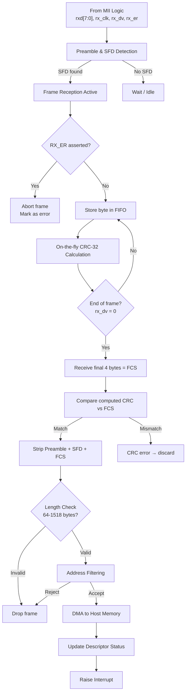

### 3. Detailed MAC Stage-by-Stage (Post-MII)

#### Stage 1 – Preamble & SFD Detection
The MAC continuously monitors the byte stream from MII:

**Preamble pattern** (7 bytes): `0x55 0x55 0x55 0x55 0x55 0x55 0x55` (binary `01010101`)  
**SFD** (1 byte): `0xD5` (binary `11010101`)

**MAC logic**:
- Wait for `rx_dv = 1` (frame start)
- Look for 7 consecutive `0x55` bytes followed by `0xD5`
- Once SFD detected, **next byte** is Destination Address (DA), byte 0 of Ethernet header

> **If no SFD found after 8+ bytes** → `rx_er` or abort frame

---

#### Stage 2 – Frame Reception Active
After SFD, the MAC enters **receive active** state:

- Each clock cycle with `rx_dv = 1` → accept byte
- Store byte in **Rx FIFO** (typically 2-4 KB depth)
- If FIFO fills → flow control (PAUSE frame or backpressure)

---

#### Stage 3 – Error Handling (RX_ER)
If `rx_er = 1` during reception:

| Scenario | MAC action |
|----------|------------|
| `rx_er=1` mid-frame | Abort frame immediately, discard, increment `rx_errors` |
| `rx_er=1` while `rx_dv=0` | Ignore (idle line error) |
| `rx_er=1` at end | Treat as CRC error |

---

#### Stage 4 – On-the-Fly CRC-32 Calculation
The MAC computes CRC-32 **as bytes arrive** (not after full frame):

- Start CRC with `0xFFFFFFFF`
- Process each byte from **DA through Payload** (exclude preamble/SFD/FCS)
- Use **parallel CRC** (8/32 bits per clock for Gigabit speeds)

**Hardware implementation** (simplified):
```verilog
// Parallel CRC-32 for Ethernet (one byte per clock)
crc_next = crc32_table[crc_current[31:24] ^ data_byte] ^ (crc_current << 8);
```

---

#### Stage 5 – End of Frame Detection
Frame ends when `rx_dv` transitions from 1 → 0.

At that moment:
- The **last 4 bytes** received are the FCS (Frame Check Sequence)
- MAC has already computed CRC over DA → Payload
- Compare computed CRC with received FCS

**Comparison logic**:
```
if (computed_crc == received_fcs)
    frame_valid = 1
else
    frame_valid = 0
```

#### Stage 6 – Strip Preamble, SFD, and FCS
The MAC removes these **before** DMA to host:

| Field | Bytes | Stored in memory? |
|-------|-------|-------------------|
| Preamble | 7 | ❌ No |
| SFD | 1 | ❌ No |
| Destination MAC | 6 | ✅ Yes |
| Source MAC | 6 | ✅ Yes |
| EtherType/Length | 2 | ✅ Yes |
| Payload | 46-1500 | ✅ Yes |
| FCS (CRC) | 4 | ❌ No (usually) |

> Some NICs optionally keep FCS for diagnostic (promiscuous + keep CRC mode)

Note: 
1. From above => MAC actually process after Preamble/SFD/FCS are stripped, and the size is:
    - 1500 (payload) + 6 (Dst) + 6 (Src) + 2 (Type/Len) = 1514 Bytes.
2. There are 2 more common scenarios where 1514 bytes number can grow:
    - VLAN Tagging (802.1Q):
        - If You are using VLANs, a 4-byte tag is inserted between the Source MAC and the EtherType:
          Which in which case MAC handles 1518 bytes. 
    - Jumbo Frames:
        In High performance data centers the payload is increased from 1500 to 9000 bytes, in which case:
        - MAC is processing 9014 or 9018 bytes.

3. And the Total Electric Foot Print on the wire : 1514+Preamble+SFD+FCS and inter-pkt gap) = 1526 bytes. 


#### Stage 7 – Length Check
After stripping, MAC verifies frame length (without FCS):

| Condition | Frame size (bytes) | Action |
|-----------|-------------------|--------|
| < 60 (no VLAN) | Runt | Drop, increment `rx_runt` |
| 60-1514 | Standard | Accept |
| 1515-1522 | With VLAN tag | Accept if VLAN enabled |
| > 1522 | Jumbo | Accept if jumbo enabled, else drop |
| > 9000 | Oversized | Drop |

> Note: Minimum frame without FCS = 60 bytes (64 including FCS)

#### Stage 8 – Address Filtering
MAC compares **Destination Address** (first 6 bytes of frame) with:

| Filter type | Match condition | Use case |
|-------------|----------------|----------|
| Unicast | Exact match with MAC address | Normal traffic |
| Broadcast | `FF:FF:FF:FF:FF:FF` | ARP, DHCP |
| Multicast | Hash table match | IPv6 ND, mDNS |
| Promiscuous | Always accept | Tcpdump/Wireshark |

**Hardware filtering** (typical):
- 16-64 perfect unicast filters
- 64-4096-bit multicast hash filter
- Promiscuous mode bypasses all

#### Stage 9 – DMA to Host Memory

After the MAC validates the frame ( and usually strips the FCS), the **DMA Engine** takes over to move the
data into system RAM without bothering CPU.

1. Setup: ( Descriptor Rings )

- Modern NICs use **Circular Buffer Rings** in host RAM.
- "Index Card": Each slot in the ring is a **Descriptor**.( i.e its data struct /metadata that provides
  info about a memory block). It contains the address of an empty memory buffer pre-allocated by the OS. 
- Each descriptor points to a buffer.

- Ownership: (`OWN` bit): 
    - `OWN = 1` NIC owns the descriptor ( ready to be filled )
    - `OWN = 0` The *Host/Driver* owns the descriptor ( data is ready to be read )

2. Step-by-Step flow:

    1. Fetch: DMA engine fetches the next descriptor from the ring and checks the `OWN` bit. 
        - If `OWN = 0`, the ring is full, and the NIC drops the incoming packet (RX Drop).
    2. Extract: It extracts the Host Buffer Address from that descriptor.
    3. Transfer (The Burst): The DMA engine writes the frame bytes (Destination MAC → Payload) directly 
       into the Host RAM via the PCIe bus.
    4. Status Write-Back: Once the transfer is complete, the NIC "signs off" by overwriting the descriptor
       in RAM with:
       - Actual Frame Length: (Since the buffer might be 2048 bytes but the packet only 64).
       - Check Results: Hardware-verified Checksum (IPv4/TCP/UDP) and CRC status.
       - VLAN Info: Any stripped VLAN tags.
    5. Flip Ownership: The NIC sets the `OWN` bit to 0. This is the signal to the CPU that "This packet is
       done and ready for you."
    6. Move: The DMA engine increments its internal pointer to the next descriptor in the ring.

In short the DMA Engine:
    
1. Fetches next **free descriptor** from host ring
2. Extracts host buffer address from descriptor
3. Writes frame bytes (DA → Payload) via PCIe/axi
4. Updates status word (CRC OK, length, timestamp).
    - Frame Length 
    - CRC pass/fail 
    - Timestamp 
    - VLAN tag (if present)
5. Clears OWN bit (ownership back to driver).
6. Moves to next descriptor.
7. No CPU involvement during data transfer.

**Descriptor ring example** (simplified):
```c
struct rx_desc {
    uint32_t buffer_addr;   // Host memory address
    uint16_t length;        // Frame length
    uint16_t status;        // CRC, errors, VLAN
    uint32_t next_desc;     // Next descriptor address
};
```

– The next stage is Interrupt / Status Update:
  - After DMA completes (or when RX ring is full), MAC raises interrupt.
  - Driver reads status, processes frames, refills descriptors.

---

#### Stage 10 – Interrupt & Driver Notification

1. The Signal: 
    - After one or more DMAs are complete, the MAC raises an Interrupt (MSI-X/IRQ).

2. Throttling: 
    - To save CPU cycles, the NIC uses Interrupt Coalescing (waits for a few pkts or a small timer before 
      "ringing the bell").

3. The Clean-up: 
    - The Driver sees the interrupt and checks the ring:
        * It processes all descriptors where `OWN == 0`.
        * It passes the data up to the Network Stack (IP/TCP).

4. The Refill: 
    - The Driver places a new empty buffer address in the descriptor and flips the `OWN` bit back to 1, 
      handing control back to the NIC.

```c 
struct rx_desc {
    uint64_t buffer_addr;   // Physical RAM address provided by OS
    uint16_t length;        // Written by NIC: Size of arrived packet
    uint16_t status_flags;  // Written by NIC: Checksum OK, End of Packet, etc.
    uint32_t control;       // Includes the 'OWN' bit (1=NIC, 0=CPU)
};
``` 

5. summary

| Condition | Action |
|-----------|--------|
| Single frame | Set interrupt pending bit |
| Multiple frames | Coalesce interrupts (Linux NAPI) |
| Ring full | Set "receive ring full" interrupt |
| Error frame | Increment stats, no interrupt (usually) |

Driver then:
- Reads status from descriptor
- Passes frame to network stack (e.g., `netif_rx` in Linux)
- Refills descriptor with new buffer
- Clears interrupt

---

### 4. Complete Sequence Diagram (PHY → MII → MAC → DMA)

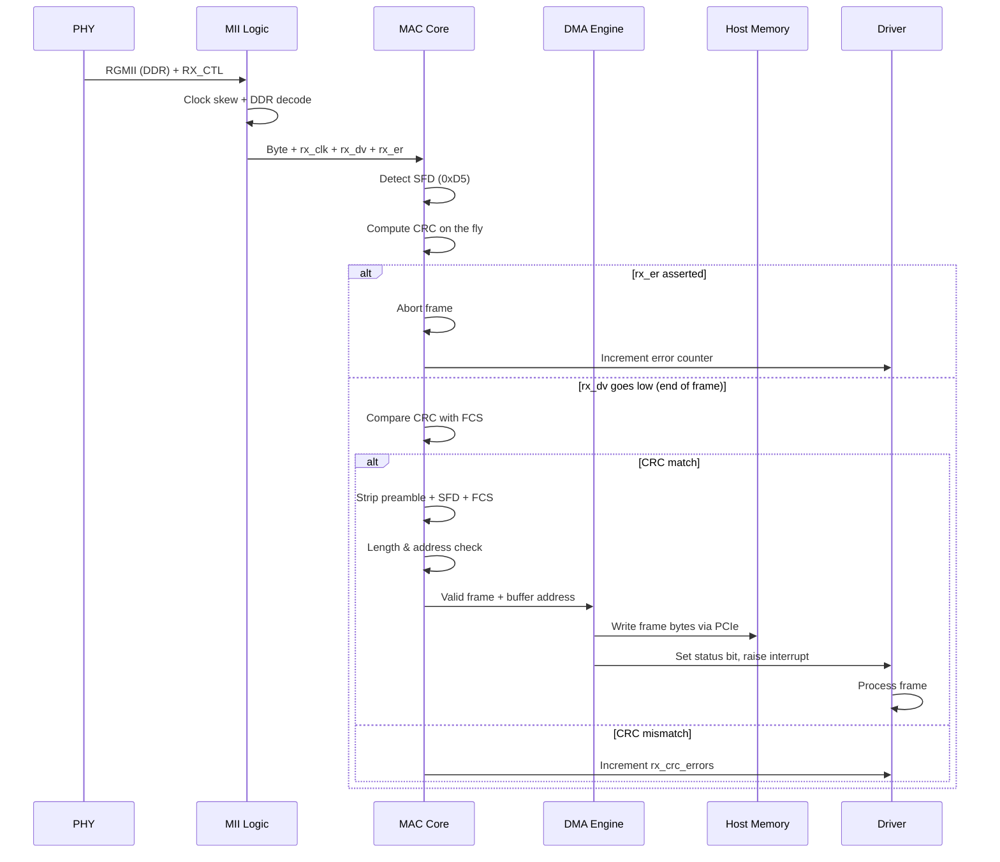

---

### 5. Summary Table – MAC Rx Stages (Post-MII)

| Stage | Input | Output | Key register/flag |
|-------|-------|--------|-------------------|
| SFD detect | Byte stream | Frame start | `sfd_found` |
| CRC calc | DA → Payload | 32-bit CRC | `crc_register` |
| End detect | rx_dv fall | Frame complete | `rx_end` |
| CRC check | FCS bytes | Valid/invalid | `crc_match` |
| Strip | Preamble/SFD/FCS | Clean frame | `strip_enable` |
| Length check | Frame size | Pass/fail | `rx_len_ok` |
| Address filter | DA | Accept/drop | `filter_hit` |
| DMA | Frame bytes | Host memory | `descriptor_owner` |
| Interrupt | Status update | Driver wake | `rx_done_irq` |

### 6. What the MAC Does NOT Do (Post-MII)

| Function | Handled by |
|----------|------------|
| Clock recovery | PHY CDR |
| Line decoding (8B/10B) | PHY (or SGMII MII logic) |
| Analog equalization | PHY AFE |
| RGMII DDR assembly | MII logic |
| IP/TCP checksum | Optional offload engine (beyond MAC) |
| Packet routing | Network stack (CPU) |

### 7. Real-World Example – Intel I210 MAC (Gigabit)

| Feature | Implementation |
|---------|----------------|
| Rx FIFO | 16 KB |
| CRC engine | 32-bit parallel (1 cycle/byte) |
| Address filters | 16 perfect + 4096-bit hash |
| Descriptors | 64-byte each, up to 1024 entries |
| DMA | 64-bit, MSI-X interrupts |
| Offloads | TCP/UDP checksum, VLAN stripping, RSS |

**Latency**: MII input → DMA start ≈ 5-10 µs (depends on frame size)

## DMA and OS integration: 

```
PHY → MII → MAC (FIFO + CRC + Filtering)
```

Now the next stage is:

```
MAC → DMA → System Memory → OS Network Stack
```

### 1. High-Level Stages (DMA + OS)

Once the MAC has a **valid frame** in its **Rx FIFO**:

1. **DMA engine notification** – MAC signals DMA (descriptor ready)
2. **Descriptor fetch** – DMA reads next free descriptor from host memory
3. **Buffer address extraction** – DMA gets host physical address
4. **Data transfer** – DMA copies frame from MAC FIFO → host memory (PCIe/AXI)
5. **Status write-back** – DMA updates descriptor with frame length, timestamp, errors
6. **Interrupt generation** – DMA raises IRQ to CPU
7. **Driver interrupt handler** – Acknowledges IRQ, schedules NAPI (Linux)
8. **OS network stack** – Packet traverses `netif_rx` → IP → TCP/UDP → socket
9. **Application delivery** – `recv()` or `read()` returns data to userspace

> **Key point**: The CPU is **not involved** in copying data – DMA does it directly.

---

### 2. DMA + OS Packet Flow

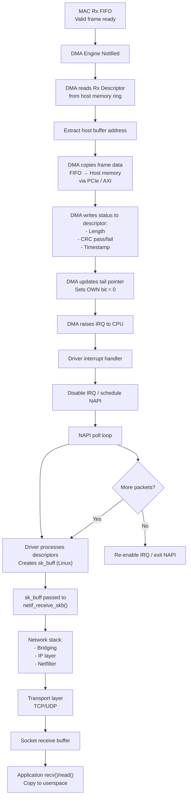

### 3. Detailed DMA Stage-by-Stage

#### Stage 1 – DMA Engine Notification
When MAC has a **complete frame** in FIFO:

| Condition | DMA action |
|-----------|-------------|
| Frame passes CRC | DMA starts immediately |
| Frame fails CRC | DMA **not** started (discard) |
| FIFO threshold met | Optional: start before full frame (cut-through) |

**Hardware signal**: MAC asserts `dma_req` to DMA engine.

#### Stage 2 – Descriptor Ring Overview
The driver pre-allocates a **circular buffer** of descriptors in host memory:

**Descriptor structure** (typical, e.g., Intel I210):
```c
struct rx_descriptor {
    uint64_t buffer_addr;   // Physical address of host buffer
    uint16_t length;        // Frame length (filled by DMA)
    uint16_t checksum;      // IP/TCP checksum offload
    uint32_t status;        // OWN bit, CRC error, VLAN tag
    uint32_t timestamp;     // Hardware timestamp (PTP)
};
```

**Descriptor ring** (size = 64, 128, 256, 512, 1024 entries):

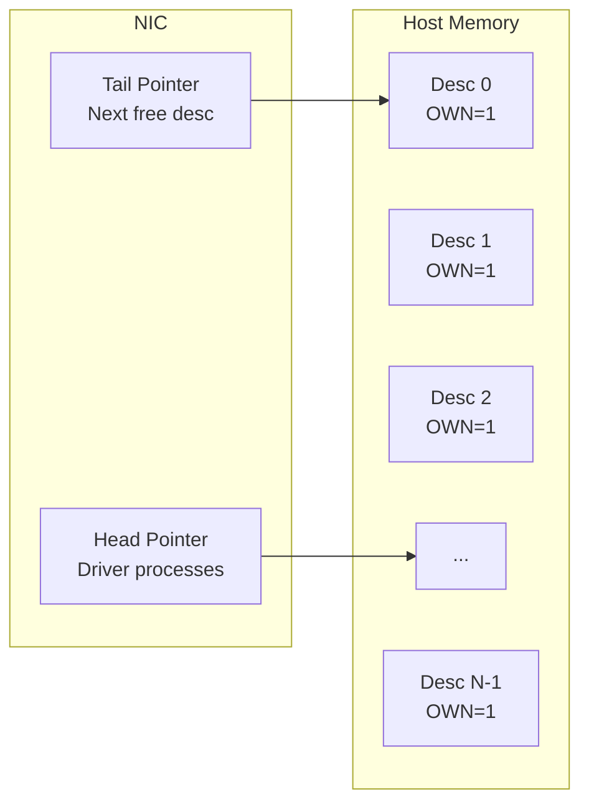

**OWN bit semantics**:
- `OWN = 1` → NIC owns descriptor (can write)
- `OWN = 0` → Driver owns descriptor (processed)

---

#### Stage 3 – Descriptor Fetch

DMA engine performs **PCIe read transaction**:

```
NIC → PCIe → Memory Controller → Host RAM
```

| Step | Operation |
|-------|-----------|
| 1 | DMA reads descriptor at `ring_base + (tail * desc_size)` |
| 2 | Extracts `buffer_addr` (physical address) |
| 3 | Validates address (page-aligned, within DMA mask) |

> **Latency**: ~200-500 ns for descriptor fetch (modern PCIe Gen3)

---

#### Stage 4 – Data Transfer (FIFO → Host Memory)
DMA copies frame bytes from **MAC FIFO** to **host buffer**:

**Transfer size**: 64 bytes (minimum) to 9000+ bytes (jumbo)

**Bus transaction** (PCIe):
- Uses **Memory Write** (MWr) TLPs
- Max payload size = 128/256/512 bytes per TLP
- Multiple TLPs for large frames

**Example**: 1500-byte frame with 256-byte MPS:
```
TLP 1: Bytes 0-255   (MWr)
TLP 2: Bytes 256-511 (MWr)
TLP 3: Bytes 512-767 (MWr)
TLP 4: Bytes 768-1023 (MWr)
TLP 5: Bytes 1024-1279 (MWr)
TLP 6: Bytes 1280-1499 (MWr, last)
```

> **No CPU cache involved** – DMA writes directly to DRAM (may invalidate cache lines)

---

#### Stage 5 – Status Write-Back
After data transfer completes, DMA writes **status** to descriptor:

| Status field | Value |
|--------------|-------|
| Length | Actual frame bytes (e.g., 1514) |
| CRC error | 0 = good, 1 = bad |
| VLAN tag | Extracted from frame (if present) |
| IP checksum | Calculated by hardware (offload) |
| Timestamp | PTP hardware clock value |

**Write transaction**: DMA updates descriptor in host memory (MWr TLP)

---

#### Stage 6 – Tail Pointer Update
DMA increments **tail pointer** (NIC register) to next descriptor:

```
tail = (tail + 1) % ring_size
```

NIC now owns the **next descriptor** for future frames.

**Ring behavior**:
- If `tail == head` → ring empty (NIC waits)
- If `head == tail - 1` → ring full (NIC drops packets)

---

#### Stage 7 – Interrupt Generation
DMA raises **MSI-X interrupt** to CPU:

**Interrupt coalescing** (modern NICs):
- Interrupt per frame? → Too many IRQs (150k/sec at 1 Gbps)
- Instead: Interrupt after:
  - N frames received (e.g., every 32 frames)
  - Timeout reached (e.g., 50 µs without new frame)
  - Ring half-full

**Linux NAPI** relies on this coalescing.

### 4. OS Interrupt & Driver Handling

#### Stage 8 – CPU Interrupt Handler

When CPU receives IRQ:

```c
// Simplified driver interrupt handler (Linux)
irqreturn_t ixgbe_intr(int irq, void *data) {
    struct adapter *adapter = data;
    
    // Read NIC status register
    uint32_t status = readl(adapter->hw_addr + IXGBE_EICR);
    
    if (status & IXGBE_EICR_RX_QUEUE) {
        // Disable RX interrupt temporarily (NAPI polling)
        writel(IXGBE_EICR_RX_QUEUE, adapter->hw_addr + IXGBE_EIAC);
        
        // Schedule NAPI poll
        napi_schedule(&adapter->napi);
    }
    
    return IRQ_HANDLED;
}
```

**Key points**:
- Handler runs in **interrupt context** (cannot sleep, limited stack)
- Does minimal work – just schedules NAPI
- Returns quickly (microseconds)

---

#### Stage 9 – NAPI Poll Loop

NAPI (New API) allows **polling** instead of interrupt-per-packet:

```c
int ixgbe_poll(struct napi_struct *napi, int budget) {
    struct adapter *adapter = container_of(napi, struct adapter, napi);
    int work_done = 0;
    
    // Process up to 'budget' packets (e.g., 64)
    while (work_done < budget) {
        struct sk_buff *skb = ixgbe_fetch_rx_packet(adapter);
        if (!skb)
            break;
        
        // Pass to network stack
        netif_receive_skb(skb);
        work_done++;
    }
    
    if (work_done < budget) {
        // No more packets – re-enable interrupts
        napi_complete(napi);
        writel(IXGBE_EICR_RX_QUEUE, adapter->hw_addr + IXGBE_EIAC);
    }
    
    return work_done;
}
```

**NAPI benefits**:
- Interrupt rate drops from 150k/sec → 1-2k/sec
- Better CPU cache locality
- Higher throughput (especially at 10+ Gbps)

---

#### Stage 10 – Driver Creates sk_buff
For each descriptor, driver:

```c
struct sk_buff *ixgbe_fetch_rx_packet(struct adapter *adapter) {
    struct rx_desc *desc = get_current_descriptor(adapter);
    
    // Check OWN bit (0 = driver owns)
    if (desc->status & IXGBE_RXD_STAT_DD) {
        // Get buffer address from descriptor
        dma_addr_t dma_addr = desc->buffer_addr;
        
        // Create sk_buff (Linux socket buffer)
        struct sk_buff *skb = build_skb(dma_addr, desc->length);
        
        // Set metadata
        skb->protocol = eth_type_trans(skb, adapter->netdev);
        skb->ip_summed = CHECKSUM_UNNECESSARY; // HW checksum good
        skb->dev = adapter->netdev;
        
        // Give buffer back to NIC (refill)
        refill_rx_buffer(adapter, desc);
        
        return skb;
    }
    
    return NULL;
}
```

**Buffer recycling**:
- Driver allocates new buffer for descriptor
- Maps buffer via DMA API (`dma_map_single`)
- Writes physical address to descriptor
- Sets OWN bit = 1 (NIC owns again)

---

### 5. OS Network Stack Processing

### Stage 11 – netif_receive_skb() (Layer 2)
Entry point to network stack:

```c
int netif_receive_skb(struct sk_buff *skb) {
    // Packet tapping (tcpdump)
    if (packet_rcv_hook)
        packet_rcv_hook(skb);
    
    // Bridge (if configured)
    if (skb->dev->br_port)
        return br_handle_frame(skb);
    
    // VLAN handling
    if (skb->protocol == htons(ETH_P_8021Q))
        vlan_do_receive(skb);
    
    // Pass to Layer 3 (IP, ARP, etc.)
    return deliver_skb(skb);
}
```

---

#### Stage 12 – IP Layer (Layer 3)
```c
int ip_rcv(struct sk_buff *skb) {
    // Verify IP header
    if (ip_hdr(skb)->version != 4)
        goto drop;
    
    // Netfilter (iptables)
    if (nf_hook(NF_INET_PRE_ROUTING, skb))
        goto drop;
    
    // Defragmentation if needed
    if (ip_is_fragment(ip_hdr(skb)))
        return ip_defrag(skb);
    
    // Route lookup
    struct rtable *rt = ip_route_input(skb);
    
    // Pass to higher layer (TCP/UDP)
    return ip_local_deliver(skb);
}
```

---

#### Stage 13 – TCP/UDP Layer (Layer 4)
**UDP example**:
```c
int udp_rcv(struct sk_buff *skb) {
    struct udphdr *uh = udp_hdr(skb);
    
    // Find socket by port
    struct sock *sk = udp_v4_lookup(uh->dest);
    
    // Add to socket receive buffer
    skb_queue_tail(&sk->sk_receive_queue, skb);
    
    // Wake up waiting process
    sk->sk_data_ready(sk);
    
    return 0;
}
```

**TCP example** (more complex):
- Sequence number checking
- In-order queueing
- Flow control (window)
- Retransmission detection
- Wake up blocked `recv()`

---

#### Stage 14 – Socket Receive Buffer
Data sits in socket buffer until application reads:

```c
// Application syscall
ssize_t recv(int sockfd, void *buf, size_t len, int flags) {
    struct sock *sk = sockfd_lookup(sockfd);
    
    // Wait for data if socket is blocking
    if (skb_queue_empty(&sk->sk_receive_queue)) {
        wait_event_interruptible(sk->sk_sleep, 
                                 !skb_queue_empty(&sk->sk_receive_queue));
    }
    
    // Copy from kernel to userspace
    skb = skb_dequeue(&sk->sk_receive_queue);
    len = skb_copy_datagram(skb, 0, buf, min(len, skb->len));
    
    return len;
}
```

---

#### Stage 15 – Application Receives Data
Finally, data reaches **userspace**:

```c
// Application code
char buffer[1500];
int n = recv(socket_fd, buffer, sizeof(buffer), 0);
printf("Received %d bytes: %s\n", n, buffer);
```

**Memory copies so far**:
1. PHY → MAC FIFO (hardware)
2. MAC FIFO → Host buffer (DMA, no CPU)
3. Host buffer → sk_buff (kernel, often zero-copy with `build_skb()`)
4. sk_buff → Socket buffer (pointer handoff, no copy)
5. Socket buffer → Userspace buffer (one final copy)

**Total CPU copies**: 1 (kernel → userspace)

---

### 6. Complete End-to-End Sequence Diagram

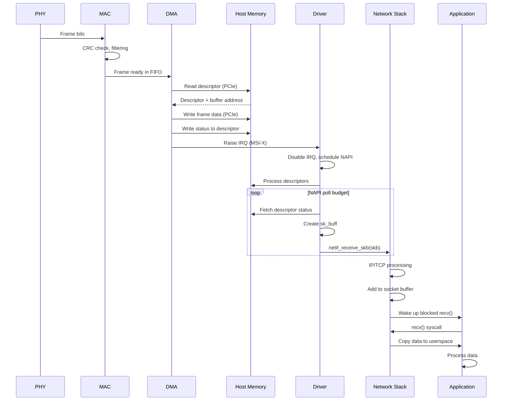

---

### 7. Summary Table – DMA + OS Stages

| Stage | Component | Operation | CPU involved? |
|-------|-----------|-----------|----------------|
| DMA notification | MAC → DMA | Assert dma_req | No |
| Descriptor fetch | DMA → Host | PCIe read | No |
| Data transfer | DMA → Host | PCIe write (MWr) | No |
| Status write-back | DMA → Host | Update descriptor | No |
| Interrupt | DMA → CPU | MSI-X IRQ | Yes (handler) |
| NAPI poll | Driver → Host | Process descriptors | Yes |
| sk_buff creation | Driver | Zero-copy or alloc | Yes |
| Network stack | Kernel | IP/TCP/UDP | Yes |
| Socket buffer | Kernel | Queue packet | Yes |
| System call | App → Kernel | recv()/read() | Yes |
| Copy to userspace | Kernel → App | copy_to_user() | Yes |

---

### 8. Performance Optimizations (Modern NICs)

| Technique | Benefit |
|-----------|---------|
| RSS (Receive Side Scaling) | Multiple CPU cores, one queue per core |
| Zero-copy DMA | Build sk_buff directly around DMA buffer |
| Interrupt coalescing | Reduces IRQ rate from 150k/sec → 5k/sec |
| Large Receive Offload (LRO) | Aggregate small TCP segments |
| TCP/UDP checksum offload | NIC computes checksum |
| VLAN stripping | NIC removes VLAN tag |
| Timestamping | PTP hardware clock |

**Example: RSS queue mapping**:
```
Frame hash (IP src/dst) → Queue ID → CPU core
Queue 0 → CPU 0
Queue 1 → CPU 1
Queue 2 → CPU 2
Queue 3 → CPU 3
```

---

### 9. Complete Path Summary

```
Electrical signal (wire)
    ↓
PHY (AFE → CDR → Decode)
    ↓
MII (Clock sync, DDR decode, error extraction)
    ↓
MAC (SFD detect → CRC → Filter → FIFO)
    ↓
DMA (Descriptor fetch → Data copy → Status write-back)
    ↓
Interrupt (MSI-X → CPU)
    ↓
Driver (NAPI → sk_buff creation)
    ↓
Network Stack (netif_receive_skb → IP → TCP/UDP)
    ↓
Socket Buffer (sk_receive_queue)
    ↓
System Call (recv() → copy_to_user)
    ↓
Application (userspace buffer)
```

**Latency** (typical, 1 Gbps):
- PHY+MAC+DMA: ~5-10 µs
- Interrupt+Driver: ~10-20 µs
- Network stack: ~20-50 µs
- Total: ~35-80 µs (wire to app)

**Throughput** (10 Gbps): DMA can saturate PCIe Gen3 (8 GB/s) without CPU involvement.

Now you have the **complete picture** from electrical signal to `recv()` in userspace!


-----------------------------------------------------------------------------------------------------------

### 1. The Hard IRQ (Hardware Interrupt)
Once the packet is in RAM:
* **The Signal:** The NIC sends a hardware interrupt (**IRQ**) to the CPU to signal that new data has arrived.
* **The Handler:** The CPU executes the registered IRQ handler for that NIC driver.
* **NAPI Initiation:** Modern Linux drivers use **NAPI** (New API). Instead of handling every packet via IRQ (which would cause "livelock"), the IRQ handler simply disables further hardware interrupts for the NIC and schedules a **SoftIRQ**.

### 2. The SoftIRQ & Poll (NAPI)
This is where the heavy lifting happens in the kernel context:
* **`ksoftirqd`:** The kernel thread (or the end of the hardware interrupt) triggers `NET_RX_SOFTIRQ`.
* **Polling:** The driver’s `poll()` method is called. It harvests packets from the RX Ring buffer in RAM.
* **sk_buff Creation:** The raw data is wrapped into a metadata structure called an **`sk_buff`** (socket buffer). This is the primary object used by the Linux stack.

### 3. The Network Stack Entry
* **`netif_receive_skb()`:** The driver passes the `sk_buff` to this core function.
* **Taps & Delivery:** If tools like `tcpdump` (AF_PACKET) are running, the packet is cloned and sent to them here.
* **Protocol Layer:** The kernel looks at the Ethernet header to decide where to send it next (e.g., IPv4, IPv6, or ARP). 
* **IP Processing:** The packet enters `ip_rcv()`. Here, netfilter hooks (PREROUTING) are executed, and the routing table is consulted to see if the packet is destined for the local machine or needs to be forwarded.

---

### 5. Flow Visualization 

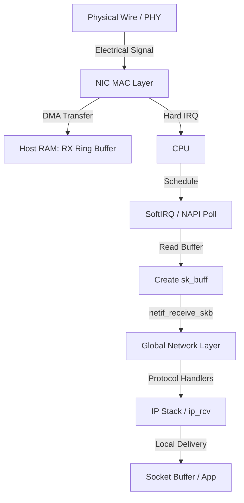

---

### 6. Tools and Observability

To learn and verify these steps, you can use the following system files and tools:

### Hardware & Interrupts
* **`/proc/interrupts`**: Check how many hard interrupts are hitting specific CPU cores for your NIC (e.g., `watch -n1 cat /proc/interrupts`).
* **`/proc/softirqs`**: Monitor `NET_RX` counters to see the SoftIRQ processing load.
* **`ethtool -S <eth0>`**: Shows hardware-level statistics (drops, errors, packets received by the NIC hardware).

### NAPI & Driver Statistics
* **`/proc/net/softnet_stat`**: Crucial for identifying bottlenecks.
    * *Column 1:* Total packets processed.
    * *Column 2:* Packets dropped due to `netdev_max_backlog` being exceeded.
    * *Column 3:* Number of times the NAPI poll was terminated because it ran out of "quota."

#### Tuning the "Pipeline"
* **`/proc/sys/net/core/netdev_max_backlog`**: The maximum number of packets queued on the input side when the interface receives packets faster than the kernel can process them.
* **`/sys/class/net/<dev>/queues/rx-<n>/`**: Explore Receive Side Scaling (RSS) settings to see how packets are distributed across CPU cores.

#### Tracing
* **`perf top`**: Look for functions like `net_rx_action` or driver-specific poll functions to see where the CPU is spending time during heavy traffic.
* **`dropwatch`**: A tool to find exactly where in the kernel the packet is being dropped (if it's not reaching the app).

---

# packet flow with XDP: 

When XDP (eXpress Data Path) enters the picture, it essentially "hijacks" the traditional flow you just learned. Depending on the mode, the hook is placed at different stages of the "data to CPU" pipeline.

Here is the breakdown of those three modes:

1.  **Offload Mode (xdp-offload):** The XDP program is loaded directly onto the NIC hardware (NFP or SmartNICs). The packet is processed or dropped before it even touches host RAM or the CPU.
2.  **Native Mode (xdp-native):** This is the "standard" high-performance mode. The hook is located inside the **Network Driver** at the earliest possible point in the CPU cycle—right after the DMA transfer but *before* an `sk_buff` metadata structure is even allocated.
3.  **Generic Mode (xdp-generic/skb):** This is a "fallback" mode for drivers that don't support XDP natively. The hook is placed much later, after the kernel has already done the work of wrapping the packet in an `sk_buff`. It offers no performance benefit but is great for testing.

---

### XDP Hook Points Flow

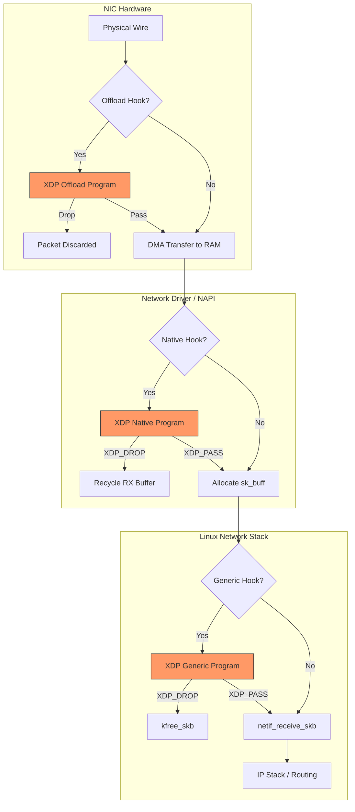

---

### How to Check and Monitor XDP Modes

If you are learning or debugging these hooks, these commands are your "eyes" into the kernel:

* **`ip link show <dev>`**: This is the quickest way to see what's running. Look for `xdp` or `xdpgeneric` in the output.
    * `prog/xdp`: Indicates Native mode.
    * `prog/xdpgeneric`: Indicates Generic (skb) mode.
* **`bpftool net list`**: Specifically designed to show which BPF programs are attached to which network interfaces and in which mode (xdp, tc, etc.).
* **`ethtool -i <dev>`**: Check your driver version. Native XDP support is highly dependent on the driver (e.g., `i40e`, `mlx5_core`, `virtio_net`).
* **`/sys/fs/bpf/`**: If your XDP programs are "pinned" (made persistent), you can find them here.
* **`cat /sys/kernel/debug/tracing/trace_pipe`**: If you use `bpf_printk()` in your XDP code for learning, the output will stream here.

---

## XDP Actions:

The power of XDP isn't just in the "Go/No-Go" decision of dropping or passing; it’s in its ability to manipulate the packet and redirect it entirely, bypassing the local CPU's stack or sending it back out where it came from.

Here is the flow of the possible return codes (actions) an XDP program can trigger:

### XDP Action Outcomes

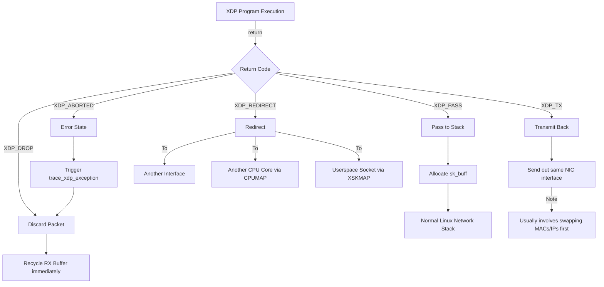

---

### Deep Dive into the Actions

* **`XDP_TX` (The Hairpin):** This is commonly used for load balancers or DDoS mitigators. After modifying the Ethernet header (switching source and destination MACs), the packet is pushed right back out of the same interface it arrived on. This is incredibly fast because it never touches the kernel's memory management.
* **`XDP_REDIRECT`:** This is the "Swiss Army Knife" of actions.
    * **Interface Redirect:** Moving a packet from `eth0` to `eth1` (software-defined switching).
    * **AF_XDP:** This allows you to hand the packet raw data directly to a high-performance application in userspace, bypassing the kernel stack entirely.
    * **CPUMAP:** You can load-balance the "stack processing" work by picking which CPU core should handle the `sk_buff` allocation for a specific packet.
* **`XDP_ABORTED`:** You should never manually return this in a "happy path." It’s meant for when your program hits a runtime error (like an out-of-bounds memory access). It behaves like `XDP_DROP` but logs an error to the kernel's trace pipe for debugging.

---

### Verification and Advanced Learning Tools

When you start playing with `XDP_TX` and `XDP_REDIRECT`, these files and tools become vital:

* **`/sys/kernel/debug/tracing/events/xdp/`**: This directory contains various tracepoints. You can enable them to see exactly what’s happening when a redirect fails or an exception occurs:
    * `echo 1 > /sys/kernel/debug/tracing/events/xdp/xdp_redirect/enable`
* **`bpftool map dump`**: XDP programs use **Maps** (like `devmap` or `cpumap`) to decide where to redirect. You can use this command to inspect the contents of those maps in real-time to see where your traffic is being routed.
* **`xdp-loader` (from xdp-tools)**: A modern utility to manage XDP programs. It simplifies the process of attaching and detaching compared to the older `ip link` commands.
* **`bpftool prog show`**: Use this to see the "tag" of your program and check if it has "helper" functions available (like `bpf_redirect_map`).


How are you planning to use these? If you're building a load balancer or a firewall, the `XDP_TX` vs `XDP_REDIRECT` choice is usually where the most interesting performance tuning happens.

Would you like to see a simple C snippet of how an XDP program actually decides to `XDP_DROP` or `XDP_PASS` a packet?


---

## Complex use-case:

AF_XDP (Address Family XDP) is the "high-speed exit" from the kernel. Instead of the kernel managing the packet memory via `sk_buff`, AF_XDP creates a **UMEM** (a shared memory region between the kernel and userspace) and uses **Ring Queues** to pass descriptors of that memory back and forth.

This allows for "Zero Copy" (ZC) performance, where the packet is DMA’d into RAM by the NIC and accessed directly by your C/Go/Rust application without a single CPU copy operation.

---

### The AF_XDP Architecture

The logic relies on four rings:
1.  **Fill Ring:** Userspace tells the Kernel: "Here are empty buffers you can use for new packets."
2.  **RX Ring:** Kernel tells Userspace: "I've put new packets into these buffers."
3.  **TX Ring:** Userspace tells the Kernel: "Please send the data in these buffers."
4.  **Completion Ring:** Kernel tells Userspace: "I've finished sending that data; you can have the buffer back."


### Integrated Flow: From PHY to Userspace App

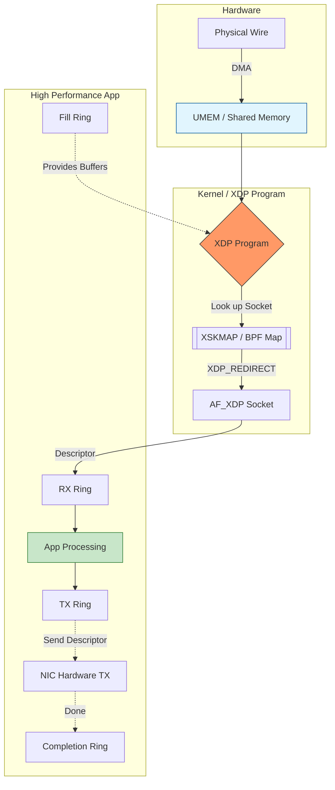

---

### Implementation Essentials

To implement this, you need three distinct parts working in concert:

#### 1. The XDP Kernel Program (C/eBPF)
The kernel side is simple: it just acts as a traffic cop. It checks the packet and, if it matches your criteria, redirects it to a specific entry in an `XSKMAP`.

```c
// Simplified XDP Kernel Snippet
SEC("xdp")
int xdp_sock_prog(struct xdp_md *ctx) {
    int index = 0; // Usually matches the Queue ID
    // Redirect packet to the socket pinned in map at 'index'
    return bpf_redirect_map(&xsks_map, index, XDP_PASS);
}
```

#### 2. The Userspace Setup (Libxdp / Libbpf)
The application must initialize the memory:
* **Allocate UMEM:** A large, page-aligned block of memory.
* **Create Rings:** Initialize the Fill, Completion, RX, and TX rings.
* **Bind Socket:** Bind the AF_XDP socket to a specific Netdev and Queue ID.

#### 3. The Control Plane
You must populate the `XSKMAP` with the file descriptor (FD) of your AF_XDP socket so the kernel knows which socket "owns" which queue.

---

### Tools for Debugging AF_XDP

* **`ss -xl`**: Use this to see the AF_XDP (XDP) sockets currently active on the system.
* **`ethtool -L <dev> combined <N>`**: AF_XDP usually binds to a specific hardware queue. You often need to configure your NIC queues to match your application threads.
* **`cat /proc/net/xdp`**: Provides a list of AF_XDP sockets and their associated device/queue IDs.
* **`perf stat -a`**: Monitor the CPU instructions per cycle (IPC). With AF_XDP, you should see very low "Kernel" time and very high "User" time, as the stack is bypassed.
* **`libxdp` examples**: Check the `xdp-project` GitHub. The `xdpsock` sample utility is the "gold standard" for testing if your driver supports Zero Copy.

> **Tip:** To achieve "Zero Copy" mode, your NIC driver must support it. If it doesn't, AF_XDP will transparently fall back to `copy mode`, which is still fast but lacks the extreme performance of ZC. You can check this in your app logs when binding the socket.

Are you looking to write the C code for the userspace ring management, or are you focusing on the orchestration of the maps?

---

## Summary:

Starting from the physical wire and moving toward **AF_XDP** is actually the most logical way to learn this because each layer "buys" you performance by sacrificing general-purpose convenience. 

Your approach follows the **"Path of Least Resistance"** for the packet: you are essentially moving the processing closer to the hardware to avoid the "toll booths" of the Linux kernel.

### Why your approach works for Planning

1.  **Phase 1 (Standard Stack):** You learned what you are trying to *avoid* (sk_buff allocation, context switching, and heavy protocol parsing).
2.  **Phase 2 (XDP Hooks):** You identified *where* to intercept. If you can drop a packet here, you save 90% of the CPU cost.
3.  **Phase 3 (AF_XDP):** You identified how to *bypass* the stack entirely for complex logic that is too heavy for eBPF but too slow for the kernel.

---

### The Integrated Planning Flow (Logical Architecture)

This diagram combines everything you've learned into a single decision-making pipeline. This is how you should "plan" your implementation:

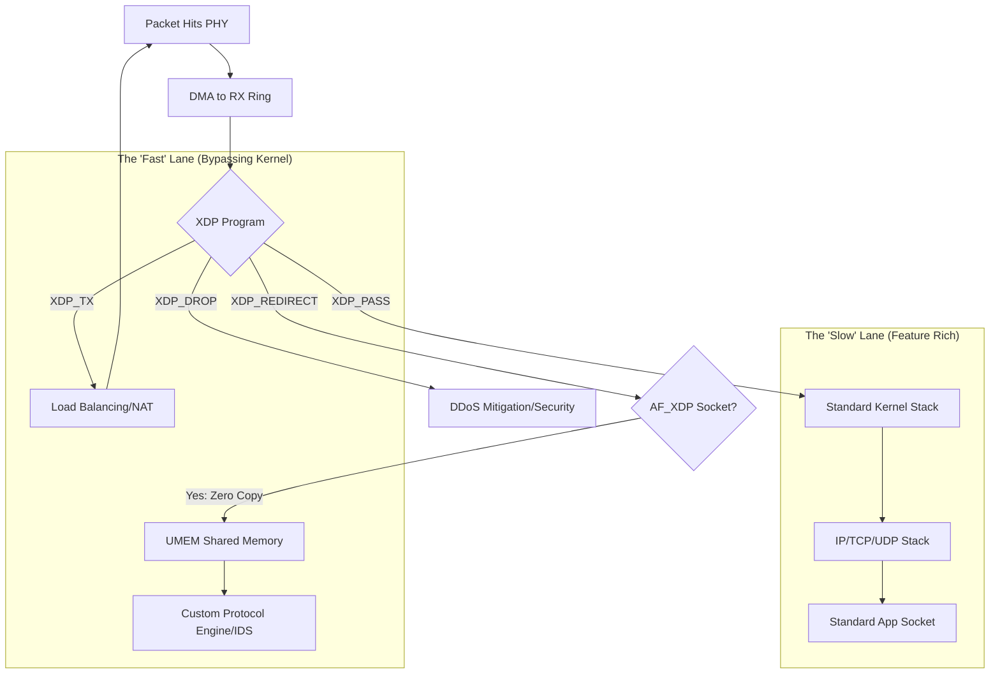

---

### Implementation Design Checklist

Before you hit the code, use this checklist to finalize your design:

#### 1. Hardware Capability
* **Does the NIC support Native XDP?** (Check `ethtool -i`). If not, you’re stuck with `xdpgeneric`, and AF_XDP performance will be significantly lower.
* **Does it support Zero Copy (ZC)?** This is vital for AF_XDP. Without it, the kernel still has to copy data into your UMEM.

#### 2. Memory Management (The UMEM)
* For AF_XDP, you must plan your **UMEM** size. Since it's fixed-size chunks (frames), you need to ensure your application can process the RX ring fast enough so the **Fill Ring** never runs dry. 
* **Pro-tip:** Use `hugepages` for your UMEM to reduce TLB misses during high-speed transfers.

#### 3. The "Fallback" Strategy
* What happens if your AF_XDP app crashes? If your XDP program is still redirecting packets to a dead socket, those packets are dropped.
* **Design Tip:** Implement a heartbeat or a "Pass on Error" logic in your XDP kernel program so traffic falls back to the standard kernel stack if the userspace app isn't responding.

#### 4. Observability Hookup
* **Standard:** `tcpdump` won't see packets dropped by XDP or redirected to AF_XDP. 
* **Modern:** You’ll need to use `xdp-dump` or attach a `fentry` BPF program to your XDP function to see what's happening during development.

### Useful `/sys` and `/proc` for Planning
* **`/proc/interrupts`**: Check if your NIC has multiple queues. You’ll want one AF_XDP socket per queue for maximum parallelism.
* **`/sys/class/net/<iface>/queues/`**: Verify the number of RX/TX queues. Your code should ideally pin one userspace thread to one queue/CPU.

**Verdict:** Your mental model is solid. You’ve mapped the "Hardware -> Hook -> Hand-off" pipeline correctly. You are ready to start defining your **UMEM** structures and writing the **eBPF C code**.

---

## SmartNIC:

Absolutely. Presenting this architecture to a SmartNIC (or DPU) development team is high-value because it bridges the gap between **Silicon Design** and **Linux Upstream Acceptability**.

If a team builds hardware that doesn't align with these specific Linux sub-systems, they end up forcing customers to use proprietary "bloatware" SDKs instead of standard Linux tools.

Here is how you can frame this as a strategic roadmap for a SmartNIC driver team:

---

## 1. Hardware/Firmware Requirements (The "Must-Haves")
To support the flow we discussed, the hardware and firmware must implement:
* **Descriptor Consistency:** The NIC must use a descriptor format that allows the driver to quickly determine packet length and status without multiple PCIe round-trips.
* **Header Splitting:** Ability to split headers from data. This is massive for AF_XDP, allowing the "payload" to go straight to UMEM while metadata stays in the kernel.
* **Multi-Queue Support:** RSS (Receive Side Scaling) must be programmable so XDP can steer specific flows to specific AF_XDP sockets pinned to specific CPU cores.

## 2. Driver Implementation Strategy
The team should focus on three specific "tiers" of integration:

| Feature Tier | Implementation | Value Prop |
| :--- | :--- | :--- |
| **Tier 1: XDP Native** | Implement `ndo_bpf` in the driver. | Allows the NIC to drop/redirect packets before `sk_buff` allocation. |
| **Tier 2: AF_XDP ZC** | Implement Zero-Copy (ZC) support in the RX/TX paths. | Enables the "Fast Lane" we mapped, bypassing kernel memory copies. |
| **Tier 3: XDP Offload** | Move the eBPF JIT compiler into the SmartNIC firmware. | Discards/Redirects traffic on the NIC SoC, leaving host CPUs at 0% load. |

---

## 3. The "Smart" in SmartNIC: Offloading Logic
Since this is a SmartNIC team, the ultimate goal is **XDP Offload Mode**. 

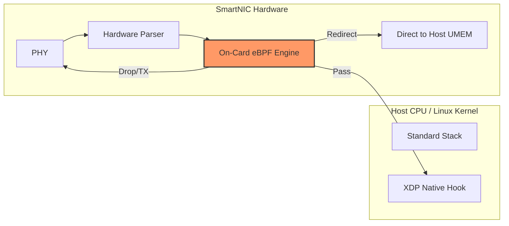


---

## 4. Key Prototyping Tools for the Team
During the design phase, the team can use these to validate their hardware/software interface:

* **`ethtool --set-priv-flags <dev> xdp-zc-force on`**: Forces the driver into Zero-Copy mode; if the hardware/firmware isn't ready, it should fail gracefully here.
* **`bpftool feature probe`**: Helps the team verify which eBPF helpers their driver currently supports.
* **`xdp-bench`**: A tool within the `xdp-tools` suite to measure the exact nanosecond overhead of the driver's packet processing path.
* **`/sys/kernel/debug/tracing/events/xdp`**: Monitoring `xdp_exception` during driver development is the fastest way to find bugs in the driver's memory management (e.g., failing to recycle buffers correctly).

---

### Final "Pitch" Point
By designing with **AF_XDP** and **XDP** in mind from day one, the team ensures the SmartNIC is **"Cloud Native."** It allows users to write a single eBPF program that runs on a standard NIC today and is automatically "accelerated" by the SmartNIC hardware tomorrow without changing a line of userspace code.

Does this help you structure the proposal for the driver team, or should we dive deeper into the memory-mapping (UMEM) constraints they'll face?

--- 

## Inputs for HW designing team:

This is a critical window. If the HW team doesn't design the silicon to be "eBPF-aware," the SW team will be forced into a "hacky" implementation later that kills performance.

When hardware is designed for Linux XDP/AF_XDP from the ground up, the primary goal is **reducing PCIe overhead and CPU cycle-count per packet.**

Here is a strategic breakdown of inputs you can provide to the HW and SW architecture teams to ensure the SmartNIC is a "first-class citizen" in the Linux networking ecosystem.

---

## 1. Input for the HW/ASIC Team: "The Data Path"
The hardware needs to support specific features to make XDP/AF_XDP efficient.

### A. Unified Buffer Management
* **The Problem:** Traditional NICs often assume they own the memory.
* **The HW Requirement:** The NIC must support **User-Provided Buffers**. In AF_XDP, the memory (UMEM) is allocated by the application. The HW must be able to DMA directly into these unaligned or specific memory offsets provided by the host.

### B. Header Splitting & Multi-Descriptor Support
* **The Requirement:** The ASIC should be able to parse headers (L2/L3/L4) and place them in a separate memory area (or a "head" area of the buffer) while the payload goes to a different offset. 
* **Why:** This allows the XDP program to inspect the header while keeping the payload in a "Zero Copy" state for userspace.

### C. Large/Flexible Descriptor Rings
* **The Requirement:** Support for very deep rings (e.g., 4096 or 8192 descriptors) and "Doorbell" batching.
* **Why:** XDP and AF_XDP process packets in batches. If the HW requires a "doorbell" ring (interrupting the NIC) for every single packet, the CPU will bottleneck on PCIe writes.


---

## 2. Input for the SW/Firmware Team: "The Driver Interface"
The software bridge must be built to "get out of the way" as fast as possible.

### A. Single-Step Metadata (The `xdp_hints` approach)
* **The Requirement:** The firmware should prep-populate packet metadata (vlan, hash, checksum status) in a specific "metadata area" right before the packet data in RAM.
* **Value:** This allows the XDP program to access hardware-calculated checksums or timestamps without the CPU having to re-calculate them.

### B. Zero-Copy (ZC) Path by Default
* **The Requirement:** The driver must implement the `ndo_xsk_wakeup` and `xsk_pool` interfaces.
* **Value:** This is the difference between a "fast" NIC and a "SmartNIC." Without ZC, the packet is copied in memory, negating the hardware speed.

---

## 3. High-Level Design Flow for the SmartNIC
This mermaid block illustrates how the HW and SW should interact to support the complex AF_XDP use case.

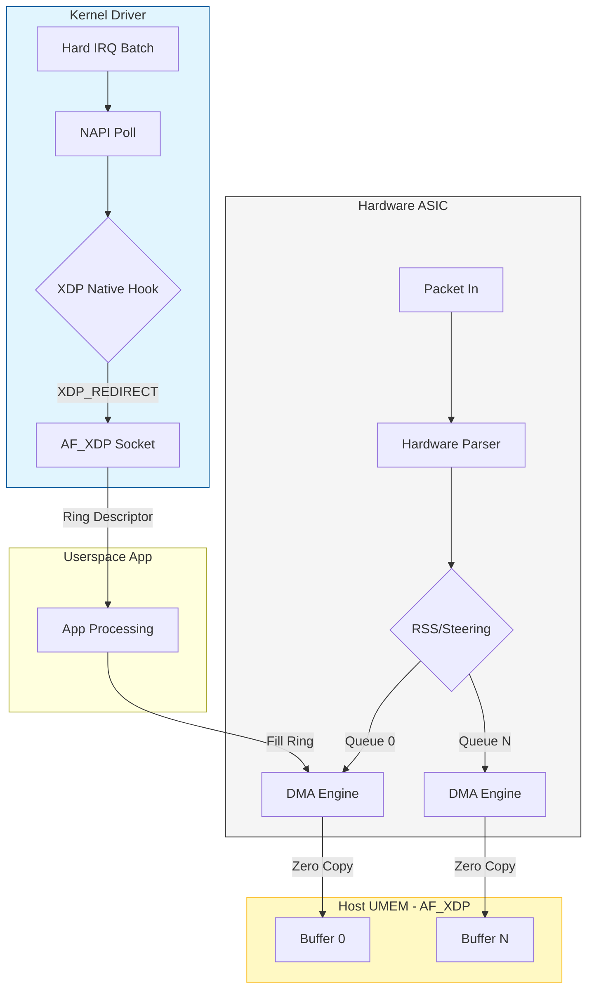

---

## 4. Key Performance Metric Goals (KPIs)
When presenting to the teams, set these targets for the design phase:

| Metric | Target | Why? |
| :--- | :--- | :--- |
| **Context Switches** | 0 per batch | Use NAPI polling to keep the CPU in a "hot" loop. |
| **PCIe Transactions** | Batched | One PCIe "Doorbell" should signal 16-64 packets. |
| **Latency (Wire-to-App)** | < 10 microseconds | Required for high-frequency trading or 5G telco apps. |
| **Throughput** | Line Rate (100G+) | XDP must be able to drop/pass at wire speed. |

## 5. System Check: "The Sandbox"
Even before hardware is ready, the team can use **`virtio-net`** in a VM or the **`netdevsim`** (Network Device Simulator) in the Linux kernel to mock the driver behavior.

* **`modprobe netdevsim`**: Allows the SW team to simulate a NIC that supports XDP offload.
* **`bpftool dev list`**: Use this to check if the simulated device is correctly reporting "Smart" features to the kernel.

**The ultimate goal:** You want the hardware to be so compatible with Linux that a user can plug it in and use `xdp-loader` without ever downloading a proprietary driver. That is the gold standard for modern SmartNICs.
