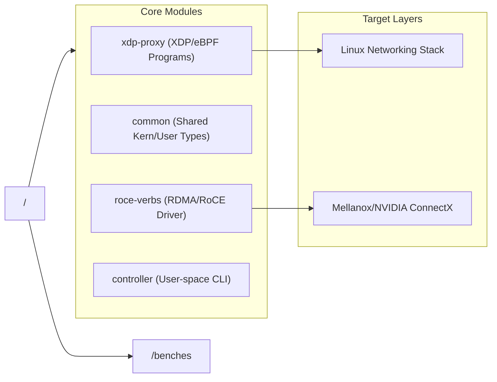
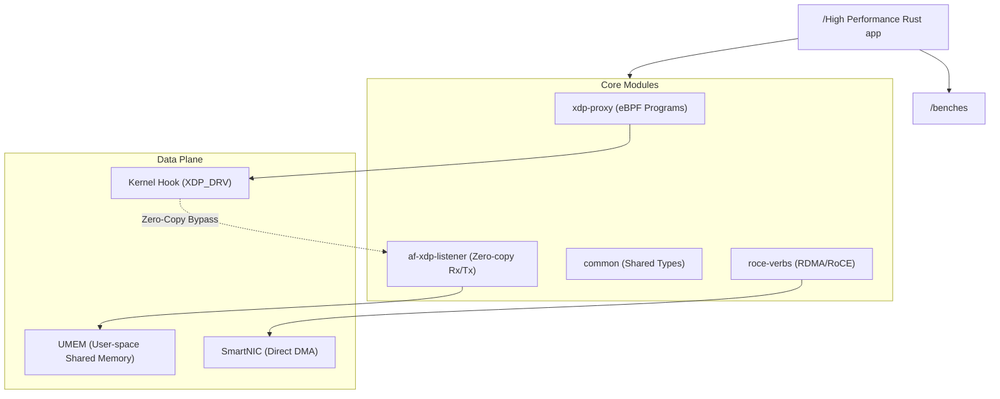

# Rust Systems programming examples

## High-Performance Systems & Data-Plane Rust

This repo is dedicated to low-latency, HW aware systems programming, focusing on **XDP (eXpress Data Path)**, 
**RoCE (RDMA over Converged Ethernet)**, and **Linux Kernel development**.

---

## Why Rust for High-Performance Systems?

Traditionally, systems programming (Kernel, NIC drivers, Telemetry) was the exclusive domain of C and C++. 
While these languages offer the "near-metal" control required, they lack memory safety, leading to critical
vulnerabilities (Use-after-free, Buffer overflows) that are particularly catastrophic in the kernel.

Rust provides a **third way**: Performance that matches or exceeds C/C++, with a compiler-enforced safety 
model.

### The Rust Ecosystem Support for Systems

The transition of high-performance networking to Rust is supported by three primary pillars:

1.  **Zero-Cost Abstractions:** 

    - Rust’s ownership model allows for "Zero-Copy" networking. 
    - You can pass a packet buffer from the NIC to a user-space application without a single `memcpy`, and
      the compiler ensures the memory is never accessed once it's returned to the hardware.
2. **Aya & eBPF:** 

    - Unlike traditional LLVM-based C workflows for eBPF, the **Aya** framework allows
      writing both kernel-space BPF programs and user-space loaders in pure Rust. It shares types between 
      the two, removing the "brittleness" of FFI boundaries.

3.  **No Standard Library (`no_std`):** 
    - Rust's ability to run without a runtime or standard library makes it native to the Linux Kernel env 
      and embedded NIC firmware.

---

## 🏗 Repository Architecture

This monorepo uses a **Cargo Workspace** to manage the lifecycle of kernel-resident code and user-land 
controllers.






### 1. The "Systems-First" Repository Layout

In high-performance systems, you often have a **User-space agent** and a **Kernel/Hardware-space component**. A workspace layout keeps them coupled but distinct.

```text
/my-systems-portfolio
├── Cargo.toml                # Workspace definition
├── crates/
│   ├── common-sys/           # Shared FFI bindings, types, and logging
│   ├── ebpf-programs/        # XDP/TC programs (using Aya or libbpf-rs)
│   ├── roce-driver/          # RoCE/RDMA verbs implementation
│   └── pcie-tools/           # Direct hardware access/MMIO utilities
├── kernel/                   # Rust Linux Kernel modules (using 'Rust for Linux')
├── benches/                  # Performance benchmarks (Criterion/Iai)
├── scripts/                  # Setup scripts (hugepages, NIC binding, bpftool)
└── README.md                 # Your high-level "System Architecture" doc
```

---

### 2. Core Pillars for Your GitHub Portfolio

To demonstrate mastery in these specific areas, focus on these implementation details in your code:

#### **A. Memory Management (The RoCE/RDMA Angle)**
In RoCE, performance lives and dies by **Zero-Copy**. 
* **What to show:** Custom `Allocator` implementations that use **Hugepages** or **Pinned Memory**. 
* **Key Concept:** Use `std::ptr` and `std::mem::MaybeUninit` to show you understand how to manage memory that the NIC hardware can DMA (Direct Memory Access) into without CPU intervention.

#### **B. eBPF & XDP (The Networking Angle)**
Since you mentioned SmartNICs, showing an **XDP (eXpress Data Path)** program is essential. 
* **Tooling:** Use the [Aya framework](https://aya-rs.dev/). It allows you to write both the kernel-space eBPF and the user-space loader in pure Rust.
* **The Hook:** Implement a simple "firewall" or "load balancer" that runs on the NIC or at the driver level to drop packets before they even hit the Linux networking stack.


#### **C. Kernel Development**
If you are doing Linux kernel work, your repo should reflect the current **Rust for Linux** (RfL) standards.
* **Visibility:** Show how you handle `unsafe` blocks by wrapping them in safe, ergonomic abstractions. 
* **Example:** A simple character device driver that interacts with a virtual hardware register.

---

### 3. "Powerful" Documentation Strategy
For systems programming, a `README` isn't enough. People want to see **Numbers**.

1.  **Flamegraphs:** Include a `profiling/` folder with flamegraphs showing where the CPU cycles are spent in your RoCE driver.
2.  **Benchmark Tables:** Use a table to compare your Rust implementation against a C equivalent (e.g., `libibverbs`).
| Metric | C Implementation | Rust (Your Version) |
| :--- | :--- | :--- |
| Latency (μs) | 1.2 | 1.15 |
| Throughput (Gbps)| 94.2 | 94.1 |

3.  **Hardware Requirements:** Explicitly state what kernel version and NIC hardware (e.g., Mellanox ConnectX-5) your code was tested on.

### 4. Recommended Resources (The "Missing" Manuals)
Since you couldn't find tutorials, here are the "gold standards" for these specific niches:
* **eBPF:** [The Aya Book](https://aya-rs.dev/book/) is the best way to learn Rust eBPF.
* **Kernel:** Follow the [Rust for Linux](https://rust-for-linux.com/) project on GitHub for the latest abstractions.
* **High Performance:** Read *The Rust Performance Book* and study the source code of [Cloud Hypervisor](https://github.com/cloud-hypervisor/cloud-hypervisor) or [Firecracker](https://github.com/firecracker-microvm/firecracker)—they are the peak of Rust systems engineering.


