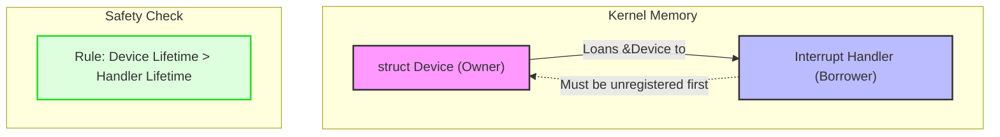
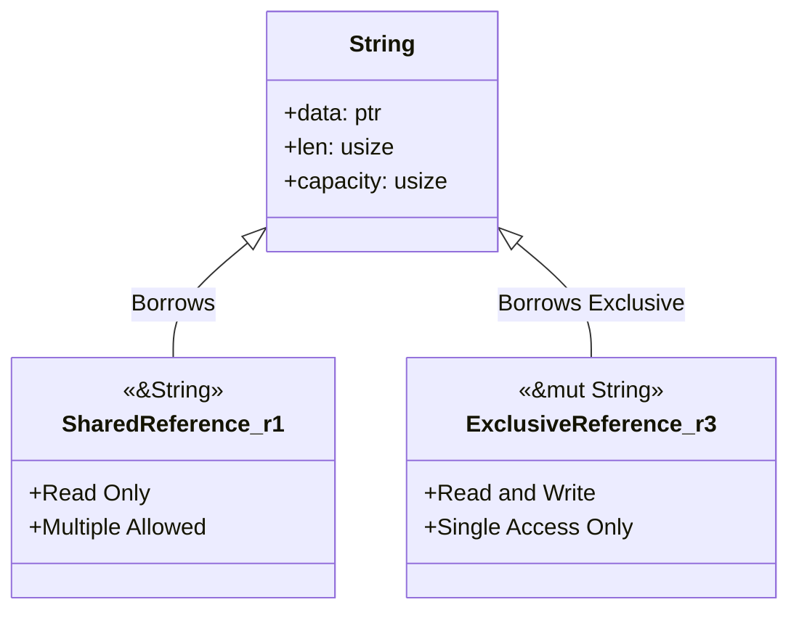

# Rust lifetimes in kernel:

1. The Scope Overlap (Lifetime Violation)
This diagram visualizes why the compiler rejects code when the data dies before the reference.

```mermaid 
gantt
    title Lifetime Conflict: Reference vs. Data
    dateFormat  X
    axisFormat %s

    section Stack
    Data 'x' (The Owner)           :a1, 0, 10
    Reference 'r' (The Borrower)   :after a1, 0, 15
    
    section Error Zone
    Dangling Pointer Risk          :crit, 10, 15
```

2. The Kernel Safety Bridge (Interrupt Handler)
This diagram shows the relationship between a hardware device and an interrupt handler, 
illustrating how Rust enforces the "registration must end before device drops" rule.

3. Relationship of Reference Types
To reinforce your first slide on the difference between Shared and Exclusive references:

