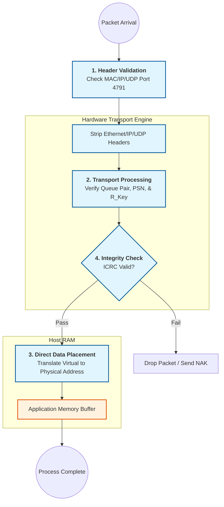

# RoCE, RDMA, SmartNIC:

## Introduction:

- Standard TCP/IP is a best effort networking, this model presents many challenges when we move into the
  world of high-throughput, sub-microsecond latency environments like HPC, AI Clustering and High
  Frequency trading. 

- Standard Linux network stack, the CPU spends it's life copying data from NIC to the kernel and then
  kernel to the user-space application. Every packet that hits a normal NIC triggers an interrupt,
  forcing the CPU to stop what it's doing, copy data from the NIC to kernel-space and then over to
  user-space. This model works but runs into trouble to meet the demands of HPC, AI clustering or High
  frequency trading.

**To solve this latency of fast processing, there is a need for zero-copy technology that bypasses the
CPU entirely.** 

- **RDMA** : ( Remote Direct Memory Access ) is not a physical cable or a specific port; its a data transfer
  paradigm. 

- In traditional networking (TCP/IP), the cpu acts as a "middleman", It must copy data from the
  application, wrap it in headers and hand it to the NIC. On the receiving end the CPU does the
  reverse. This consumes CPU cycles and adds "jitter" ( latency spikes ).

- **RoCE**: ( RDMA over Converged Ethernet ) is a specific protocol that allows the RDMA paradigm to run
  over standard Ethernet cables and switches. 

- Historically RDMA required InfiniBand HW. RoCE was invented to bring that same performance to the
  Ethernet world you already use. And this has two versions:
  - RoCE V1: A layer 2 protocol, It only works if both computers are on the same switch ( same
    broadcast domain). Is is rarely used today. 
  - RoCE V2: The modern standard. It wraps RDMA data inside UDP/IP packets. Because it has an IP
    header, it can be routed across different subnets and data centers. This is what connectx-5 cards
    use. 

- **Fabric**:  its a network technology where nodes ( server, storage... etc) are connected via multiple
  interconnected switches. Unlike traditional hierarchical network which look like a tree with a single
  trunk, a Fabric looks like a mesh or a web. 

- In RDMA ecosystem ( InfiniBand, RoCE ) Fabric refers to the entire collection of switches, cables, and
  adapters that allow one server to read/write directly to the memory of other computer without
  involving either server's CPU.

- Characteristics:
    1. Any-to-Any Connectivity: Ever node can talk to every other node with roughly the same high
       speed and low latency. 
    2. Flatness: It reduces "hops", In a fabric data usually takes a very different path from point A
       to point B.
    3. Non-Blocking: Designed so that many pairs of nodes can communicate simultaneously at full
       speed without causing bottleneck. 
    4. Intelligence: Logic of network is distributed across the switches which manage traffic routing
       dynamically. 

### 01. The Core Hardware: SmartNIC's & DPU's:

- SmartNICs: NIC's that have its own on-board processing engine ( ASIC, DPU or FPGA's ) that handle the
  data by offloading tasks like ( Encryption or Firewalling ), this way the Host CPU does not have to
  process the packet. 

- This way presents a practical method for reaching high speed networking ( 100Gbe+ ). Generally for
  100's of Gbps the cpu consumption can take up to 30+% of server's CPU just processing header and
  moving data. SmartNIC's can handle tasks like encryption ( IPSec/TLS ), firewalls, and storage logic
  to the NIC. 

- DPU ( Data processing Unit ): These are super SmartNICs that can run its own mini Linux OS
  independently of the host server. 

- SmartNIC's reach high speeds ( 100G, 400G, 800G ) so the standard ethernet cable which supports only a
  single data lane can not support the high speeds, so SmartNIC's use QSFP ( Quar Small factor
  pluggable ) and OSPF ( Octal Small Form-factor Pluggable ) ports to support the high density and
  bandwidth.

  1. QSPF ( Quad ): Port support 4 independent tx/rx lanes into a single plug, If each lane runs at
     25Gps you get 100G port, if each line runs say at 50Gbps then you get 200G.

  2. OSPF ( Octal ): Newer, port combines 8 lanes, With 100Gbps per lane ( using PAM4 signaling). a
     single OSFP port delivers 800G of bandwidth. 

- A PCIe Gen-4 x16 slot can move roughly 256Gbps. ( Each PCIe lane about 920+ Mbps for PCIe 3.0 ).

- A QSFP56 port (200G) or QSFP-DD/OSFP (400G+) ensures that the network connection isn't the bottleneck for
  the RDMA traffic coming off the motherboard.


### 02. The Protocols: RDMA ( The "How" )

RDMA (Remote Direct Memory Access) is the ability to access memory on a remote machine without involving 
that machine’s CPU or Operating System.

#### The Three Flavors of RDMA:

1. InfiniBand (IB): Its a completely different hardware ecosystem from Ethernet. Its a proprietary
   networking architecture designed from the groundup for HPC. It does not use Ethernet at all.

- *Fabric Control*: It uses *Subnet Manager* to handle routing and traffic, making it "lossless" by design
  at the HW level. 

- *Latency*: Offers lowest possible latency (sub-microsecond ) as HW handles flow control natively. 
- *Design*: Lossless by design using hardware-level flow control (credits).
- *Components*: Requires InfiniBand Switches and a **Subnet Manager (SM)** to assign LIDs (Local IDs).

2. RoCE (RDMA over Converged Ethernet):

- The Hybrid:  Runs RDMA over standard Ethernet cables/switches.
- RoCE v1: Layer 2 only (can't cross routers).
- RoCE v2: Wraps RDMA in UDP/IP (routable).

3. iWARP:

- The Legacy:  RDMA over TCP. It's more complex and has higher latency than RoCE, so it is rarely used in
  modern AI/HPC clusters.

### 03. The Linux Implementation (The "Where")

On Linux, everything RDMA-related lives in the `rdma-core` user-space and the `ib_verbs` kernel subsystem.

### Key Linux Tools:

| Tool | Purpose |
| --- | --- |
| `ibv_devices` | Lists available RDMA-capable hardware. |
| `rdma link` | The modern `iproute2` command to manage RDMA interfaces. |
| `ibstat` / `ibstatus` | Checks if the InfiniBand link is "Active" and has a LID. |
| `opensm` | The daemon that acts as the Subnet Manager (required for InfiniBand). |
| `perftest` | A suite of tools (`ib_send_bw`, `ib_write_lat`) to benchmark RDMA. |

---

## 4. The "Missing" Piece: Lossless Ethernet (PFC)

If you choose **RoCE** instead of **InfiniBand**, you must configure your Linux host and your Network Switch 
for **PFC (Priority Flow Control)**.

* Standard Ethernet drops packets when congested.
* RDMA **fails** if a packet is dropped (it doesn't have the "retry" logic of TCP).
* PFC tells the sender to "pause" so the buffer doesn't overflow, making Ethernet behave like InfiniBand.

## 5. Verbs:

They are standardized API (Application Programming Interface) used to manage those high-speed data 
transfers without bothering the CPU.

"Verbs" are like grammar of RDMA: they are the specific actions to tell the network card exactly what to do.


---

## How Verbs Work:

In traditional TCP/IP, the operating system handles the heavy lifting.

With RDMA Verbs allow an application to talk directly to the HCA ( Host Channel Adapter ). 

This by-passes the kernel, reducing latency and CPU overhead. 

The architecture relies on a **Queue Pair (QP)** mechanism, consisting of two queues:

1. **Send Queue** : Where the application posts instructions for data to be sent. 
2. **Receive Queue** : Where the application posts instructions from where incoming data should be
   placed. 

### Core Categories of Verbs: 

The RDMA eco-system typically categorizes these operations into two main types:

#### 1. One-Sided Operations  ( The "True" RDMA )

The local CPU specifies the memory address on the remote machine. 
The remote CPU doesn't even know the transfer is happening. 

- **RDMA Write**: Push data from local memory to remote memory.
- **RDMA Read**: Pull data from remote memory to local memory. 
- **Atomic Opeartions** : Perform "fetch-and-add" or "compare-and-swap" on remote memory addresses. 

#### 2. Two-Sided Operations ( Channel Semantics ):

Both sender and the receiver are involved, similar to traditional networking but much faster.

- Send: The local side sends data.
- Receive: The remote side must have a "receive request" waiting in its queue to accept that data.

---

### The Lifecycle of a Verb Call

To execute a transfer, an application follows a specific workflow:

| Step | Action | Description |
| --- | --- | --- |
| 1. | Registration | Register a memory region with the HCA so the hardware can access it safely. |
| 2. | Post Send/Receive | Place a **Work Request (WR)** into the Queue Pair. |
| 3. | Processing | The HCA hardware executes the request independently of the CPU. |
| 4. | Completion | The HCA places a **Completion Queue Entry (CQE)** into a Completion Queue (CQ) to let the app know it's done. |

---

Using Verbs is significantly more complex than standard socket programming, but the payoff is massive:

* *Zero-Copy:* Data goes straight from application memory to the wire.
* *Kernel Bypass:* No context switching between user mode and kernel mode.
* *Low Latency:* Microsecond-level transfers, essential for AI training clusters and high-frequency trading.


Registering a Memory Region (MR) is a critical step: 
It "pins" the memory (prevents the OS from swapping it to disk) and gives the HCA a translation table so 
it can find the physical RAM addresses without asking the CPU.

#### 1. C Code Example (`libibverbs`)

In C, you use the `ibv_reg_mr` function. 

You must already have an open "Protection Domain" (`pd`), which is a container that groups your resources.

```c
#include <infiniband/verbs.h>
#include <stdio.h>
#include <stdlib.h>

int main() {
    // 1. Allocate a standard buffer in user-space
    size_t length = 4096;
    void *buffer = malloc(length);

    // 2. Assume 'pd' is a previously initialized struct ibv_pd*
    struct ibv_pd *pd; 
    // ... (Device opening and PD creation code would go here)

    // 3. Register the memory region
    // Access flags: Local Write, Remote Read, Remote Write
    int access_flags = IBV_ACCESS_LOCAL_WRITE | 
                       IBV_ACCESS_REMOTE_READ | 
                       IBV_ACCESS_REMOTE_WRITE;

    struct ibv_mr *mr = ibv_reg_mr(pd, buffer, length, access_flags);

    if (!mr) {
        fprintf(stderr, "Error: Could not register MR\n");
        return 1;
    }

    printf("MR registered! Remote Key (R_Key): %u\n", mr->r_key);

    // Clean up
    ibv_dereg_mr(mr);
    free(buffer);
    return 0;
}

```
---

## how linux supports RDMA ecosystem:

- The Linux kernel doesn't treat RDMA as a "standard" network interface like `eth0`. Instead, it has a
  dedicated **RDMA Subsystem**.

### **The Kernel Side (`drivers/infiniband`)**

- Despite the name, this directory handles all RDMA (InfiniBand, RoCE, and iWARP).
    * **Core Stack (`ib_core`):** The engine that manages memory pinning and protection domains.
    * **Hardware Drivers:** This is where your ConnectX-5 lives. The driver is `mlx5_ib`. It
      translates generic RDMA commands into the specific language the ConnectX-5 hardware
      understands.
    * **Verbs API:** This is the "language" of RDMA. Instead of `send()` and `recv()`, you use
      "Verbs" like `post_send` and `poll_cq`.

### **The User Space Side (`rdma-core`)**

- Linux provides a set of libraries that allow your C or Rust code to talk to the hardware without going
  through the slow kernel path (Kernel Bypass).
    * **`libibverbs`:** The primary library for data transfer.
    * **`librdmacm`:** The "Connection Manager." Since RoCE v2 uses IP addresses, this library helps
      you find the other computer and set up the initial connection.

- `libibverbs`: Core linux user-space library that enables applications to perform Remote Direct Memory
  (RDMA) operations.
  - Provides Standardized HW-agnostic API that allow SW to communicate directly with RDMA capable network
    HW ( infiniband, iWARP and RoCE ) adapters. Allowing programs to by-pass the OS kernel for data
    transfer. 
  - This achieve high-throughput and low-latency networking by reducing CPU overhead:
    * Kernel Bypass: data path operations happen directly between applications and network HW. ( avoids
      overhead of system calls and context switched into the kernel)
    * Zero-Copy Networking: Data is moved directly between application memory and the network HW, avoiding
      intermediate copies between user and kernel memory buffers. 
    * Async I/O: Used mechanisms like *Complete Queues* (CQs) to handle data transfers asynchronously,
      allowing the applications to continue processing without waiting for network operations to finish.

- `libibvers` Verbs API: Library implements the **Verbs** Interface as defined in InfiniBand Arch Spec.
  This API provides the primitives for resource management, such as creating Protection Domains, Memory
  Regions, Completion Queues and Queue Pairs. 

- `User/Kernel Interaction` : 
    - *Control Path*: Complex setup/teardown tasks ( creating resource ) are handled by communicating with
      the kerenl via the `ib_verbs` kernel module. 
    - *Fast Path*: Once resources are established, the application interacts directly with the network HW by
      writing to HW registers mapped into its user-space memory ( `mmap()`)

- Vendor Plugins: `libbibverbs` acts as an abstraction layer.To support specific HW it uses vendor-specific
  user-space drivers ( providers ) that handle the actual communication with the specific network adapter. 

- `rdma-core`:  `libibvers` is a part of `rdma-core` project, which contains the common user-space
  infrastructure for all RDMA technologies on Linux.

- `librdmacm`: For applications that require standard IP-based addressing ( Connection establishment, route
  resolution), `libibverbs` is typically used in conjunction with `librdmacm` ( RDMA Connection Manager).

Reference:
    - [RDMAmojo blog:](www.rdmamojo.com) RDMAmojo resource for understanding the API and InfiniBand
      concepts. 

### Control Flow of RDMA application: 

Before sending a single byte, you need to set up a specific set of resources:

- ** `libibvers` initialization workflow**: Setting up a connection involves several distinct objects that
  work together. ( i.e setting up a private high-speed lane ).
  1. **Device Discovery**: 
    - `ibv_get_device_list()`: find available RDMA adapters
    - `ibv_open_device()`: Start a session. 
  2. **Protection Domain (PD)**:
    - `ib_alloc_pd()`: Create a PD. This acts as container that groups resources ( like memory and queues)
      to ensure they can work together securely. 
  3. **Memory Registraion (MR)**: You must "pin" the mem you want to use for data transfer using:
    - `ibv_reg_mr()`: Tells the OS not to move this memory to disk (swap) so the HW can access it directly. 
  4. **Completion Queue (CQ)**:
    - `ibv_create_cq()`: Creates a CQ. This queue is where HW places "work completions" to tell you a
      transfer is done. 
  5. **Queue Pair (QP)**:
    - `ibv_create_qp()`: Creates a QP. This consists of a *Send Queue* and *Receive Queue*. This is primary
      interface for posting work requests. 

### Simple Code Ex: Opening a Device: 

Code snippet : How to initialize the very first step in C:
test.c
```c 
#include <stdio.h>
#include <infiniband/verbs.h>

int main() {
   struct ibv_device **dev_list;
   struct ibv_context *context;
   /* 1. Get the list of RDMA Devices */
   dev_list = ibv_get_device_list(NULL);
   if (!dev_list) {
      perror("Failed to get RDMA devices list");
      return 1;
   }
   /* 2. Open the first available device */
   context = ibv_open_device(dev_list[0]);
   if (!context) {
      fprintf(stderr,"Couldn't release context for %s\n", ibv_get_device_name(dev_list[0]));
      return 1;
   }
   printf("RDMA device %s opened successfully.\n", ibv_get_device_name(dev_list[0]));
   /* 3. cleanup */ 
   ibv_free_device_list(dev_list);

   return 0;
}
```
Makefile:
```make
# Compiler
CC = gcc

# Compiler flags: 
# -Wall for general warnings
CFLAGS = -Wall

# Linker flags: -libverbs is required for libibverbs applications
LDFLAGS = -libverbs

# Binary name
TARGET = rdma_test

# Source file
SRC = test.c

all: $(TARGET)

$(TARGET): $(SRC)
        $(CC) $(CFLAGS) $(SRC) -o $(TARGET) $(LDFLAGS)

clean:
        rm -f $(TARGET)

# Useful target to run with sudo since RDMA devices often require root privileges
run: $(TARGET)
        sudo ./$(TARGET)

```
```bash 
$ ./rdma_test 
RDMA device rocep1s0f0 opened successfully.
```
---

## Key Differences in the Linux CLI
When you plug in your ConnectX-5 cards, you will see two different "identities" for the same hardware:

| Interface Type | Tool to View | Purpose |
| :--- | :--- | :--- |
| **Ethernet Identity** | `ip link` | Used for standard pings, SSH, and TCP traffic. (e.g., `enp1s0`) |
| **RDMA Identity** | `ibv_devices` | Used for RDMA "Verbs" traffic. (e.g., `mlx5_0`) |

---

### Summary for your ConnectX-5 Setup
With CX5 cards on system, Linux will see the hardware as an Ethernet card, but the **`mlx5_ib`** driver will
"expose" an RDMA device to the system. You will use the Ethernet side to assign an IP address (the handshake
address) and the RDMA side to move the actual data.
Before we move to Phase 1 there are some important internals to pickup:

## 1. The Verbs API ( The language ):

- Standard Linux networking, you use "Sockets" (`send`, `recv`). In RDMA, we use **Verbs**.

- Because a "Socket" implies the Kernel is handling the buffer. 
- A "Verb" is a direct command to the Hardware.

* **The Big Three:** * `POST_SEND`: "Hey NIC, take this data and go."
    * `POST_RECV`: "Hey NIC, I've cleared some space in my RAM; put the next incoming data there."
    * `POLL_CQ`: "Hey NIC, are you done yet?"

### 2. The Memory "Pinning" Requirement
This is the #1 point of failure for beginners. 
* **Standard RAM:** The Linux kernel moves memory pages around (swapping) to optimize performance.
* **RDMA RAM:** The NIC needs to know the **physical address** of your data. If the Kernel moves a page while the NIC is writing to it, you get a system crash or data corruption.
* **The Fix:** You must "Register" memory. This "pins" the memory in place so the Kernel cannot touch it until the RDMA operation is over.

### 3. The Libraries (The Tools)
You don't need to know every file, just these three layers:
1.  **`libibverbs`**: The "Low-Level" library. You use this to move data.
2.  **`librdmacm`**: The "Connection Manager." You use this to find the other computer's IP and "dial" them.
3.  **`rdma-core`**: This is the umbrella project name on GitHub that contains both of the above.

---

## `Ping Pong`: style data transfer.

- "Hello world" of RDMA. Demonstrates how two machines actually exchange data once the device is opened. 

### RDMA Data transfer Flow:

In a standard "Send/Receive" operation, the flow follows a strict handshake between the CPU and the HCA 
(Host Channel Adapter):

1. **Post Receive:** 
    - The receiver must *first* tell its HW where to put incoming data by posting a "Receive Request" to its
      Queue Pair.
2.  **Post Send:** 
    - The sender posts a "Send Request" containing the data.
3.  **Hardware Transfer:** 
    - The *HCAs* communicate across the network without involving either CPU.

4.  **Completion:** 
    - Both sides poll their Completion Queues (CQ) to see a "Work Completion" (WC) entry, signaling the
      transfer is finished.

### Detailed Code Example: Memory Registration and Sending

Once you have your `context` and `pd` (Protection Domain) from the previous step, you would register memory
and send a buffer like this:

```c
    // 1. Register a memory buffer (1KB) for RDMA
    char *buf = malloc(1024);
    struct ibv_mr *mr = ibv_reg_mr(pd, buf, 1024, IBV_ACCESS_LOCAL_WRITE | IBV_ACCESS_REMOTE_READ);

    // 2. Prepare a "Scatter/Gather" element (points to our data)
    struct ibv_sge sge;
    sge.addr   = (uintptr_t)buf;
    sge.length = 1024;
    sge.lkey   = mr->lkey;

    // 3. Prepare a "Work Request" (the command for the HCA)
    struct ibv_send_wr wr, *bad_wr;
    memset(&wr, 0, sizeof(wr));
    wr.wr_id      = 123; // Private ID to track this specific request
    wr.sg_list    = &sge;
    wr.num_sge    = 1;
    wr.opcode     = IBV_WR_SEND;
    wr.send_flags = IBV_SEND_SIGNALED; // Tell HCA to create a Completion entry

    // 4. Post the send to the Queue Pair (qp)
    if (ibv_post_send(qp, &wr, &bad_wr)) {
        fprintf(stderr, "Error posting send\n");
    }

    // 5. Wait for completion
    struct ibv_wc wc;
    while (ibv_poll_cq(cq, 1, &wc) < 1) {
        // Busy-wait/spin until data is sent
    }

    if (wc.status == IBV_WC_SUCCESS) {
        printf("Message sent successfully!\n");
    }
```

### Comparison: RDMA vs. Standard Sockets
It helps to visualize why `libibverbs` feels so different from standard `TCP/UDP` programming:

| Feature | Standard Sockets (`POSIX`) | RDMA (`libibverbs`) |
| :--- | :--- | :--- |
| **Data Copying** | Multiple (User $\rightarrow$ Kernel $\rightarrow$ NIC) | Zero (User $\rightarrow$ NIC) |
| **CPU Usage** | High (Interrupts, Protocol Stack) | Near Zero (Offloaded to HCA) |
| **Latency** | ~10–50 microseconds | < 1 microsecond |
| **Complexity** | Simple (read/write) | High (Queue management) |

Install development libraries to compile and run the code.

###  Requirements:

1. `ibv_device`: list of all RDMA-capable devices currently recognized by the verbs library.

```bash 

$ ibv_devices 
    device                 node GUID
    ------              ----------------
    rocep1s0f0          6cb31103008855b4
    rocep1s0f1          6cb31103008855b5

```
2. `ibv_devinfo`: state of the physical ports, the maximum supported MTU, and the link layer (InifiniBand
   vs. Ethernet/RoCE).
   ```bash 

   $ ibv_devinfo
     hca_id: rocep1s0f0
        transport:                      InfiniBand (0)
        fw_ver:                         16.35.4506
        node_guid:                      6cb3:1103:0088:55b4
        sys_image_guid:                 6cb3:1103:0088:55b4
        vendor_id:                      0x02c9
        vendor_part_id:                 4119
        hw_ver:                         0x0
        board_id:                       MT_0000000425
        phys_port_cnt:                  1
                port:   1
                        state:                  PORT_ACTIVE (4)
                        max_mtu:                4096 (5)
                        active_mtu:             1024 (3)
                        sm_lid:                 0
                        port_lid:               0
                        port_lmc:               0x00
                        link_layer:             Ethernet

     hca_id: rocep1s0f1
        transport:                      InfiniBand (0)
        fw_ver:                         16.35.4506
        node_guid:                      6cb3:1103:0088:55b5
        sys_image_guid:                 6cb3:1103:0088:55b4
        vendor_id:                      0x02c9
        vendor_part_id:                 4119
        hw_ver:                         0x0
        board_id:                       MT_0000000425
        phys_port_cnt:                  1
                port:   1
                        state:                  PORT_ACTIVE (4)
                        max_mtu:                4096 (5)
                        active_mtu:             1024 (3)
                        sm_lid:                 0
                        port_lid:               0
                        port_lmc:               0x00
                        link_layer:             Ethernet

   ```
   - **hca_id**: The name you use in code 
   - **port_list**: Most cards have 1 or 2 ports. 
   - **state**: This must say PORT_ACTIVE. If it says PORT_DOWN or PORT_INITIALIZING, your code will be able
     to "open" the device, but you won't be able to send any data.
   - **link_layer**: Tells you if you are running on InfiniBand or Ethernet (RoCE).

3. Kernel modules:
```bash 
$ lsmod | grep ib_uverbs
  ib_uverbs             217088  2 rdma_ucm,mlx5_ib
  ib_core               585728  12 rdma_cm,ib_ipoib,rpcrdma,ib_srpt,iw_cm,ib_iser,ib_umad,ib_isert,rdma_ucm,ib_uverbs,mlx5_ib,ib_cm
```

4. Hardware Presence: Check if the PCIe card is even visible.
```bash 
$ lspci | grep -i mellanox  
01:00.0 Ethernet controller: Mellanox Technologies MT27800 Family [ConnectX-5]
01:00.1 Ethernet controller: Mellanox Technologies MT27800 Family [ConnectX-5]
```

### Soft-RoCE : You dont require expensive HW :

- You can simulate an RDMA device over your standard Ethernet card using Soft-RoCE (RXE):

```bash 

$ sudo rdma link add rxe0 type rxe netdev eth0

```
Now, `ibv_devices` will show `rxe0`, and your code will run perfectly for testing!

### Update on Kernel/Hardware translation
You asked how a generic command becomes a "ConnectX-5" command. 
1.  **Your App** calls a Verb (e.g., `ibv_post_send`).
2.  **`libibverbs`** looks at your hardware and loads a "User-space Driver" (for CX5, this is `libmlx5`).
3.  **The User-space Driver** writes a specific "Doorbell" (a tiny piece of data) directly to the
    PCI-Express address of your CX5 card.
4.  **The CX5 Hardware** sees the Doorbell, fetches the command from your RAM, and sends the packet. 

**The Kernel (`ib_core`) is bypassed entirely during the actual data transfer!** It only gets involved to
set up the permissions at the beginning.

---

Next Phase 1:
- With the understanding of "pinning RAM" and "ringing a hardware doorbell," the Soft-RoCE setup will make 
  much more sense. 
- Look at step-by-step commands to enable Soft-RoCE and run your first hardware-emulated ping.





--- 

## RDMA Connection ( programmers approach )

An RDMA connection involves **two independent hosts**, and each host goes through a similar setup process
before they can communicate.

Let's call them **Host A (client)** and **Host B (server)**.

```
+--------------------+                     +--------------------+
|      Host A        |                     |      Host B        |
|                    |                     |                    |
|   User Process     |                     |   User Process     |
|        |           |                     |        |           |
|    libibverbs      |<------ RDMA ------->|    libibverbs      |
|        |           |                     |        |           |
|      SmartNIC      |=====================|      SmartNIC      |
+--------------------+                     +--------------------+
```

---

### Phase 1: Discover and open the RDMA device

Both hosts do this independently.

```
device_list = ibv_get_device_list()

      ↓

choose device

      ↓

ctx = ibv_open_device(device)
```

At this point each process has a connection to **its own** SmartNIC.

---

# Phase 2: Create a Protection Domain

Again, both hosts.

```
pd = ibv_alloc_pd(ctx)
```

Now each process has a container for all of its RDMA resources.

```
Host A                     Host B
-------                    -------
PD A                       PD B
```

These PDs have nothing to do with each other.

---

# Phase 3: Allocate buffers

Each application allocates memory.

```
buffer = malloc(...)
```

Example:

```
Host A                     Host B
-------                    -------
buffer A                   buffer B
```

---

# Phase 4: Register memory

Each side tells its NIC:

> "You may DMA into this buffer."

```
mr = ibv_reg_mr(pd, buffer, ...)
```

Now each side has

```
Host A                     Host B
-------                    -------
buffer A                   buffer B
MR A                        MR B
lkey                        lkey
rkey                        rkey
```

The NIC pins these pages and stores the translation.

---

# Phase 5: Create Completion Queue

Each host creates a CQ.

```
cq = ibv_create_cq(...)
```

The CQ receives notifications when work completes.

---

# Phase 6: Create Queue Pair

Each host creates a Queue Pair.

```
qp = ibv_create_qp(pd, ...)
```

Now we have

```
Host A                     Host B

PD                          PD

MR                          MR

CQ                          CQ

QP                          QP
```

Still nothing is connected.

---

# Phase 7: Exchange connection information

Now the two applications communicate over **some other channel**.

Usually:

* TCP socket
* MPI
* SSH
* gRPC
* etc.

They exchange information like

```
QP Number

LID or GID

RKey

buffer address
```

Example

Host A sends

```
QP = 123

RKey = 98765

Address = 0x7f120000
```

Host B sends

```
QP = 456

RKey = 11111

Address = 0x7f980000
```

Notice this is **not RDMA yet**.

It's ordinary networking.

---

# Phase 8: Connect the Queue Pairs

Each side transitions its QP through several states:

```
RESET

↓

INIT

↓

RTR (Ready to Receive)

↓

RTS (Ready to Send)
```

Now the SmartNICs know where the peer QP lives.

---

# Phase 9: Perform RDMA

Now Host A can issue

```
RDMA Write

RDMA Read

Send

Receive
```

using Host B's

```
remote address

+

remote rkey
```

The SmartNIC performs the DMA directly into Host B's registered memory.

```
Host A

buffer A

↓

SmartNIC A

================ network ================

SmartNIC B

↓

buffer B
```

The CPUs are not involved in copying the data.

---

# Overall timeline

```
Host A                              Host B

Open device                         Open device

Create PD                           Create PD

Allocate buffer                     Allocate buffer

Register MR                         Register MR

Create CQ                           Create CQ

Create QP                           Create QP

        <--- exchange QP/rkey/address via TCP --->

Move QP to INIT                     Move QP to INIT

Move QP to RTR                      Move QP to RTR

Move QP to RTS                      Move QP to RTS

============= RDMA traffic starts ============
```

One important distinction that often clears up confusion is that there are **two kinds of setup** happening:

* **Local resource setup** (everything through `ibv_*`): opening the device, creating the PD, registering
  memory, creating CQs and QPs. Each host does this independently.
* **Connection setup**: exchanging identifiers (QP number, address, rkey, GID/LID) over a conventional
  communication channel so the two hosts know how to reach each other.

Only after both parts are complete can either SmartNIC perform RDMA operations directly into the other
host's registered memory.

--- 

## Explain the above Steps:

- The easiest way to understand the sequence is to realize that every step exists because of the NIC is
  going to access memory directly without involving the CPU. 
  Therefore the NIC must know:
  * Which memory it is allowed to access. 
  * Which process owns that memory.
  * Where to place incoming packets. 
  * How to notify you when operations complete 
  * Which remote machine it is talking to.

=> Once you understand that, every object in the verbs API makes sense. 
Once you understand that, every object in the verbs API makes sense.

---

### Before starting: What happens in normal TCP?

With sockets, a send looks like

```
Application
      |
    send()
      |
    Kernel
      |
  TCP/IP stack
      |
     NIC
```

The kernel owns everything.

When receiving

```
    NIC
     |
Kernel buffer
     |
    Copy
     |
Application buffer
```

There are multiple copies and kernel involvement.

---

### With RDMA

The kernel mostly disappears after setup.

```
  Application 
      |
  libibverbs
      |
  RDMA NIC
      |
---------------- Network ----------------
      |
Remote RDMA NIC
      |
Application memory
```

The NIC itself performs DMA directly into application memory.

Since the NIC is now touching your process memory, we need all those setup steps.

---

### Step 1. Discover/Open RDMA device

```c
ibv_get_device_list();
ibv_open_device();
```

**What is happening?**

The machine may have several RDMA-capable NICs.

For example

```
mlx5_0
mlx5_1
```

or

```
RoCE port 1
RoCE port 2
```

You choose which one to use.

Opening the device returns

```
ibv_context
```

Think of it as

> "A handle to the RDMA NIC."

Everything afterwards is created through this context.

---

#### Why is this needed?

The verbs library needs to know

* which NIC
* which firmware
* which hardware queues

you are talking to.

Without this there is nowhere to create queues.

---

#### Analogy

Like opening

```
/dev/nvme0
```

before issuing disk commands.

---

### Step 2. Create Protection Domain (PD)

```c
ibv_alloc_pd()
```


This is usually the first confusing object.

In simple terms PD is an isolated "sandbox" or a secure container within an RDMA device. 
It acts like a gatekeeper to ensure that specific components of your RDMA application can only interact with
other components that belong to the same domain.

Its like a security boundary. If Component A tries to access Component B's resource, the RDMA HW checks:
" __Are you both in the same Protection Domain?__ " If no the operation is blocked at the HW level. 

i.e Think of a Protection Domain as

> a hardware security container.

Imagine two applications

```
Database
```

and

```
Video encoder
```

Both use RDMA.

Without protection

```
Database NIC could DMA into
Video memory.
```

That would be disastrous.

Instead

```
PD A
    |
    +-- memory
    +-- queue pairs

PD B
    |
    +-- memory
    +-- queue pairs
```

Hardware checks

> "Does this Queue Pair belong to the same PD as this Memory Region?"

If not

```
ACCESS ERROR
```

---

#### Why?

The NIC performs DMA.

The CPU is not checking permissions anymore.

So hardware must enforce ownership.

---

#### Analogy

Like a process address space.

Only objects inside the same protection domain can work together.

#### What does PD actually group together? 

When you create a PD using `ibv_alloc_pd` You use that context to bind several critical RDMA resources
together. 
- **Memory Region ( MR )** : When you register memory for RDMA opeartions, you must assign it to a **PD**.

- **Queue Pairs ( QP )** : The virtual network interfaces used to send and receive data must also be
  assigned it to a **PD**.

- **Address Handles ( AH )** : Used for unreliable datagram (UD) transfers to identity destination
  addresses. 

This gives Security and isolation: it precents a **QP** in one part of application ( or a different
application entirely ) from accidentally or maliciously reading/writing to a memory region it shouldn't have
access to.

It Tells the Host Channel Adapter ( HCA / the RDMA network card ) how to validate incoming network requests.
when a remote machine tries to write to your memory using a RDMA key (`rkey`) the HCA verifies that the
target memory region and the receiving **QP** share the same **PD**.


#### Ref:

- [RDMAmojo](rdmamojo.com) : This is the gold standard blog written by Dotan Barak. It is effectively the
  unofficial documentation for almost every `ibv_*` funs. If you want to know exactly what `ibv_alloc_pd`
  does, look it up here.
- InfiniBand Architecture Specification: (Specifically Volume 1). It is massive and dense, but it is the
  ultimate source of truth for why concepts like PDs, QPs, and CQs exist.

- Linux Man pages ( libibverbs :  ibv_alloc_pd , ibpv)

- RFC 5040 / 5041 (for iWARP/RDMA concepts): Great for a conceptual overview of the architecture.

- A quick web search for "NVIDIA RDMA Programming Manual" or "Mellanox RDMA Aware Networks Programming
  Manual" will yield a highly comprehensive PDF guide with code examples.

---

### Step 3. Allocate buffer


Once you have created a **PD** next we prepare memory that RDMA will use. 
Unlike standard network programming where you can just pass any pointer to `send()` function, RDMA requires
you to allocate buffer and then explicitly register that memory with the RDMA HW. 

#### Step-by-Step: Allocation 

- Allocate regular memory in your user-program. Since RDMA transfers data directly to/from your RAM,
  performance is significantly better if the memory is page-aligned.

- The OS and the RDMA hardware handle memory in chunks called pages (usually 4KB). Aligning your buffer to
  page boundaries prevents the hardware from having to deal with awkward memory offsets.

Example

```c
char *buf = malloc(4096);
```

Now you simply have

```
Application memory

+------------------+
|                  |
|      Buffer      |
|                  |
+------------------+
```

Nothing RDMA-specific yet.

Note: use `posix_memalign()` or `aligned_alloc()` instead of malloc().


---

### Why?

Eventually

```
RDMA Write
```

needs somewhere to write.

---

### Step 4. Register Memory

```c
ibv_reg_mr()
```

This is probably the most important concept.

Normally

```
malloc()
```

returns virtual memory.

Example

```
Virtual

0x400000
```

But DMA hardware cannot understand

```
virtual addresses
```

It needs

```
physical pages
```

Memory registration does several things.

#### It pins the memory

The OS promises

> "I won't move these pages."

Otherwise

```
DMA
```

could suddenly point to the wrong page.

---

#### It translates

Virtual →

Physical

---

#### It gives permissions

Example

```
READ

WRITE

REMOTE_WRITE

REMOTE_READ
```

---

#### It creates keys

```
lkey
```

Local key

```
rkey
```

Remote key

These are hardware access tokens.

When posting an RDMA operation

```
NIC checks

Is lkey valid?
```

Remote NIC checks

```
Is rkey valid?
```

---

#### Why?

Without registration

the NIC has no idea where your memory is.

---

#### Analogy

Like giving the NIC

> "Here is a certified map of memory you may touch."

#### Register the memory (MR) 

Once we have the above buffer we register it with the InfiniBand/RDMA Card using function `ibv_reg_mr`

`struct ibv_mr *ibv_reg_mr(struct ibv_pd *pd, void *addr, size_t length, int access);`

Here you pass the **PD** created earlier, the pointer to the buffer, its length, and access permissions (
e.g local read, local write, remote read, remote write)

Memory registration is heavy operation, which is why its done during initialization phase of your
application. 

Calling `ibv_reg_mr` : the OS Kernel, and the RDMA HW do :

**Memory Pinning ( locking )**: In modern OSs, the Virtual memory your application sees can be moved around
in Physical RAM or swapped out to the hard drive ( paging ) at any time by the OS. 
1. RDMA bypasses the CPU entirely. If the HCA tries to write directly to a physical RAM addr, but the OS has
   secretly moved that data to the swap space, the system will crash or data will corrupt. 

2. Pinning locks those physical memory pages in place. The OS guarantes they will not be moved ot swapped
   out as long as the memory registration exists. 


** Address Translation (Virtual to Physical Mapping)**: Your application uses virtual memory addresses, but
the RDMA hardware needs to know the exact physical RAM addresses to do Direct Memory Access.

During registration, the kernel looks up the physical pages assigned to your buffer and loads this
translation table directly onto the RDMA hardware's onboard memory.

When you tell the RDMA card to "send data from virtual address 0x7fff...", the card uses its own internal
table to immediately find the physical RAM location.

**The Result: Keys (lkey and rkey)**  If ibv_reg_mr() is successful, it returns a pointer to a 
`struct ibv_mr` (Memory Region). This structure contains two incredibly important security tokens: 

- `lkey` (Local Key): Used by your local RDMA card. When you post a work request to send or receive data,
  you must provide the `lkey` to prove to your local card that this memory region belongs to your application
  and your Protection Domain.

- `rkey` (Remote Key): Used by the remote machine. If you want a remote server to directly read or write to
  thismemory buffer (using RDMA Read or RDMA Write), you must send them this rkey and your virtual address 
  beforehand (usually over a standard TCP socket during setup). The remote machine includes this rkey in its
  network packets to authorize the hardware-level transfer.


---

### Step 5. Create Completion Queue (CQ)

After registration and pinning of memory, we need actual communication infrastructure. 

`Completion queue` and `Queue pairs` are the heart and sole of RDMA Async network model.

Before you create the `Queue Pair`, you need to build the traffic monitoring station the `Completion Queue`.

The **CQ** is an asynchronous notification queue.

RDMA operations are completely non-blocking. 
When you tell the hardware to send data, the function returns immediately while the hardware works in the
background. Once the hardware actually finishes sending or receiving the data, it drops a "receipt" called 
a `Work Completion` ( **WC** ) into the **CQ**.

- API: `ibv_create_cq(struct ibv_context *context, int cqe, ...)`

-  Key Parameter (`cqe`): This defines the size of the queue (how many completion receipts it can hold at
   one time). If your CQ overflows because your application isn't polling it fast enough, it can cause a
   fatal driver/hardware error.

Why it goes first: You cannot create a Queue Pair without assigning it to a CQ. Multiple Queue Pairs can
actually share a single CQ if you want a single thread to manage multiple connections.

```c
ibv_create_cq()
```

Suppose you issue

```
RDMA Write
```

The operation is asynchronous.

Your function returns immediately.

Later the NIC finishes.

How do you know?

The NIC places an entry into

```
Completion Queue

+---------+
| done    |
| done    |
| error   |
+---------+
```

The application polls

```
ibv_poll_cq()
```

---

### Why?

Otherwise you'd never know

* success
* failure
* bytes transferred

---

### Analogy

Like an inbox.

Every completed operation leaves a receipt.

---

### Step 6. Create Queue Pair (QP)

The Queue Pair is your virtual network interface. In RDMA, you don't use standard sockets; you use a **QP**
to represent a connection to a remote node.

A **QP**) is actually made up of two distinct queues:

- **Send Queue (SQ)** : Where your application posts "Work Requests" (WR) telling the hardware to execute an
  operation (e.g., Send, RDMA Write, RDMA Read).

- Receive Queue (RQ): Where your application posts "Receive Requests" telling the hardware where to place
  incoming data if the remote side executes a standard Send operation. (Note: If you are strictly using
  one-sided RDMA Write/Read, the RQ might go unused, but it is still part of the structure).

**Create QP**:
`ibv_create_qp()`. 

Unlike other resources, this function takes a configuration structure (`struct ibv_qp_init_attr`) where you 
must specify:
- Which Protection Domain (PD) this QP belongs to (binding it to your security sandbox).
- Which CQ to use for Send completions, and which CQ to use for Receive completions (they can be the same CQ).
- The cap (maximum number of outstanding requests allowed in the SQ and RQ at any given time).
- The QP Type (e.g., IBV_QPT_RC for Reliable Connected, or IBV_QPT_UD for Unreliable Datagram).

```
+-----------------------------------------------------------+
|                  PROTECTION DOMAIN (PD)                   |
|                                                           |
|  [ Memory Region (MR) ]  <--->  [ Queue Pair (QP) ]       |
|    - Buffer Address               - Send Queue            |
|    - lkey / rkey                  - Receive Queue         |
+-----------------------------------------------------------+
                                          |
                                    (Completions)
                                          v
                                 [ Completion Queue (CQ) ]
```

At this exact moment in your code, the QP has been created, but it is in a RESET state. It is completely
dead to the network; it doesn't know who its destination is, what its own network address is, or how to
route traffic.

The next step in the RDMA pipeline is modifying the QP state to move it from RESET -> INIT -> RTR (Ready to
Receive) -> RTS (Ready to Send).

To do that, you'll need to exchange some information with the remote node.


```c
ibv_create_qp()
```

The Queue Pair is the communication endpoint.

It contains

```
Send Queue (SQ)

Receive Queue (RQ)
```

```
          QP

   +---------------+
   | Send Queue    |
   | Receive Queue |
   +---------------+
```

---

### Send Queue

Application posts

```
SEND

WRITE

READ
```

work requests.

---

### Receive Queue

Application posts

```
empty receive buffers
```

before packets arrive.

Incoming messages land there.

---

### Why?

The NIC processes queues.

It doesn't understand function calls.

You give it work by placing descriptors into queues.

---

### Analogy

Think of a printer.

You don't call

```
print_now()
```

You place jobs into

```
print queue
```

The printer processes them.

---

### Step 7. Exchange connection information

Because RDMA operates at the hardware layer to bypass the CPU, the RDMA network card (HCA) cannot
automatically discover or "handshake" with a remote machine on its own. It needs you to manually feed it the
destination's specific hardware addresses.

To do this, you must perform an Out-of-Band (OOB) Handshake—usually using a standard TCP/IP socket or a
shared file—to trade connection information.

**What Information Needs to be Exchanged?**

For two Queue Pairs (QPs) to talk to each other, each side must send a small packet of data containing three
critical pieces of information to the other side:

- LID (Local Identifier) or GID (Global Identifier): The subnet address of the RDMA network card. If you are
  on an InfiniBand network, you use the LID. If you are running RoCE (RDMA over Converged Ethernet), you use
  the GID (which looks like an IPv6 address).

- QPN (Queue Pair Number): Every time you create a QP, the hardware assigns it a unique ID number (like a
  port number in TCP). The remote side needs to know exactly which QP number it is targeting.

- PSN (Packet Sequence Number): A starting random number used to track packets and ensure order/reliability
  (similar to TCP sequence numbers). Both sides must agree on the starting PSN.

If you are planning to do one-sided operations (RDMA Read/Write), this is also the exact moment you usually
bundle and send your Virtual Address and rkey (from your Memory Registration step) over the socket.

**The Exchange Process (The Socket Phase)**

The actual exchange looks like this:

1. Establish TCP Socket: Node A and Node B connect using standard Linux sys/socket.h TCP code.
2. Pack the Data: Node A packs its LID, QPN, and PSN into a simple struct.
3. Send and Receive: Node A sends its struct to Node B over the TCP socket, and Node B sends its struct to
   Node A.
4. Close or Hold: Once the data is exchanged, the TCP socket is no longer strictly needed for data transfer,
   though many developers keep it open as a "control channel" to signal when the application is shutting
   down.

**Bringing the Queue Pair to Life: The State Machine**

Now that Node A knows Node B's addresses (and vice versa), you must transition your QP through the mandatory
hardware state machine using the ibv_modify_qp() function. You cannot skip these steps, or the hardware will
reject network traffic.

**State 1**: RESET →  INIT

You transition the QP to INIT (Initialized). This tells the card basic information, such as which physical
port on the network card to use, and what access permissions (Local Write, Remote Read, Remote Write) are
allowed.

**State 2**: INIT → RTR (Ready to Receive) This is where you feed the card the remote node's information
that you just got from the TCP exchange.
- You call `ibv_modify_qp()` and pass the remote QPN, remote `LID`/`GID`, and remote starting `PSN`.
- Once this function returns successfully, the QP is Ready to Receive. It can now accept incoming data from
  the remote machine, but it cannot send anything yet.

State 3: RTR  → RTS (Ready to Send) You call `ibv_modify_qp()` one last time to move the QP to RTS. You pass
your own local starting `PSN`.

Once both sides reach the RTS state, the Out-of-Band phase is completely over. The hardware queues are
linked directly across the network fabric.

Your next and final operational step is to Post Work Requests (WR) to the Send or Receive queues to actually
start blasting data at gigabit speeds without CPU intervention.

---
Now each machine has created a QP.

But neither knows where the other lives.

They exchange

```
QP Number

LID (InfiniBand)

or

GID/IP (RoCE)

PSN

rkey

remote address
```

Usually via

* TCP socket
* gRPC
* MPI
* SSH
* REST

Anything works.

---

### Why?

RDMA does **not** discover peers automatically.

Unlike TCP

```
connect(ip)
```

RDMA needs hardware identifiers.

---

### Analogy

Before mailing a package

you need

```
house address
```

---

### Step 8. Connect Queue Pairs

A QP has states.

```
RESET

↓

INIT

↓

RTR
(Ready to Receive)

↓

RTS
(Ready to Send)
```

During this process

the hardware learns

```
Remote QPN

Remote PSN

Path

MTU

Destination GID
```

Once both sides reach

```
RTS
```

communication can begin.

---

### Why?

The NIC needs routing information before sending packets.

---

### Analogy

Like dialing a phone.

Before talking

both phones establish the call.

---

### Step 9. Perform RDMA

Once your Queue Pair is in the RTS (Ready to Send) state, the initialization is complete, and you are ready
to actually move data using `ibv_post_send()`.

Unlike traditional network programming where a send() call blocks until the kernel copies data to a buffer,
`ibv_post_send()` is a non-blocking notification to the RDMA hardware. You are essentially dropping a task
into the hardware's inbox.

Here is exactly how this final step works and how to structure it.

1. **Structuring the Work Request (WR)**

To tell the hardware what to do, you must populate a `struct ibv_send_w`r (Work Request). 
This structure acts as the instruction manual for the network card.

Because you can chain multiple requests together to minimize overhead, the API expects a linked list of
these structures.

Key fields you must populate in the `ibv_send_wr` include:

- `wr_id`: A 64-bit private ID (usually a pointer to a context tracking structure or an index). The hardware
  doesn't care about this value, but it will pass it back to you in the Completion Queue (CQ) when the
  operation finishes so you know which specific transfer completed.

- `sg_list`: Pointing to a struct ibv_sge (Scatter/Gather Element). This specifies the local memory buffer
  you registered earlier—it includes the virtual address, length, and the lkey.

- `opcode`: This defines the type of RDMA operation you want to perform:

    - `IBV_WR_SEND`: Standard two-sided send.
    - `IBV_WR_RDMA_WRITE`: One-sided write into the remote machine's memory.
    - `IBV_WR_RDMA_READ`: One-sided read pulling data from the remote machine's memory.

`send_flags`: Crucially, you can set `IBV_SEND_SIGNALED`. If you set this flag, the hardware will generate a
"receipt" (Work Completion) in the CQ when done. If you don't set it, the transfer happens silently to save
CPU cycles, though you must handle inline signaling occasionally to prevent queue overflow.


**For One-Sided Operations (RDMA Write/Read)**:

If you are doing a one-sided operation, you must populate an extra submodule inside the structure (wr.rdma):

`remote_addr`: The virtual memory address on the remote machine where you want to read/write.

`rkey`: The remote memory key you obtained during the Out-of-Band exchange.

2. Executing `ibv_post_send()`

Once your Work Request is ready, you hand it off to the Send Queue using `ibv_post_send()`.

```
int ibv_post_send(struct ibv_qp *qp, struct ibv_send_wr *wr, struct ibv_send_wr **bad_wr);
```

What happens here: The function checks the request. If there's an immediate syntax or capacity error, it
fails instantly and points bad_wr to the culprit.

If successful, it rings the hardware's "doorbell" (a memory-mapped I/O write) to alert the HCA.

The function returns immediately. The CPU is now completely free to do other work while the network card
DMA-copies the data straight out of your RAM and sends it over the wire.

3. The Absolute Final Step: Polling for Completion Just because `ibv_post_send()` returned 0 doesn't mean
   the data has left your machine; it just means the request was successfully queued.

To ensure the transfer actually succeeded and that your memory buffer is safe to modify or reuse, you must
poll the Completion Queue (CQ) using `ibv_poll_cq()`

``` int ibv_poll_cq(struct ibv_cq *cq, int num_entries, struct ibv_wc *wc); ```

Your application loops on this function (or uses interrupts). When the hardware finishes the transfer,
`ibv_poll_cq` will populate the `ibv_wc` (Work Completion) structure.

If `wc.status == IBV_WC_SUCCESS`, your data has successfully landed across the network fabric.

You have officially completed an RDMA transaction!

Finally

```
ibv_post_send()
```

posts operations.

Possible operations

```
SEND

RECV

RDMA READ

RDMA WRITE

ATOMIC
```

The NIC executes them.

Example

```
Machine A

RDMA Write

------------------------->

Machine B memory
```

No CPU

No kernel

No memcpy

The remote CPU doesn't even execute code.

---

# Putting everything together

```
                 Application
                       |
         Open RDMA Device
                       |
             ibv_context
                       |
        Create Protection Domain
                       |
                 Protection
                       |
            Allocate Memory
                       |
              Register Memory
         (pin pages, create keys)
                       |
             Create CQ
        (completion notifications)
                       |
             Create Queue Pair
          (send/receive queues)
                       |
      Exchange QP information
         (TCP or another channel)
                       |
          Move QP to RTS state
                       |
          Post RDMA operations
                       |
                RDMA NIC DMA
                       |
              Remote Application
```

## Why RDMA has so many setup steps

In traditional socket programming, the **kernel** creates sockets, manages memory, enforces protection, tracks connections, buffers packets, and signals completion. The application only sees a simple `send()`/`recv()` interface.

In RDMA, many of those responsibilities move into the **NIC hardware** to eliminate kernel involvement and memory copies from the data path. Each setup step configures a specific hardware resource:

| Step                 | What it creates          | Why the NIC needs it                                                          |
| -------------------- | ------------------------ | ----------------------------------------------------------------------------- |
| Open device          | NIC context              | Selects the RDMA adapter to use.                                              |
| Protection Domain    | Security domain          | Restricts which queues can access which memory.                               |
| Allocate buffer      | Application memory       | Provides storage for incoming/outgoing data.                                  |
| Register memory      | Memory Region (MR)       | Pins pages, exposes DMA addresses, and generates access keys (`lkey`/`rkey`). |
| Completion Queue     | Completion notifications | Reports when asynchronous operations finish.                                  |
| Queue Pair           | Communication endpoint   | Holds send and receive work queues that the NIC executes.                     |
| Exchange information | Peer metadata            | Shares identifiers and memory access information with the remote side.        |
| Connect QPs          | Hardware path            | Programs the NIC with the destination QP and routing details.                 |
| Perform RDMA         | Work requests            | The NIC directly moves data using DMA with little or no CPU involvement.      |

Viewed this way, the verbs API is essentially a sequence of configuring hardware resources. Once configured, the NIC can transfer data directly between application memory on two hosts at very high throughput and very low latency, which is the fundamental advantage of RDMA over conventional socket-based networking.
