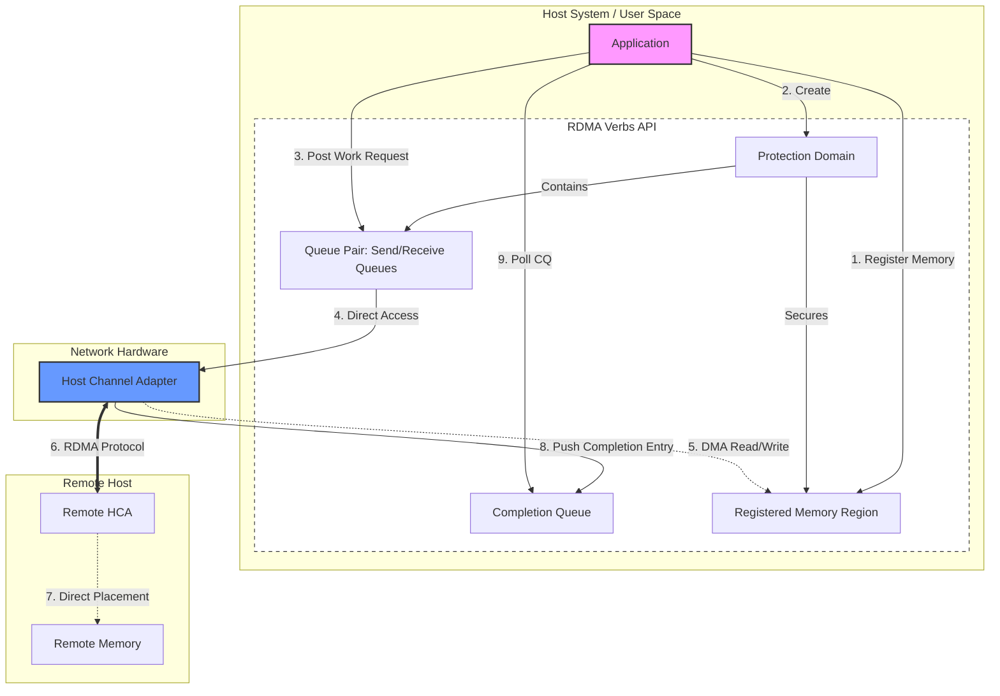
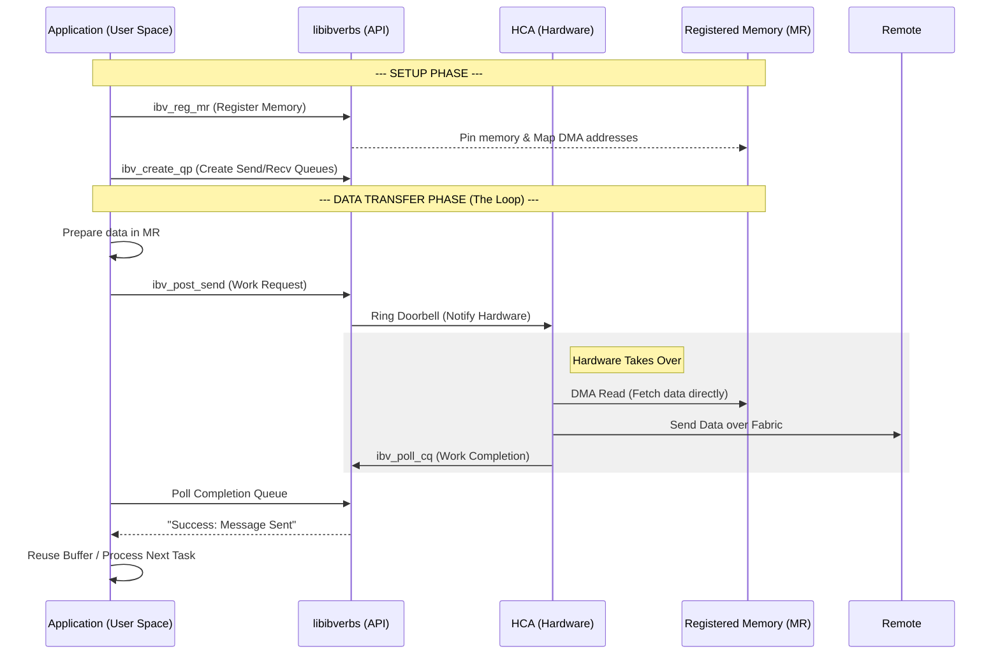
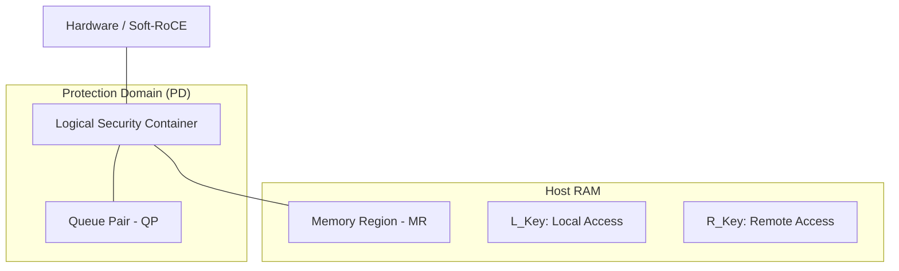
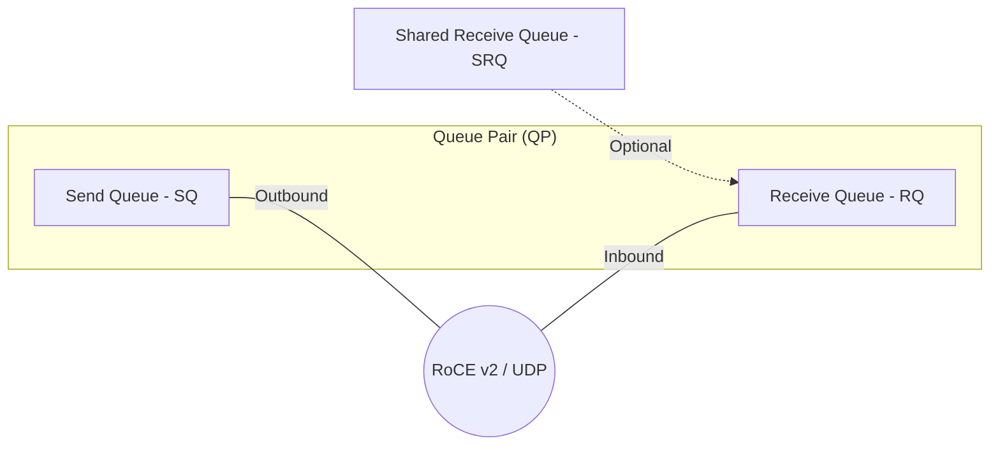
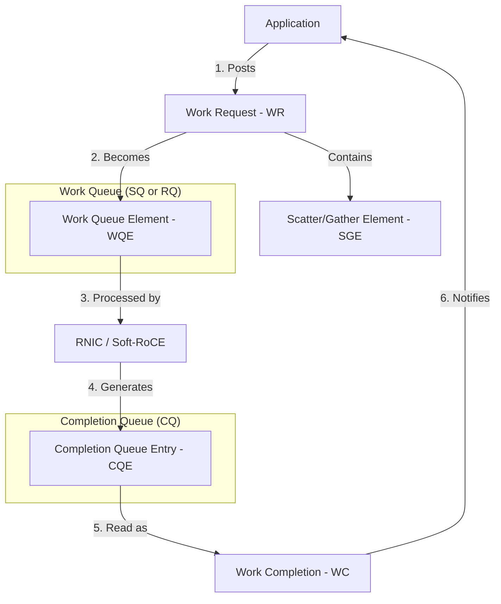
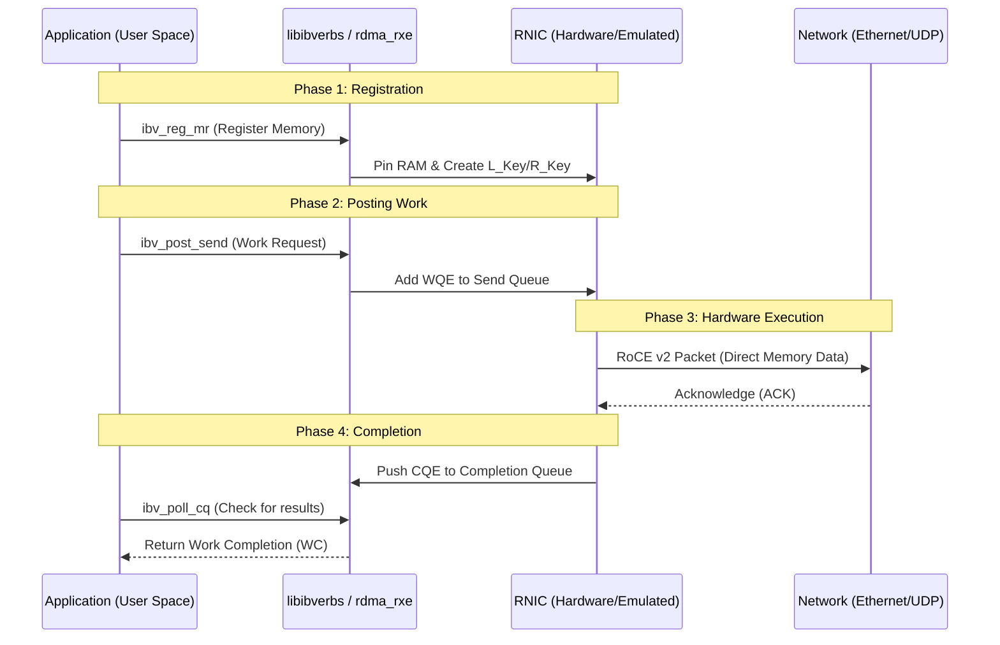
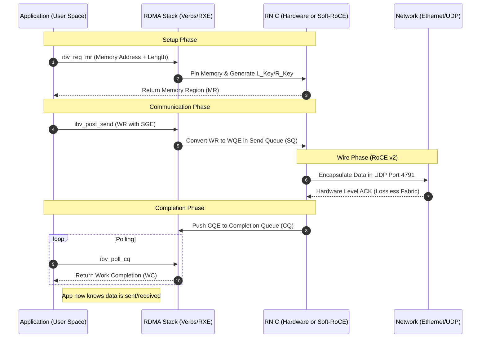

# RDMA : Remote Direct Memory Access:

Refers:
- [Intro to RDMA](https://www.rdmamojo.com/2014/03/31/remote-direct-memory-access-rdma/)

---

## Introduction:

- **DMA**: Direct Memory Access, is the ability of accessing memory ( for read and write) without the
  intervention of the CPU's.

- **RDMA:**: Remote DMA, its the ability of accessing (i.e reading from or writing to) memory on a remote
  machine without interrupting the processing of the CPU(s) on that system. 

### Advantages:

This offers many advantages:

1. **Zero-Copy**: 

    Apps can perform data transfer without the network software stack involvement and data is being send
    received directly to the buffers without being copied between the network layers.

2. **Kernel bypass**:

   Apps can perform data transfer directly from user-space without the need to perform context switches.

3. **No CPU involvement**: 

   Apps can access remote memory without consuming any CPU in the remote machine. The remote memory machine
   will be read without any intervention of remote process (or processor). The caches in the remote CPU(s)
   won't be filled with the accessed memory content.

4. **Message based transactions**: 

   The data is handled as discrete messages and not as a stream, which eliminates the need of the
   application to separate the stream into different messages/transactions.
   ( In TCP which is byte-stream protocol and its fragmentation nature does not care message boundaries,
   this puts a overhead on the application to delineation, Add headers like "Length" field to every pkt, so
   the receiving CPU can scan the stream, find where one message ends and copy it into usable buffer.

   In case of RDMA: ( which is message based ):
   - When you initiate an RDMA Write or Send you define a specific memory region as a single "message".
    * The RDMA HW (HCA host channel adapter) ensures that the data arrives at the destination exactly as it 
      was sent. If you send 4KB block the receiver HW knows exactly when the 4KB block is complete.
    * "Start" and "End" of transaction is handled by the HW not by OS kernel. 

   Apps doesn't have to maintain a "re-assembly buffer" to stitch fragments back together. When the HW 
   signals that a "Work Request" is complete, the data is already at the application's memory, fully formed 
   and ready for use.

5. **Scatter/gather entries support**: 

   **RDMA** supports natively working with multiple scatter/gather entries i.e. reading multiple memory
   buffers and sending them as one stream or getting one stream and writing it to multiple memory buffers.

6. **Low Latency**: 
   HPC, financial services, web 2.0. 

7. **High Bandwidth**: 
   Example HPC, medical appliances, storage and backup systems, cloud computing. 

8. **Small CPU footprint**: 
   HPC, cloud computing. 

### Protocols that use RDMA: 

**Network Protocols that support RDMA**:

- **InfiniBand (IB)** : 

  A new generation network protocol which supports RDMA natively from the beginning. Requires *NICs* and
  switches which supports this technology.

- **RDMA Over Converged Ethernet (RoCE)**:

  A network protocol that performs `RDMA over Ethernet network`. Its lower network headers are Ethernet
  headers and its upper network headers (including the data) are `InfiniBand headers`. This allows using 
  `RDMA` over standard Ethernet infrastructure (switches). Only the NICs should be special and support RoCE.

- **Internet Wide Area RDMA Protocol (iWARP)**

  A network protocol which allows performing `RDMA over TCP`. There are features that exist in `IB` and
  `RoCE` and aren't supported in `iWARP`. This allows using `RDMA` over standard Ethernet infrastructure
  (switches). Only the NICs should be special and support `iWARP` (if CPU offloads are used) otherwise, all
  `iWARP` stacks can be implemented in SW and loosing most of the `RDMA` performance advantages.

### Programming:

- A common API (verbs) can be used for all the above RDMA enabled network protocols. 

- Linux: `libibverbs` and `Kernel verbs` are required.

- Apps need to do Memory Registration, the memory gets pinned and it cannot be updated by any process/Cache. 

### verbs 

Verbs are a standardized set of API functions and data structures that allow applications to interact
directly with RDMA-capable network interface cards (RNICs). They define the verbs API used to manage memory,
establish connections, and perform data transfers without involving the operating system kernel or the CPU,
resulting in high throughput and low latency.

In other words, "Verbs" are the abstract SW interface used to interact with the RDMA-capable HW (the HCA).
We can picture them as sockets in standard networking, in RDMA we use *verbs*. 

- Verbs provide a hardware-agnostic interface, applications written to this API can run on different RDMA
  hardware (InfiniBand, RoCE, iWARP).

- Verbs act as bridge between application and RDMA HW, Unlike TCP/IP where data is handed over to OS, Verbs
  allows applications to bypass kernel and talk directly with the HW. 

### Core Objects: 

To use Verbs, you work with several key components that manage the "plumbing" of the connection:

- **Queue Pair (QP):** 
    - The fundamental unit of communication. Every connection consists of a **Send Queue** and a **Receive
      Queue**. It's roughly equivalent to a "socket."

- **Completion Queue (CQ):** 
    - This is where the hardware "reports back." When a message is sent or received, the hardware places a
      **Completion Queue Entry (CQE)** here to tell the CPU the job is done.

- **Memory Region (MR):** 
    - Before RDMA can happen, you must "register" a chunk of your RAM with the hardware. This gives the HCA
      permission to access that memory directly without asking the CPU.

- **Protection Domain (PD):**  
    - A "container" that ensures your Queue Pairs can only access the Memory Regions they are authorized to
      use, providing security.

#### Core Functions of Verbs:

- They enable the application to perform key operations, often referred to as "posting a verb" to the
  hardware: 
    * `Memory Registration`: Informing the HCA about memory buffers that can be accessed via DMA (Direct
      Memory Access), pinning them to physical memory to prevent paging.
    * `Queue Pair (QP) Management`: Creating and managing send and receive queues to communicate with other
      nodes.
    * `Data Transmission`: Initiating RDMA Read, RDMA Write, or Send/Receive operations.
    * `Completion Queue (CQ) Polling`: Checking the status of previously posted work requests.

### How Verbs Function (The Workflow)

The interaction follows a specific pattern of "posting" and "polling":

1.  **Post Work Request (WR):** 
    - The application "posts" a command to the Queue Pair (e.g., *"Hey hardware, send this 10MB of data from
      Memory Address X"*).

2.  **Hardware Execution:** 
    - The HCA takes over. It reads the data from RAM and sends it across the wire without the CPU’s help.

3.  **Poll for Completion:** 
    - The application periodically checks the **Completion Queue** (or waits for an interrupt) to see if the
      hardware has finished the task.

#### Classification of RDMA Verbs

RDMA operations are classified into two main communication paradigms: 

1. Channel Semantics (Two-Sided) 
    - Operations: Send, Receive.
    - Mechanism: Requires both sides of the communication to be active. The receiver must post a Receive
      verb to prepare a buffer, and the sender must post a Send verb.
    - Use Case: Sending control information or small messages. 

2. Memory Semantics (One-Sided)
    - Operations: Read, Write, Atomic.
    - Mechanism: Only one side (the initiator) is actively involved. The sender can directly write to or
      read from the remote memory address, bypassing the receiver's CPU.
    - Use Case: High-performance, large data transfers.

#### Key Components of Verbs Architecture

- Protection Domain (PD): 
A secure sandbox that groups RDMA resources (like QPs and memory regions) to ensure that only authorized
connections can access specific memory.

- Work Request (WR): 
An object posted by the application to the send or receive queue that defines the action the NIC should
perform.

- Completion Queue (CQ): 
A queue where the hardware posts a completion notification (Work Completion - WC) after a WR is finished.

- Memory Region (MR): 
A registered memory region containing memory keys (Local Key and Remote Key) used for RDMA access.

### Verbs Workflow and Relation with Application:

RDMA Verbs workflow and the relationship between the Application, the Verbs interface, and the HCA hardware.

- **Queue Pair (QP)**: The mailbox where the application posts "Work Requests" (commands).

- **Memory Region (MR)**: The specific slice of RAM that the HCA is allowed to access directly.

- **Protection Domain (PD)**: The "glue" or security container that ensures a specific QP can only access
  its assigned MR.

- **Completion Queue (CQ)**: The "Inbox" where the HCA drops a note (Work Completion) once a task is
  finished.

- **DMA (Direct Memory Access)**: The process where the HCA bypasses the CPU to read/write data directly
  from/to the Registered Memory.

--- 

#### Programming:

RDMA application lifecycle:
 
1. Setup Verbs (The "Builder" Phase)

Before you can communicate, you must create the infrastructure. These verbs set up the Protection Domain,
Memory, and Queues.

* **`ibv_open_device()`**: Finds and opens your RNIC (or your Soft-RoCE `rxe0` device).

* **`ibv_alloc_pd()`**: Creates the **Protection Domain**, the "sandbox" for your resources.

* **`ibv_reg_mr()`**: **The most important setup verb.** It registers a memory buffer, pins it in RAM, and
  returns the **L_Key** and **R_Key**.

* **`ibv_create_cq()`**: Creates the **Completion Queue** where "receipts" (WC) will be dropped.

* **`ibv_create_qp()`**: Creates the **Queue Pair** (SQ/RQ) and attaches it to a CQ.

2. Management Verbs (The "Handshake" Phase)
A newly created QP is in a "Reset" state. It cannot send data until it is moved through a state machine.

* **`ibv_modify_qp()`**: This is used multiple times to change the QP state:
    1.  **RESET → INIT**: Sets basic permissions.
    2.  **INIT → RTR (Ready to Receive)**: You provide the **Remote IP/GID** and **Remote QPN**. The QP can
        now "hear" the other side.
    3.  **RTR → RTS (Ready to Send)**: The QP is now fully "connected" and can initiate transfers.

3. Data Transfer Verbs (The "Action" Phase)
These are the verbs you call in your main loop to actually move data. Note that these are "Post"
operations—they are asynchronous and return immediately.

**Channel Semantics (Two-Sided)**
* **`ibv_post_recv()`**: Places a **Work Request (WR)** onto the **Receive Queue**. You are essentially
  saying: *"I am ready for someone to put data into this specific buffer."*
* **`ibv_post_send()`** with opcode `IBV_WR_SEND`: Sends data to the other side. The receiver **must** have
  already called `ibv_post_recv`.

**Memory Semantics (One-Sided)**
* **`ibv_post_send()`** with opcode `IBV_WR_RDMA_WRITE`: Pushes data directly into the remote RAM. You must
  include the `remote_addr` and `rkey` in the Work Request.
* **`ibv_post_send()`** with opcode `IBV_WR_RDMA_READ`: Pulls data from the remote RAM.

4. Completion Verbs (The "Feedback" Phase)
Because the "Post" verbs return immediately, you need a way to know when the hardware is finished.

* **`ibv_poll_cq()`**: The "Workhorse" of your application loop. It checks the **Completion Queue** for any
  new **Work Completions (WC)**.
    * If it returns `1`, you have a success/error message to process.
    * If it returns `0`, the hardware is still working.

### The "Verbs" Translation Table

| Concept | C Function (libibverbs) | Purpose |
| :--- | :--- | :--- |
| **Registration** | `ibv_reg_mr()` | Tells the HCA: "You have permission to touch this specific RAM." |
| **Connection** | `ibv_create_qp()` | Sets up the "Socket-like" transport. |
| **The Action** | `ibv_post_send()` | The "Post Work Request" step. This is **non-blocking**. |
| **The Action** | `ibv_post_recv()` | Prepares a buffer to catch an incoming message. |
| **The Result** | `ibv_poll_cq()` | Checks the "Inbox" to see if the hardware finished the task. |

---

### A Final Implementation Mental Model
Think of the RDMA process like a **Commercial Kitchen**:

1.  **Registering Memory:** You clear a specific counter-top (RAM) and tell the Prep Cook (HCA) they are
    allowed to work there.

2.  **Posting a Work Request:** You write a "Ticket" (Work Request) and hang it on the rail. You don't stand
    there waiting for the food; you go do other things.

3.  **HCA Operation:** The Prep Cook sees the ticket, grabs ingredients from the counter-top (DMA Read), and
    sends the dish out.

4.  **Polling the CQ:** You occasionally glance at the "Finished" window. When you see a "Done" slip, you
    know that counter-top space is now free to be used for the next dish.

If you try to clean the counter-top (modify the memory) before you see that "Done" slip in the Completion
Queue, you're going to create a mess!

### Interoperability:

- As these are different network protocols, the corresponding pkts are different and cannot send/recv
  messages directly without any router/gateway in between them.

- As all these protocols support `libibverbs` the same binary can be used without the need to recompile the
  source code. 

- Linux Supports RDMA natively and all distros support it, Other OS requires packages like OFED to add RDMA

## Basic Concept:

Essentials to understand how the RDMA concept: ( these are the only way CPU and the NIC talk to each other)

1. **The Queue Pair (QP) - The Mailbox**:

QP is the address of the communication endpoint, similar to Sockets in traditional socket based programming. 
Every communication endpoint needs to create a `QP` to talk to each other.

Every Connection between two end points has its own `QP`: It consists of two `pipes`:

* **Send Queue (SQ)**: Where the applications place "Work Request" (Ex: "Hay NIC go get this data from
  address 0x500 and send it to System B")

* **Receive Queue (RQ)** Where the applications places "Receive Requests" (Ex: Hay NIC if someone send me
  data, put it in this specific buffer at 0x900 ).

There are 3 types of `QP`: 
    - RC ( Reliable Connection )
    - UC ( UnReliable Connection)
    - UD ( UnReliable Datagram)

A More recent optimization from Mellanox introduces DTC ( Dynamic Connected Transport ) to solve the QP
scalability problem.

The choice of **QP** type determines whether your network acts like "Virtual Fiber (RC)", a "UDP Stream"
(UC) or "Standard Ethernet" (UD).

The Standard RDMA Transport Types

| Type | Connection Style | Reliability | Features | Use Case |
| :--- | :--- | :--- | :--- | :--- |
| **RC (Reliable Connection)** | 1-to-1 | **Yes** | Supports **RDMA Read/Write** and Send/Recv. Hardware handles ACKs/Retries. | NVMe-over-Fabrics, Databases. |
| **UC (Unreliable Connection)** | 1-to-1 | **No** | Supports **RDMA Write** and Send/Recv. No ACKs; if a packet drops, data is lost. | Video streaming, Telemetry. |
| **UD (Unreliable Datagram)** | Many-to-Many | **No** | Supports **Send/Recv only**. Works like UDP; can multicast. | Network discovery, ARP-like functions. |

The "QP Scalability" Problem The Achilles' heel of **RC (Reliable Connection)** is memory. 
* To maintain reliability, the NIC must store the **state** (sequence numbers, keys, etc.) for every single
  active connection.
* In a massive cluster (e.g., 10,000 nodes), if every node talks to every other node, each NIC must manage
  10,000 QPs.
* This consumes all the on-chip SRAM of the NIC. Once the NIC runs out of "fast memory," it has to swap
  connection states to host RAM (DDR), causing a **"Thrashing"** effect that destroys performance.

2. **The completion Queue (CQ)**: The "Done" Notification:

The NIC is asynchronous. When you put something in a `QP`, the NIC works on it in the background. When it's
finished, it drops a **Completion Queue Element (CQE) into the CQ. Your code "polls" this queue to see if
the work is done. 

3. **Memory Regions (MR) : The permission Slip**

The NIC can not touch the RAM unless you give it explicit permission.

You "Register" a chunk of memory and OS give you a `L_Key` ( Local Key ) and `R_Key` ( Remote key ), without
these the HW will trigger a memory fault. 

## RDMA Basic Elements:

The primary building blocks that manage how data moves between a host and the network interface card (NIC).

Overview of the RDMA elements, structured by how they function in the life-cycle of an operation.

---

#### 1. Configuration & Protection

Before you can send data, you must define the "space" in which communication happens.

* **PD (Protection Domain):** 
    - An object that groups Queue Pairs (QPs) and Memory Regions (MRs) together for security. A QP can only
      access memory that belongs to the same PD, preventing unauthorized memory access across different
      applications.

* **MR (Memory Region):** 
    - A registered block of user memory that the RDMA NIC (RNIC) is allowed to access. You must "pin" this
      memory so the operating system doesn't swap it to disk during an RDMA transfer.

* **MW (Memory Window):** 
    - A more flexible, dynamic sub-region of an MR. Unlike MRs, you can bind/unbind MWs to specific memory
      buffers without re-registering the entire block.

#### 2. Execution Objects (The ones you listed)

These are the structures used to queue and track work.

* **QP (Queue Pair):** 
    - The fundamental communication endpoint. It consists of a Send Queue (SQ) and a Receive Queue (RQ).

* **SQ (Send Queue):** 
    - Holds the work requests (WRs) that the application wants to send.

* **RQ (Receive Queue):** 
    - Holds the descriptors for where incoming data should be placed (used in RDMA Send/Receive operations).

* **SRQ (Shared Receive Queue):** 
    - An optimization that allows multiple QPs to share a single receive queue. This significantly reduces
      memory overhead when you have thousands of active connections.

* **WQ (Work Queue):** 
    - A general term for SQ and RQ.

* **WQE (Work Queue Element):** 
    - The actual descriptor inside a WQ that describes a specific task (e.g., "Read 4KB from address X").

* **WR (Work Request):** 
    - The high-level command the software submits to the SQ or RQ.

#### 3. Reporting & Completion

These elements inform the application that a task is finished.

* **CQ (Completion Queue):** 
    - A queue that stores the results of completed Work Requests.

* **CQE (Completion Queue Element):** 
    - The outcome report (e.g., "Success" or "Error") for a completed WR.

* **WC (Work Completion):** 
    - The structure that the software reads when polling the CQ; it contains the status of the operation.

* **Completion Channel:** 
    - A mechanism that allows an application to receive an event notification (e.g., an interrupt or signal)
      when a new CQE is added to a CQ, preventing the need for constant, CPU-intensive polling.

---

### Conceptual Flow
To help visualize how these fit together in the RoCE (RDMA over Converged Ethernet) stack:

1.  **Register Memory:** Application creates an **MR** within a **PD**.

2.  **Setup Path:** Application creates a **QP** within that same **PD**.

3.  **Submit Work:** Application posts a **WR** to the **SQ** (creating a **WQE**).

4.  **Hardware Processing:** The RNIC reads the WQE, performs the RoCE packetization, and handles the network transfer.

5.  **Completion:** The RNIC places a **CQE** into the **CQ**; the application processes the **WC**.

---

### Key RoCE-Specific Elements

* **GID (Global Identifier):** 
    - In RoCEv2, this is effectively the IP address of the RDMA endpoint (equivalent to the GID in
      InfiniBand).

* **P_Key (Partition Key):** 
    - Used to isolate traffic on a shared fabric. Only QPs with matching P_Keys can communicate, providing
      another layer of network-level security.

## RDMA Infrastructure to Execution:

Logical arrangement of RDMA elements ordered from the Infrastructure down to Execution.

1. **Setup ( Infrastructure )**:

Before you can send a single bit, you must define the "sandbox" where the hardware is allowed to play.

- `HCA` / `RNIC`: The physical hardware (Host Channel Adapter) or the Soft-RoCE virtual device.

- `Protection Domain (PD)`: A container that "glues" together `QPs` and `Memory Regions`. It ensures that a
  `QP` in one application cannot accidentally access memory registered by another.

- `Memory Region (MR)`: A chunk of your RAM that you have "pinned" and registered.
    - `L_Key` / `R_Key`: The security tokens. The `L_Key` is for local hardware access; the `R_Key` is sent
      to the remote node so it can "reach in" and read/write to your RAM.

Before any data moves, you must define the **Protection Domain (PD)**. This is the security boundary that
links your memory to the HW.

--- 

2. **The Communication Channel (The "Socket" Equivalent)**

This is where your list of Queues fits in. 

- **QP (Queue Pair)**: The fundamental communication endpoint. It is always a pair:
    - **SQ (Send Queue)**: Your "Outbox."
    - **RQ (Receive Queue)**: Your "Inbox."

- **WQ (Work Queue)**: This is the generic term for either the SQ or the RQ.

- **SRQ (Shared Receive Queue)**: A specialized optimization. Instead of every `QP` having its own private
  Receive Queue, multiple `QPs` can pull from one "Shared" pool of buffers. This saves massive amounts of 
  RAM in high-scale systems (like databases). 

The Queue Pair (QP) is the "socket" of RDMA. It consists of two dedicated work queues.

3. **The Execution (The "Work")**

This is the "verb" part of RDMA. This is how you actually tell the hardware to move data.

- **WR (Work Request)**: This is what you (the software) create in C code. It’s a struct containing the
  instruction (e.g., "RDMA WRITE"), the local buffer address, and the remote address/key.

- **WQE (Work Queue Element)**: Pronounced "Wuk-kee." When you "post" a WR to a Queue, the hardware converts
  it into a WQE. This is the hardware-readable version of your request sitting in the SQ or RQ.

- **SGE (Scatter/Gather Element)**: A sub-element of a WR. It allows you to point to multiple disconnected
  chunks of memory and tell the HCA to "gather" them into one single outgoing packet.

This is the "work Cycle". You post a request (**WR**), it becomes hardware-readable (**WQE**) and results in
a notification (CQE/WC)

4. The Feedback Loop (The "Reporting")

RDMA is asynchronous. You don't wait for the function to return; you wait for the "Report Card."

- **CQ (Completion Queue)**: A queue where the HCA places "Receipts" once a task is finished. Multiple QPs
  can share a single CQ to centralize event handling.

- **CQE (Completion Queue Element)**: The hardware-level notification that a WQE has been processed.

- **WC (Work Completion)**: This is the C struct your application reads when it polls the CQ. It tells you:
  "Success" or "Error: Local Length Violation," etc.

Diagram maps the flow from a local $C$ function call to the remote systems memory via RoCE:

When writing the code , this is the place you spend time : 
servers posts a receive and then sit in a loop pooling the `CQ`, As soon as `WC` appears you know the data
has arrived and in your registered memory and you can immediately "post a Send" back.

### The Logical Flow (Putting it together)

1. Register your memory (MR) and create a PD.
2. Create a CQ and a QP.
3. Fill out a Work Request (WR) with an SGE pointing to your data.
4. Post the WR to the Send Queue (SQ); it becomes a WQE.
5. The RNIC processes the WQE, sends the data over RoCE (UDP/IP).
6. The RNIC drops a CQE into the Completion Queue (CQ).
7.  Your app polls the CQ and receives a Work Completion (WC).

Diagram maps the transition from high level $C$ code down to $RoCE$ wire and back up to your application:

