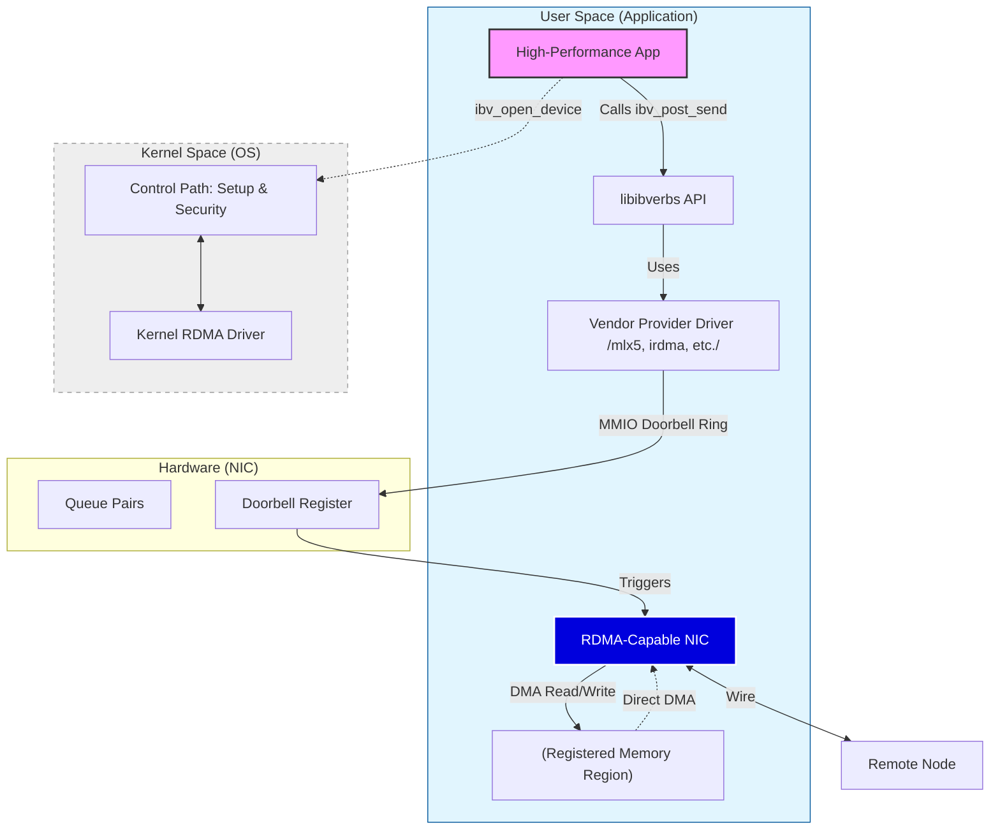
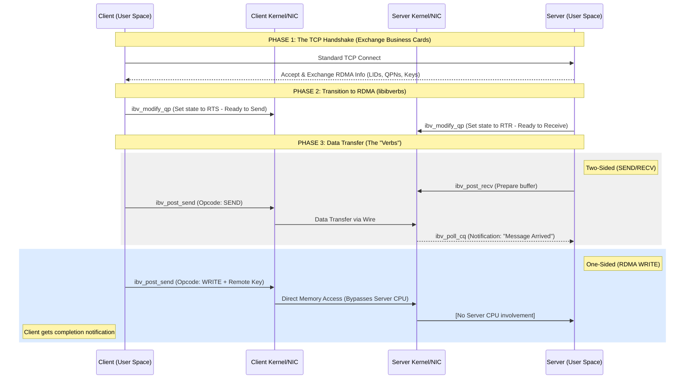
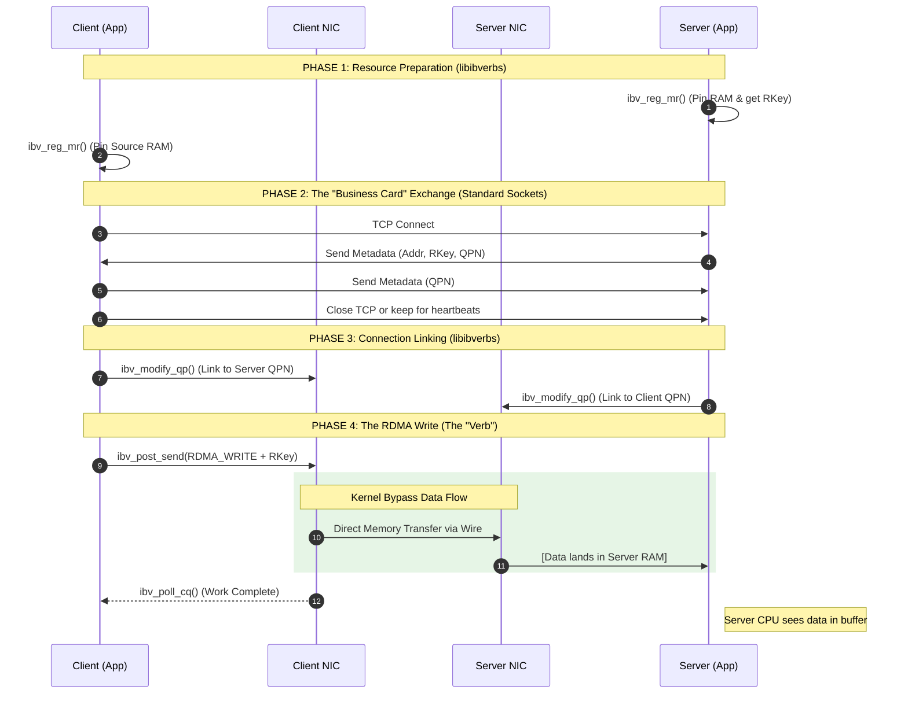

# libibverbs :

## `libibverbs`:

- A lowlevel library for development of applications, which utilize **RDMA**.

- This library provides the required features that help to teleport data ( read/write) directly to the
  memory of another computer without the involvement of system's CPU. 

- The primary goal of `libibverbs`: Provide a user-space interface to the HW capabilities of RDMA-capable
  network cards (like InfiniBand, RoCE, or iWARP). 

- This library address the bottleneck of latency in traditional network :
    - *Kernel ByPass*:  Allows app's to send/receive data directly through the network card, skipping the
      Linux kernel entirely. This eliminates the "middleman" and reduces latency.
    - *Zero-Copy*: Data is moved directly from the app's memory to the network wire. The CPU doesn't have to
      waste cycles copying data between buffers.
    - *CPU Offloading*: Network HW handles the heavy lifting of data transport, leaving CPU free to do
      actual computation. Crucial for AI Training and Big Data, HPC running a massive simulation across
      clusters, NVMe-Over-Fabric (NVMe-oF) which uses to make remote SSD feel like local.

- The library is named Verbs as InfiniBand Architecture defines the APIs as a set of `Verbs` (actions) that
  the application can perform, 

- Unlike traditional network programming, where we use sockets to send/recv data:

| Object | Description |
| :--- | :--- |
| **Queue Pair (QP)** | The "virtual port" used to send and receive data. |
| **Completion Queue (CQ)** | A notification area where the hardware tells you a task is finished. |
| **Memory Region (MR)** | A registered "safe zone" of RAM that the network card is allowed to access. |
| **Protection Domain (PD)** | A security wrapper that ensures your resources don't interfere with others. |

- Key Components of `libibverbs`:
    * **Control Path:** 
        - Used for setup tasks (creating queues, registering memory). 
        - This still goes through the kernel for security checks.
    * **Data Path:** 
        - Used for the actual movement of data. This is the "fast path" that bypasses the kernel and talks 
          directly to the hardware.
    * **Providers:** 
        - `libibverbs` is a generic framework. 
        - Hardware vendors (NVIDIA/Mellanox, Broadcom, or Intel) provide "provider" drivers that plug into
          it to make their specific hardware work.

- `libibverbs` is the translation layer that takes the abstract "Verbs" defined in the InfiniBand Arch(IBA) 
  and turns them into HW-specific commands.

- Visualizes the flow of data  of applications using **libibverbs**: highlighting **Kernel Bypass** and the 
  relationship between the application, the library, and the hardware.

### Explanation of the Flow
1.  **The Control Path (Dotted Line):** The application first talks to the **Kernel** to register memory and
    create queues. This ensures security—the OS verifies that the app "owns" the memory it wants to expose
    to the network.
2.  **The Data Path (Solid Line):** Once set up, the application calls `libibverbs` to send data. The
    **Provider** driver writes directly to the **NIC's Doorbell Register**.
3.  **Kernel Bypass:** Notice the solid lines completely skip the **Kernel Space**. The CPU doesn't copy the
    data; it just tells the NIC where the data is.
4.  **Zero-Copy DMA:** The NIC reads the data directly from the **Registered Memory Region** and pushes it
    onto the wire.

- Client-Sever model: While RDMA allows for "one-sided" operations (where one machine reaches into the
  memory of another without  the other machine even knowing), the initial connection and resource management
  almost always follow a Client-Server or Master-Worker model.

- In the context of `libibverbs`, the client-server relationship happens in two distinct phases:
    1. Setup Phase (The "Handshake"):
    - Before RDMA can happen, both machines need to agree on terms. 
    - Since RDMA bypasses the standard networking stack, the machines use a side channel (usually standard
      TCP/IP sockets) to exchange information.
    - They exchange "business cards" containing:
        * `LID/GID`: The network addresses of the NICs.
        * `QPN (Queue Pair Number)`: The ID of the specific queue created for this connection.
        * `Keys (rkey)`: Security tokens that allow the remote side to access specific memory regions.

    2. The Operational Phase
    - Once the connection is established, the roles become more fluid. Depending on the "Verb" used, the
      interaction looks different:
    
    ** Two-Sided Operations (SEND/RECEIVE)**
    - This feels most like traditional networking but faster.
        - Server: Posts a RECV request to its queue and waits.
        - Client: Posts a SEND request.
        - Result: The NICs coordinate the transfer. Both CPUs are involved in managing the completion of the
          message.

    **One-Sided Operations (READ/WRITE)**
    - This is the "magic" of RDMA.
        - Server: Simply sits there. It has already told the Client: "You have permission to write to this
          memory address using this key."
        - Client: Issues an `ibv_post_send` with an `RDMA_WRITE` opcode.
        - Result: The Client’s NIC pushes data directly into the Server's RAM. The Server’s CPU is never
          interrupted.
    **The Connection Manager (librdmacm)**
    - Because setting up these "Client-Server" connections manually in libibverbs is notoriously difficult 
      (involving a lot of boilerplate code to exchange those "business cards"), most developers use a 
      companion library called `librdmacm` (RDMA Connection Manager).

    - It provides a familiar `rdma_connect()` and `rdma_accept()` workflow that mimics standard sockets 
      while setting up the underlying `libibverbs` structures for you.

- Client-Server Life Cycle:

- Key Takeaways from the Diagram:
    * **The Transition**: Notice how the communication shifts from the application talking to the Kernel (to
      set up the Queue Pairs) to the application talking directly to the NIC hardware.
    * **Two-Sided vs. One-Sided:** In Two-Sided, the Server must actively "post" a receive buffer before the
      client sends, otherwise, the message is dropped or blocked.
        - In One-Sided, the Server is essentially "oblivious" while the transfer happens. It simply provides
          the memory address and the security key beforehand, and the hardware handles the rest.
    * **Completion Queues (CQ)**: In both models, the `libibverbs` flow usually ends with the application
      "polling" a queue to see if the hardware has finished the task. This is much faster than waiting for a
      standard OS interrupt.

## Setup Phase 

- "chicken and egg" problem of RDMA: **how do you tell a machine to start a fast RDMA connection if you 
  don't have a connection to it yet?**

- Here is how that layered setup works in reality:

### 1. The Network Layer (IP Assignment)

Before any code runs, the NICs must indeed have a valid physical and network layer configuration.
* **For RoCE (RDMA over Ethernet):** The NICs need standard IP addresses assigned just like a normal
  Ethernet card. You can even `ping` the other side to verify connectivity.
* **For InfiniBand:** It uses a different addressing scheme called **LIDs** (Local Identifiers) and **GIDs**
  (Global Identifiers), managed by a "Subnet Manager" (a piece of software running on the switch or a host).

### 2. The "Out-of-Band" Connection (TCP Handshake)

Most RDMA applications start exactly like a regular web server or database client.
* The **Server** opens a standard **TCP Listening Socket**.
* The **Client** connects to that socket.
* **The Purpose:** This "slow" TCP connection is used as a **side-channel** to exchange the "Business Cards"
  we discussed earlier (specifically the Queue Pair numbers and Memory Keys).

### 3. The Transition: "The Handover"

Once the TCP handshake is done, the application performs a **State Transition** via `libibverbs`.
* The Queue Pair (QP) starts in a **RESET** state.
* The app moves it to **INIT** (Initial).
* Then to **RTR** (Ready to Receive) once it has the remote side's info.
* Finally to **RTS** (Ready to Send).

At this moment, the application usually **closes or ignores the TCP socket** and starts pushing data through
the RDMA hardware queues.

---

### Comparison of the Programming Models

If you were writing this code, your "Main" function would look like a hybrid:

| Phase | Technology | Logic |
| :--- | :--- | :--- |
| **I. Discovery** | **Standard Sockets** | `socket()`, `connect()`, `send()` (exchange RDMA metadata). |
| **II. Memory** | **libibverbs** | `ibv_reg_mr()` (Pin your RAM so the NIC can see it). |
| **III. Linking** | **libibverbs** | `ibv_modify_qp()` (Plumb the local QP to the remote QP). |
| **IV. Data** | **libibverbs** | `ibv_post_send()` (The "teleportation" begins). |

---

### Is there a way to avoid the TCP part?

Yes. There is a helper library called **librdmacm** (RDMA Connection Manager).
* It acts as a "wrapper" that handles the TCP handshake for you.
* It provides functions that look like sockets (`rdma_connect`, `rdma_accept`) but automatically handles the
  exchange of those "business cards" and the `libibverbs` state transitions under the hood.

**In summary:** RDMA isn't a replacement for the *existence* of a network; it's a high-performance
*alternative* to the TCP data-transfer path once the two systems have been introduced to
each other.

### Critical Steps Highlighted:

1.  **Step 1 & 2 (Memory Registration):** Before the NIC can touch RAM, `libibverbs` tells the Kernel to
    "pin" the memory pages. If the OS swapped that memory to disk while the NIC was writing to it, the
    system would crash.
2.  **Step 4 & 5 (Metadata Exchange):** This is the "Client-Server" part. The Server must give the Client
    the **RKey** (Remote Key). Without this key, the Server's NIC will block any incoming write attempts for
    security.
3.  **Step 9 (The Doorbell):** When the Client calls `ibv_post_send`, it's literally "ringing a doorbell" on
    the NIC hardware. 
4.  **The "Silent" Arrival:** Notice there is no arrow from **SNIC** to **S** for the data arrival. In a
    pure RDMA Write, the Server's CPU is not notified by the hardware; the data just "appears" in the
    memory. If the Server needs to know the data is there, the Client must follow up with a "Send with
    ImmData" or the Server must "Poll" the memory.
