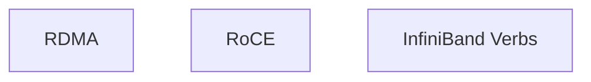
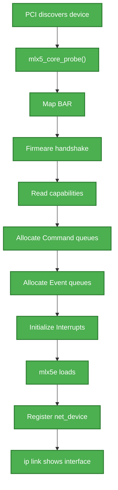
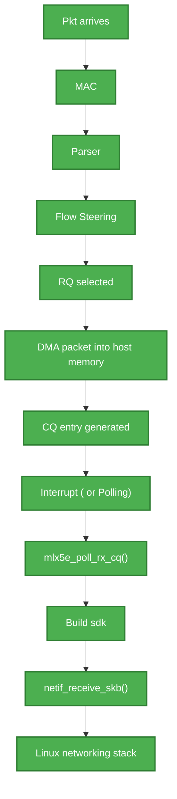
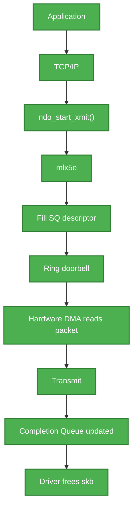
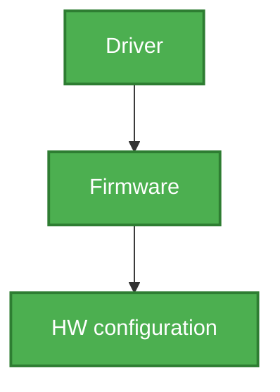

# SmartNIC ( mlx 5 )

RDMA is the deepest architecture break from standard net on this NIC.

Standard networking path for every byte:

```
   app 
    → syscall 
        → socket buffer copy 
            → TCP/IP stack 
                → driver 
                    → NIC 
                        → driver 
                            → TCP/IP Stack 
                                → socket buffer copy 
                                    →  app 
```
Every one of the above step copies and context switches costs CPU cycles and latency.
At 100Gbps that overhead alone can saturate a CPU core before doing any other real work. 

RDMA proposition: 
- Let the NIC read/write directly into a remote application memory, with the CPU on both ends completely
  uninvolved in the data movement.  This means there are no kernel stack, no copies, no interrupt per
  byte. 
- There is a trade off with this approach that this requires a much stricter contract with the network
  than TCP ever needed.


**Queue Pairs (QPs) - the RDMA execution unit.


NOTE: 
- Biggest mistake people make when learning SmartNIC is treating them as "Just a Fast NIC". A ConnectX-5
  is actually a programmable network processor with firmware, DMA engines, schedulers, packet parsers,
  memory translation HW, and command processors. 
- Linux driver is primarily a manager of these HW blocks rather then the component that processes every
  packet. 

Mental Model to study layer by layer:

```
+-----------------------------------------------------+
| User Space                                           |
| ip, ethtool, rdma-core, DPDK, SPDK, OVS              |
+-----------------------------------------------------+
| Kernel Networking                                    |
| TCP/IP, Netfilter, XDP, TC, RDMA stack               |
+-----------------------------------------------------+
| mlx5_core / mlx5e / mlx5_ib drivers                  |
+-----------------------------------------------------+
| PCIe Interface                                       |
+-----------------------------------------------------+
| ConnectX-5 Firmware                                  |
| Command Processor                                    |
| Resource Manager                                     |
| Flow Steering                                        |
| Queue Scheduler                                      |
| Event Manager                                        |
+-----------------------------------------------------+
| ConnectX-5 Hardware                                  |
| RX/TX DMA                                            |
| Packet Parser                                        |
| Match Engine                                         |
| Queue Engines                                        |
| Interrupt Logic                                      |
| PCIe DMA                                             |
| Memory Translation                                   |
+-----------------------------------------------------+
```

## 1.0 HW Components: 

Ignoring PHYs and analog circuitry, the major digital HW blocks inside a ConnectX-5 are approximately:


### PCIe Interface:

Responsible for:
- PCIe enumeration
- BAR mapping
- MSI-X 
- DMA transactions 
- Doorbell reception

Linux sees this as a PCIe endpoint. 


### Embedded Processor:

CX-5 Contains embedded CPUs ( not user-programmable in general sense ).

These processors execute firmware:

**Firmware Performs**:
- Initialization
- Command execution 
- Resource allocation
- Error recovery
- device configuration

Linux Driver never directly manipulates most HW registers, Instead the drivers sends commands to
firmware. 

### DMA Engine:

Copies pkts between:


Without CPU involvement. 

DMA performs:
- RX writes
- TX reads
- Completion Queue updates.

### Queue Engine:

Maintains:


Each Queue is actually a Circular Buffer in Host memory.
HW walks these buffers directly. 

### Pkt Parser: 

Examines Incoming pkts:
Extracts:


Produces metadata. 

--- 

### Flow Steering Engine:

HW lookup engine:

Matches:


Determines: 

This is why SmartNICs can process pkts without CPU intervention. 

### Scheduler:

Schedules transmission.
Responsible for: 
- QoS 
- Rate limiting 
- Traffic Classes 
- Priority

### Interrupt/Event Engine:

Produces:

```
- Completion Interrupts 
- Async Events 
- Errors 
- Port Changes 
- Temperature alarm

```
Delivered through MSI-X. 

### Memory Translation Unit:

Similar to the concept of IOMMU:

Translates: 

Supports: 
- Memory Registration
- RDMA 
- ODP 

## 2.0 Firmware Responsibilities:

Firmware is effectively the operating system of the NIC. 
Firmware manages **Initialization** during Boot:


### Command Processing: 

Drivers sends commands like :


Firmware validates them.

Allocates hardware resources.

Returns IDs.

### Resource Tracking:

Firmware Owns:


### Error Recovery:
Firmware detects:

Notifies Driver.

### Link Management: 

Negotiates:
```mermaid 
- 100G 
- 40G 
- 25G 
- 10G 
- FEC 
- Autoneg
```
Driver only requests changes.

## 3.0 Driver Components: 

The `mlx5` driver is split into several modules.


### `mlx5_core` :

Main PCI driver 

Responsible for

Think of it as the kernel interface to firmware.

### `mlx5e`:

Ethernet Driver
Creates: 


### `mlx5_ib` :

Implements


## 4.0 Driver Initialization Sequence: 
Very roughly:


## 5.0 Pkt Receive Path: 

This is probably the most useful thing to understand.


Notice that firmware is not processing every packet.
Firmware is mainly involved in setup.
The HW datapath handles packets.


## 6.0 Pkt Transmit Path:



## 7.0 Command Path vs Data Path
This distinction is extremely important 

### Command Path**



Examples:


### Data Path: 

```mermaid 
flowchart 
    A["Packet"] --> B["Hardware"]
    B --> C["DMA"]
    C --> D["Host memory"]
    D --> E["Driver poll"]
    E --> F["Linux stack"]
classDef green fill:#4CAF50,stroke:#2E7D32,stroke-width:2px,color:#fff;
class A,B,C,D,E,F green;
```

Fast Path. 
No firmware involvement.

## 8.0 Important Data Structures in the Driver: 

Common structures in the mlx5 driver source:

- `struct mlx5_core_dev` – Represents the device and holds global state.
- `struct mlx5_eq` – Event Queue.
- `struct mlx5_cq` – Completion Queue.
- `struct mlx5e_rq` – Receive Queue.
- `struct mlx5e_sq` – Send Queue.
- `struct mlx5e_priv` – Ethernet driver private context.
- `struct mlx5_cmd` – Command interface to firmware.

Learning how these relate to one another provides a solid map of the driver's architecture.

## 9.0 Suggested Learning Order

To build an understanding that maps hardware, firmware, and the Linux driver together:
1. PCI enumeration and probe (mlx5_core).
2. Firmware command interface (how the driver creates and destroys resources).
3. Queue objects (SQ, RQ, CQ, EQ) and their lifecycle.
4. Doorbells and DMA (how the driver notifies the NIC and how the NIC accesses host memory).
5. Receive and transmit packet paths.
6. Flow steering and RSS.
7. RDMA-specific concepts (Queue Pairs, Completion Queues, Memory Registration, etc.).

By this it gets clear that the driver does less "packet processing code" and more as a control plane that
programs the NIC, while the CX5 HW hardware executes the data plane at line rate. 

For CX5 internals with Linux `mlx5` driver the next step is walk through the driver source file by file
from `mlx5_core` PCi probe, through firmware initialization, queue creation, and finally the RX/TX data
paths. 
Next is mapping each major function to the HW block or firmware service it configures. This approach
makes the interactions between HW, firmware and driver much easier to understand.
