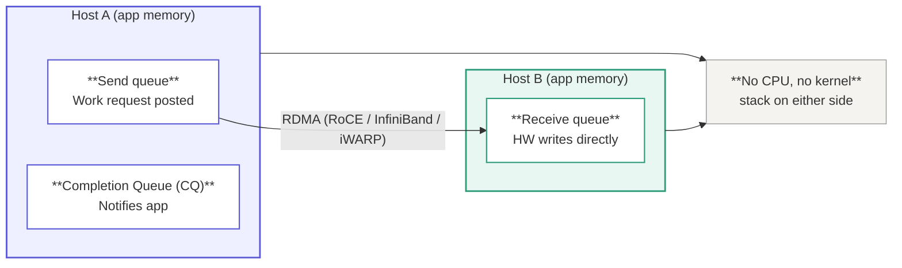
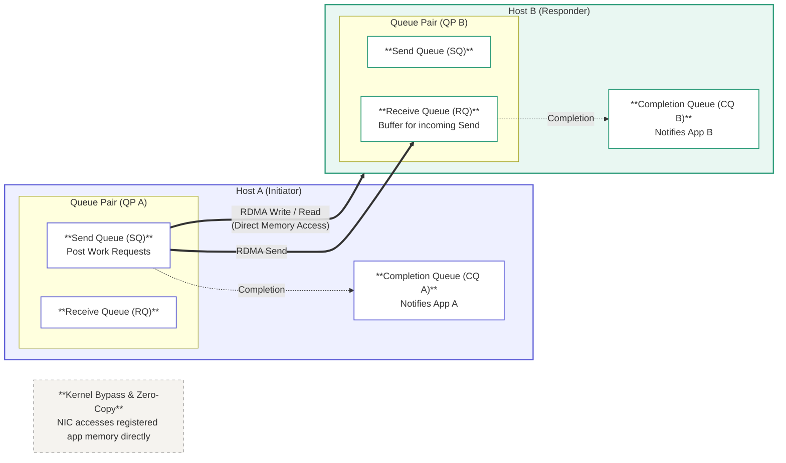
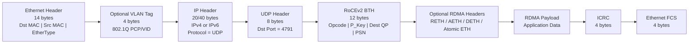
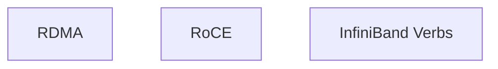
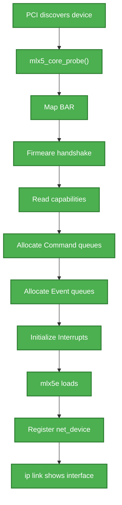
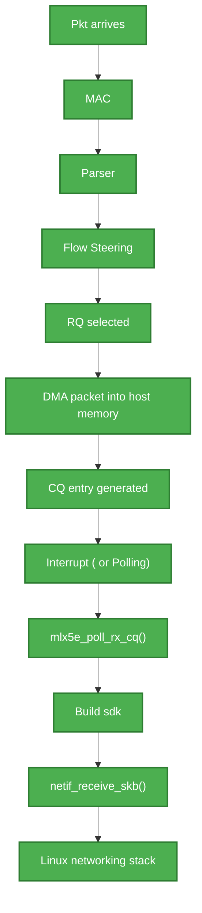

        # SmartNIC ( mlx 5 )

RDMA is the deepest architecture break from standard net on this NIC.

Standard networking path for every byte:

```
   app 
    → syscall 
        → socket buffer copy 
            → TCP/IP stack 
                → driver 
                    → NIC 
                        → driver 
                            → TCP/IP Stack 
                                → socket buffer copy 
                                    →  app 
```


Every one of the above step copies and context switches costs CPU cycles and latency.
At 100Gbps that overhead alone can saturate a CPU core before doing any other real work. 

RDMA proposition: 
- Let the NIC read/write directly into a remote application memory, with the CPU on both ends completely
  uninvolved in the data movement.  This means there are no kernel stack, no copies, no interrupt per
  byte. 
- There is a trade off with this approach that this requires a much stricter contract with the network
  than TCP ever needed.


**Queue Pairs (QPs) - the RDMA execution unit.

In place of sockets for standard TCP/IP networking, the `RDMA` unit for work is a **`Queue Pair`**:
`**a senf queue + receive queue**`, its always used together, backed by a Completion Queue (**CQ**) that
reports when work is finished. 



The above mermaid flow chart captures the core concept of **RDMA Queue Pairs** (QPs) and zero copy transfer.

For a complete picture:

- **Queue Pairs are Paired**: An `RDMA QP` consists of **`Send Queue (SQ)` and a `**Receive Queue (RQ)` on
  **both** sides. 

  - Host A has a `SQ` and `RQ`
  - Host B also has a `SQ` and `RQ` 
  - Host A and B also have a completion Queue, especially if send/receive semantics or completions with
    immediate data are used. 

- **RDMA Read/Write** vs **send/receive**:

    - For RDMA write/read data transfers directly into/out of pre-registered memory regions without
      requiring a Work Request in Host B's Receive queue. 
    - For RDMA Send, a work Request must be posted to Host B's Receive Queue (RQ) ahead of time. 

A complete flow diagram: (with two-way asynchronous notification )


**What is inside Queue Pairs**:

Each Queue Pair has:

- **Send Queue (SQ)**: Work requests: "read this memory", "write to remote memory", "send this message",
  each entry is a work queue element (**WQE**)

- **Receive Queue (RQ)**: buffers pre-posted so incoming data has somewhere to land.

- **Completion Queue(CQ)**: Where the app polls ( or gets interrupted ) to know a WQE finished.

**Three transport modes matter**:

- **RC (reliable connected)**: Like TCP's reliability guarantee, but HW enforced: Ordering, ACKs,
  retransmission, all in silicon. Used for most storage/ML traffic. 

- **UC (un-reliable connected)**: no retransmission lower overhead. 

- **UD ( Unreliable Datagram )**: Connectionless, used for things like milticast. 


**Memory Registration**: This is the other half:

Before any RDMA operation, a memory region must be registered with the NIC, which pins it and returns keys
(`lkey` for local access, `rkey` for a remote peer to reference ). 
The NIC's Memory Translation Unit (from your original map(below)) is what makes "remote peer writes into my
virtual address space" safe it translates and validates that access in HW, per operation, without a
CPU-mediated page fault... unless ODP (On-Demand Paging) is in play, which lets registered memory be
swappable and let the NIC fault it in.

**This forces "lossless Ethernet"**: 

- TCP survives packet loss because retransmission is cheap relative to total flow duration and the CPU is
  already already in the loop managing state per-connection. i.e TCP uses CPU cycles to manage complex
  retransmission windows; RDMA offloads this to NIC silicon, making packet loss recovery expensive.

- In std RoCEv2 hardware transport historically uses *Go-Back-N* retransmission. If a single packet drops,
  the entire transmission window is thrown out and retransmitted from that sequence number onward. In a
  high-throughput cluster, a tiny drop rate causes throughput to collapse instantly.

- RDMA's whole value proposition is removing the CPU from that loop  which means loss recovery in hardware
  is either very limited (drop the whole connection) or very expensive (large retransmission windows
  implemented in silicon). So instead, RoCE (RDMA over Converged Ethernet) leans on the network itself not
  dropping packets:

**Lossless Mechanisms (PFC, ECN, DCQCN)**

  * **PFC (Priority Flow Control, 802.1Qbb)**: works are L2 by sending pause frames on specific Priority
    queues (DSC/CoS mapped). It prevents queue overflows, but trades packet drops for link-level delay.
    A switch can pause a specific traffic class on a link before its buffer overflows, instead of dropping.

  * **ECN and DCQCN**: Serves as the proactive congestion manager before PFC reactively slams the breaks.
    - Switch marks **CE (Congestion Experienced)** bit in IP header when queues build up.
    - Receiver NIC detects CE and sends a CNP (Congestion Notification Packet) back to the sender NIC.
    - Sender NIC’s hardware rate-limiter throttles the specific Queue Pair (QP).

  * So **ECN (Explicit Congestion Notification)**: marks pkts approaching congestion rather than dropping
    them.
  * DCQCN (Data central quantized congestion Notification) the end-to-end congestion control loop: NIC sees ECN marks on received packets → tells the sender via CNP (Congestion Notification Packets) → sender's rate limiter throttles that flow, then slowly ramps back up. This runs in the NIC's hardware/firmware, not in TCP's software congestion window.

**RoCEv1 vs. RoCEv2** 

- **RoCEv1**: `EtherType` `0x8915`. L2-only, requires hosts to be in the same Layer 2 broadcast domain. 
  Practically obsolete in scale-out data-centers.

- RoCEv2: Encapsulates RDMA over UDP/IP (UDP Port 4791). Uses the outer IP header for Layer 3 routing and
  the outer UDP source port (computed as a hash of the QP) to allow switch ECMP (Equal-Cost Multi-Path) load
  balancing.

The catch: and this is a known operational headache, is that PFC operates per-priority-class on a link, so a
slow receiver can cause head-of-line blocking or even PFC deadlocks cascading backward through a fabric.
This is why RoCE deployments need carefully tuned lossless fabrics (DCB configuration end to end), unlike
standard Ethernet where you just let TCP handle loss.

One more distinction worth locking in: RoCEv1 is Ethernet-layer only (not routable), RoCEv2 wraps RDMA in
UDP/IP (routable across L3, which is why it's what's actually deployed today).

**Mental Model**: 

- `RoCE architecture`: 
        RDMA Transport Layer ( Go Go-Back-in HW )
             + RoCEv2 Encapsulation ( UDP/IP for L3 Routing )
             + PFC ( Lossless network Assurance )


**RoCE**:

RDMA over Converged Ethernet, this is a network protocol that enabled RDMA over standard Ethernet and IP
network. ( this is the key component that allows servers and GPUs to directly read and write to each
others memory without the involving the CPU or the OS kernel, it delivers sub-micro second latency and
massive throughput crucial for modern AI training and HPC).

Looking at the actual bytes on the wire will clarify why RoCEv2 exists at all.

**Core Problem: IB Transport header didn't originally know about Ethernet or IP** 

- RDMA's transport semantics (QP numbers, seq numbers, ACKs, opcodes) come from Infiniband. IB was its
  own fabric with its own L2/L3. RoCE is taking that IB transport layer and carrying it over Ethernet
  instead. 

- The two RoCE versions differ in how much of the IB/Ethernet/IP stack sits underneath that transport hdr.

- 
```txt 
RoCEv1 frame:

    [  Ethernet hdr  ][  Ethertype 0x891  ][  IB transport (BTH) ][  Payload  ][  CRC ]
    No IP layer: link-local only, not routable across L3.

RoCEv2 frame:
    [  Ethernet hdr  ]  [  IPv4/IPv6   ][     UDP (4791)     ][   Payload  ][  CRC ]
                          |                       |
                   ECN bits here              Src port varies 
                ( routable, DCQCN marking )   per flow (ECMP hash)

    Same IB transport header and QP semantics in both, only the underlay changed. 
```


The Encapsulation looks as below:
The RoCEv2 pkt is an ethernet/ip/udp wrapper carrying IB transport-layer semantics. 
The Encapsulation looks as below: 

```txt 
+------------------------------------------------+
| Ethernet Header                                |
|  Dst MAC | Src MAC | EtherType                 |
+------------------------------------------------+
| IP Header                                      |
|  Src IP | Dst IP | ECN bits                    |
+------------------------------------------------+
| UDP Header                                     |
|  Src Port | Dst Port = 4791                    |
+------------------------------------------------+
| InfiniBand Transport Headers (RoCEv2)          |
|  BTH + optional RETH/AETH/DETH/etc.             |
+------------------------------------------------+
| RDMA Payload                                   |
|  Data being transferred                        |
+------------------------------------------------+
| ICRC                                           |
+------------------------------------------------+
| Ethernet FCS                                   |
+------------------------------------------------+
```
the key difference with native IB is the network layer transport:

| Native InfiniBand    | RoCEv2                    |
| -------------------- | ------------------------- |
| IB Link Layer        | Ethernet                  |
| IB LID addressing    | IP addressing             |
| IB routing           | IP routing                |
| IB link packets      | UDP/IP packets            |
| IB transport headers | Same IB transport headers |

RDMA operations themselves are still based on IB protocols:
- QP 
- Work Requests/ Work completions 
- BTH  ( base transport header )
- RETH ( Remote extended transport header )
- AETH ( Ack extended transport header )
- PSN  ( packet seq number )
- R_Key / Remote Virtual Address 

**Routability**: 
RoCEv1 rides straight on Ethertype `0x8915` No IP header at all. Which means it can not cross a router,
works only within a single L2 broadcast domain. ( not useful for data center fabric spanning leaf-spine
switches.)

RoCEv2 wraps the exact same IB transport header inside a UDP/IP pkt, so std L3 routing and ECMP work on it
like any other IP traffic. This is why essentially no one deploys v1 in production anymore. 

**Why UDP and not raw IP?** 
- UDP source port is used purely as flow entropy: RoCEv2 doesn't use ports for multiplexing services like
  normal UDP does. It's varied per-QP/per-flow so that ECMP hashing across multiple equal-cost paths spreads
  different RDMA flow across different links, the same way it would for any other L4 flow. 

- Destination port is fixed at 4791 that's how a receiving NIC recognizes "this UDP packet is actually
  RoCEv2," and hands it to the RDMA transport logic instead of a normal socket.

Where DCQCN's ECN marking actually lives:

Your earlier question about the congestion loop the ECN bits it depends on are literally the IP header's 
ECN field. 
RoCEv1 has no IP header, so it has no ECN field, so DCQCN as commonly deployed is a RoCEv2-only mechanism. 

That's a hard architectural reason v2 won, not just a preference.

Addressing model: GIDs. 
RDMA doesn't address peers directly by IP; it uses a GID (Global Identifier), a holdover from InfiniBand's 
addressing. The difference between v1 and v2 is what the GID is derived from: in
v1 it's built from the MAC address (link-local); in v2 it's an IPv4-mapped or native IPv6 address. So when
your application does address resolution (via rdma_resolve_addr in the verbs API), what's actually happening
under the hood is: IP address → ARP/neighbor discovery → GID → which RoCE version's semantics apply.

Note : because the QP/transport logic is identical in both, a CX-5 doing RoCEv2 isn't running fundamentally
different silicon for the RDMA half, it's the same match/parse/steer hardware from your original map (packet
parser, flow steering engine) now also recognizing UDP:4791 and handing that off to the RDMA transport
engine instead of the normal Ethernet RX path.

NIC's flow steering engine actually demuxes RoCEv2 traffic to QPs at hardware speed.


---

NOTE: 
- Biggest mistake people make when learning SmartNIC is treating them as "Just a Fast NIC". A ConnectX-5
  is actually a programmable network processor with firmware, DMA engines, schedulers, packet parsers,
  memory translation HW, and command processors. 
- Linux driver is primarily a manager of these HW blocks rather then the component that processes every
  packet. 

Mental Model to study layer by layer:

```
+-----------------------------------------------------+
| User Space                                           |
| ip, ethtool, rdma-core, DPDK, SPDK, OVS              |
+-----------------------------------------------------+
| Kernel Networking                                    |
| TCP/IP, Netfilter, XDP, TC, RDMA stack               |
+-----------------------------------------------------+
| mlx5_core / mlx5e / mlx5_ib drivers                  |
+-----------------------------------------------------+
| PCIe Interface                                       |
+-----------------------------------------------------+
| ConnectX-5 Firmware                                  |
| Command Processor                                    |
| Resource Manager                                     |
| Flow Steering                                        |
| Queue Scheduler                                      |
| Event Manager                                        |
+-----------------------------------------------------+
| ConnectX-5 Hardware                                  |
| RX/TX DMA                                            |
| Packet Parser                                        |
| Match Engine                                         |
| Queue Engines                                        |
| Interrupt Logic                                      |
| PCIe DMA                                             |
| Memory Translation                                   |
+-----------------------------------------------------+
```

## 1.0 HW Components: 

Ignoring PHYs and analog circuitry, the major digital HW blocks inside a ConnectX-5 are approximately:


### PCIe Interface:

Responsible for:
- PCIe enumeration
- BAR mapping
- MSI-X 
- DMA transactions 
- Doorbell reception

Linux sees this as a PCIe endpoint. 


### Embedded Processor:

CX-5 Contains embedded CPUs ( not user-programmable in general sense ).

These processors execute firmware:

**Firmware Performs**:
- Initialization
- Command execution 
- Resource allocation
- Error recovery
- device configuration

Linux Driver never directly manipulates most HW registers, Instead the drivers sends commands to
firmware. 

### DMA Engine:

Copies pkts between:


Without CPU involvement. 

DMA performs:
- RX writes
- TX reads
- Completion Queue updates.

### Queue Engine:

Maintains:


Each Queue is actually a Circular Buffer in Host memory.
HW walks these buffers directly. 

### Pkt Parser: 

Examines Incoming pkts:
Extracts:


Produces metadata. 

--- 

### Flow Steering Engine:

HW lookup engine:

Matches:


Determines: 

This is why SmartNICs can process pkts without CPU intervention. 

### Scheduler:

Schedules transmission.
Responsible for: 
- QoS 
- Rate limiting 
- Traffic Classes 
- Priority

### Interrupt/Event Engine:

Produces:

```
- Completion Interrupts 
- Async Events 
- Errors 
- Port Changes 
- Temperature alarm

```
Delivered through MSI-X. 

### Memory Translation Unit:

Similar to the concept of IOMMU:

Translates: 

Supports: 
- Memory Registration
- RDMA 
- ODP 

## 2.0 Firmware Responsibilities:

Firmware is effectively the operating system of the NIC. 
Firmware manages **Initialization** during Boot:


### Command Processing: 

Drivers sends commands like :


Firmware validates them.

Allocates hardware resources.

Returns IDs.

### Resource Tracking:

Firmware Owns:


### Error Recovery:
Firmware detects:

Notifies Driver.

### Link Management: 

Negotiates:

Driver only requests changes.

## 3.0 Driver Components: 

The `mlx5` driver is split into several modules.


### `mlx5_core` :

Main PCI driver 

Responsible for

Think of it as the kernel interface to firmware.

### `mlx5e`:

Ethernet Driver
Creates: 


### `mlx5_ib` :

Implements


## 4.0 Driver Initialization Sequence: 
Very roughly:


## 5.0 Pkt Receive Path: 

This is probably the most useful thing to understand.


Notice that firmware is not processing every packet.
Firmware is mainly involved in setup.
The HW datapath handles packets.


## 6.0 Pkt Transmit Path:

```mermaid 
flowchart TD
    A["Application"] --> B["TCP/IP"]
    B --> C["ndo_start_xmit()"]
    C --> D["mlx5e"]
    D --> E["Fill SQ descriptor"]
    E --> F["Ring doorbell"]
    F --> G["Hardware DMA reads packet"] 
    G --> H["Transmit"] 
    H --> I["Completion Queue updated"]
    I --> J["Driver frees skb"]
classDef green fill:#4CAF50,stroke:#2E7D32,stroke-width:2px,color:#fff;
class A,B,C,D,E,F,G,H,I,J green;
```

## 7.0 Command Path vs Data Path
This distinction is extremely important 

### Command Path**

```mermaid 
flowchart 
    A["Driver"] --> B["Firmware"]
    B --> C["HW configuration"]
classDef green fill:#4CAF50,stroke:#2E7D32,stroke-width:2px,color:#fff;
class A,B,C,D,E,F,G,H,I,J green;
```

Examples:

```mermaid 
flowchart 
    A["Create queue"]
    B["Destroy queue"]
    C["Allocate memory key"]
    D["Modify flow"]
    E["Set MTU"]
    F["Enable RSS"]
classDef green fill:#4CAF50,stroke:#2E7D32,stroke-width:2px,color:#fff;
class A,B,C,D,E,F green;
```

### Data Path: 

```mermaid 
flowchart 
    A["Packet"] --> B["Hardware"]
    B --> C["DMA"]
    C --> D["Host memory"]
    D --> E["Driver poll"]
    E --> F["Linux stack"]
classDef green fill:#4CAF50,stroke:#2E7D32,stroke-width:2px,color:#fff;
class A,B,C,D,E,F green;
```

Fast Path. 
No firmware involvement.

## 8.0 Important Data Structures in the Driver: 

Common structures in the mlx5 driver source:

- `struct mlx5_core_dev` – Represents the device and holds global state.
- `struct mlx5_eq` – Event Queue.
- `struct mlx5_cq` – Completion Queue.
- `struct mlx5e_rq` – Receive Queue.
- `struct mlx5e_sq` – Send Queue.
- `struct mlx5e_priv` – Ethernet driver private context.
- `struct mlx5_cmd` – Command interface to firmware.

Learning how these relate to one another provides a solid map of the driver's architecture.

## 9.0 Suggested Learning Order

To build an understanding that maps hardware, firmware, and the Linux driver together:
1. PCI enumeration and probe (mlx5_core).
2. Firmware command interface (how the driver creates and destroys resources).
3. Queue objects (SQ, RQ, CQ, EQ) and their lifecycle.
4. Doorbells and DMA (how the driver notifies the NIC and how the NIC accesses host memory).
5. Receive and transmit packet paths.
6. Flow steering and RSS.
7. RDMA-specific concepts (Queue Pairs, Completion Queues, Memory Registration, etc.).

By this it gets clear that the driver does less "packet processing code" and more as a control plane that
programs the NIC, while the CX5 HW hardware executes the data plane at line rate. 

For CX5 internals with Linux `mlx5` driver the next step is walk through the driver source file by file
from `mlx5_core` PCi probe, through firmware initialization, queue creation, and finally the RX/TX data
paths. 
Next is mapping each major function to the HW block or firmware service it configures. This approach
makes the interactions between HW, firmware and driver much easier to understand.
