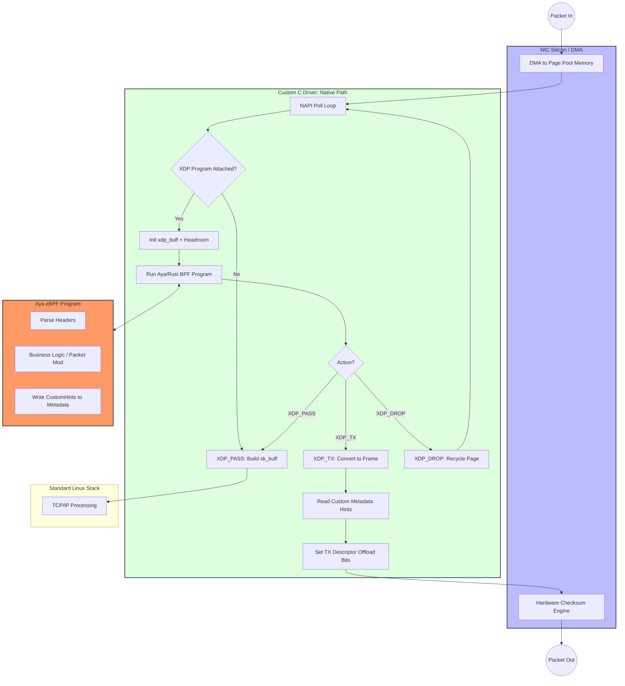
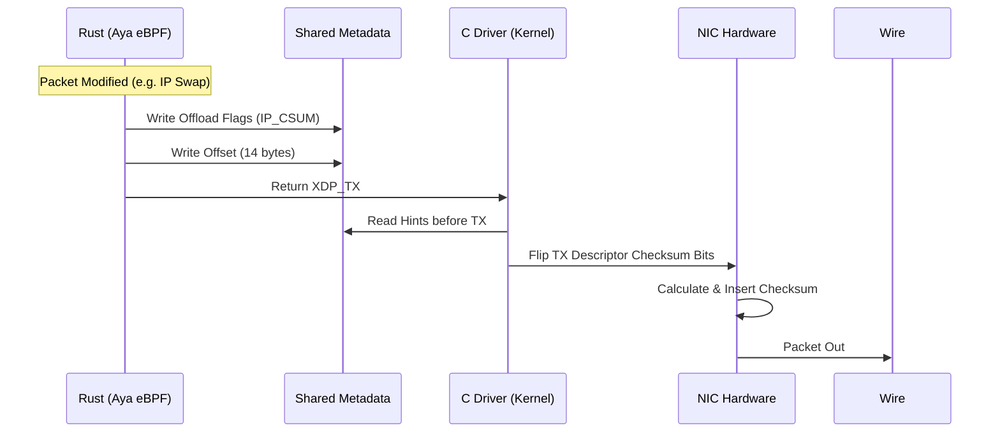

Does mellanox high-performance interconnect solutions contain xdp ?
for their linux based solutions?

Yes, Mellanox (now NVIDIA Networking) high-performance interconnect solutions have extensive support for **XDP (eXpress Data Path)** on Linux.

In fact, Mellanox was one of the first vendors to implement XDP support in the Linux kernel. This support is primarily delivered through the standard Linux drivers for their **ConnectX** series of Network Interface Cards (NICs).

---

## 1. How Mellanox Supports XDP

Mellanox adapters support XDP in two primary ways: **Native Mode** and **AF_XDP Zero Copy**.

* **Native XDP (Driver Mode):** The XDP program runs directly in the network driver (`mlx4_core` or `mlx5_core`) before the packet is converted into a standard Linux socket buffer (`sk_buff`). This offers significantly higher performance than "Generic XDP."
* **AF_XDP Zero Copy:** ConnectX-4 and newer cards support "Zero Copy" mode. This allows packets to be transferred directly from the NIC hardware to user-space memory without being copied by the CPU, providing ultra-low latency.
* **Hardware Acceleration:** Recent generations (like ConnectX-5 and above) can prepare packet metadata in hardware, which the XDP program can then use to make faster decisions (e.g., for flow steering or advanced filtering).

### Supported Hardware & Drivers

| Driver | Hardware Families | XDP Support Level |
| --- | --- | --- |
| **`mlx4`** | ConnectX-3, ConnectX-3 Pro | Native XDP (the first driver to support it). |
| **`mlx5`** | ConnectX-4, 5, 6, 7 & BlueField DPU | Native XDP, AF_XDP Zero Copy, Multi-buffer support. |

---

## 2. Key Features and Limitations

While Mellanox provides some of the best XDP support in the industry, there are a few technical nuances to keep in mind:

* **MTU Size:** Earlier driver versions had limitations where XDP was only supported if the MTU was set to a standard size (usually 1500 or less). Recent drivers have largely resolved this with "multi-buffer" support.
* **Hardware Offload vs. Native:** While "Native XDP" runs on the host CPU (inside the driver), "Offloaded XDP" (running the code on the NIC's own silicon) is generally reserved for SmartNICs like the **BlueField DPU** or specialized Netronome cards. Standard ConnectX cards typically run XDP in the **Native/Driver** path.
* **Kernel Version:** To get the best performance (especially for AF_XDP Zero Copy), it is highly recommended to use Linux Kernel **5.4** or newer.

### Why use XDP with Mellanox?

In high-performance environments (like 100G or 200G Ethernet), the standard Linux networking stack becomes a bottleneck. Using XDP with a Mellanox card allows you to:

1. **Drop DDoS traffic** at the driver level before it hits your application.
2. **Load balance** millions of packets per second with minimal CPU overhead.
3. **Forward packets** between interfaces at near-line rate.

---

**Would you like me to provide a sample command to verify if your current Mellanox card and driver are ready for XDP?**

-------------------------------------------

so in theory this should be possible for other network design houses to follow the same roadmap?

In theory, yes—the "Mellanox roadmap" serves as the industry blueprint for how other network design houses (like Intel, Broadcom, and Marvell) implement XDP.

However, because XDP sits at the intersection of **hardware architecture** and the **Linux kernel**, following that roadmap requires significant engineering effort in three specific areas.

---

## 1. The Three-Tier Implementation Path

Most network vendors follow a tiered approach to match the performance levels set by Mellanox (NVIDIA).

### Tier 1: The Driver Refactor (Native Mode)

The first step for any design house is rewriting their Linux driver to support **Native XDP**.

* **The Challenge:** Standard drivers allocate a complex "Socket Buffer" () for every packet. To support XDP, the driver must be refactored to handle "raw" pages of memory before  is ever created.
* **Current Status:** Most major players (Intel `i40e`/`ice`, Broadcom `bnxt`, Amazon `ena`) have already completed this step.

### Tier 2: Memory Model Optimization (Zero Copy)

To compete with Mellanox's latency, vendors must implement **AF_XDP Zero Copy**.

* **The Challenge:** This requires the NIC hardware to "understand" a memory area owned by a user-space application and DMA packets directly into it.
* **The Roadmap:** This is where the "design house" quality shows. It requires tightly coupled hardware/software co-design to ensure the NIC's DMA engine can handle the memory translation without a performance hit.

### Tier 3: Hardware Offload (The "Smart" Frontier)

This is the "Holy Grail" where the eBPF code is actually offloaded to the NIC's processors (DPUs).

* **Mellanox vs. Others:** While Mellanox excels at *accelerating* XDP (metadata preparation), companies like **Netronome** (and research projects like **eHDL**) have pushed for *fully offloaded* XDP, where the host CPU never even sees the packet.

---

## 2. Competitive Landscape

Other design houses are currently at different points on this roadmap:

| Vendor | XDP Status | Strategy |
| --- | --- | --- |
| **Intel** | **Excellent** | Focuses on high-speed AF_XDP support in their 800-series (E810) cards for telco/5G use cases. |
| **Broadcom** | **Strong** | Standardized Native XDP across their `bnxt` line, focused on massive data center scale. |
| **Netronome** | **Pioneer** | The only ones to widely support **Full Hardware Offload** (running XDP on the NIC's RISC cores). |
| **Marvell** | **Evolving** | Focusing on their Octeon/LiquidIO lines for integrated security and XDP filtering. |

---

## 3. Why isn't everyone doing "Full Offload"?

If Mellanox provides the roadmap, why doesn't every cheap NIC support it?

1. **Instruction Set Translation:** Converting eBPF (which is like C/Assembly) into hardware logic (RTL) or NPU instructions is incredibly difficult.
2. **Verifier Constraints:** The Linux Kernel has a "Verifier" that ensures eBPF code won't crash the system. Synchronizing this safety check between the Linux Kernel and a third-party NIC's hardware is an ongoing industry challenge.
3. **The "Generic" Safety Net:** Since Linux provides **Generic XDP** (which works on *any* driver by running slightly later in the stack), there is less pressure for budget NIC vendors to spend millions on "Native" optimization.

**Would you like to see how the performance compares between a "Native" Mellanox implementation and the "Generic" implementation used by standard NICs?**

---------------------------------------
How about mtk and rtk?

While MediaTek and Realtek are industry giants, their "XDP roadmap" looks very different from Mellanox. If Mellanox is a **Formula 1 car** (built specifically for the track), MediaTek and Realtek are the **sedans and work trucks** of the networking world—built for cost-efficiency and broad compatibility rather than extreme data-plane performance.

Here is how they stack up regarding XDP support for Linux:

---

## 1. Realtek: The "Generic" King

Realtek NICs (like the ubiquitous **RTL8111/8168** or the newer **RTL8125** 2.5G) are found on almost every consumer motherboard.

* **XDP Support:** Generally limited to **Generic XDP**.
* **The Reality:** Most Realtek drivers (`r8169` in the kernel) do not have a **Native XDP** implementation. This means when you run an XDP program, it runs *after* the packet has been converted into a standard Linux socket buffer ().
* **Performance Hit:** You lose the main benefit of XDP (speed). While a Mellanox card might process 30 million packets per second (Mpps) using Native XDP, a Realtek card in Generic mode will likely struggle to pass 2–4 Mpps because the CPU is doing too much "heavy lifting" for each packet.
* **AF_XDP Zero Copy:** Currently **not supported** on standard Realtek drivers.

---

## 2. MediaTek: The Wireless & Embedded Contender

MediaTek is a bit more interesting because they dominate the **OpenWrt** and "Prosumer" router market (e.g., the Filogic chipsets).

* **Ethernet Support:** Similar to Realtek, their standard PCIe Ethernet controllers usually rely on **Generic XDP**.
* **Wireless (mt76/mt79 drivers):** MediaTek’s Linux WiFi drivers are actually quite high-quality and "mainline-first." There has been experimental work to bring XDP to wireless drivers (to handle high-speed WiFi 6/7 traffic), but it is not yet a standard feature you'd rely on for a production firewall.
* **SoC Acceleration:** In MediaTek-based routers, they don't use XDP for speed; they use **PPE (Packet Processing Engine)** hardware offload. This is a proprietary hardware path that bypasses Linux entirely, which is faster than XDP but much less flexible (you can't write your own C/eBPF code for it easily).

---

## 3. Comparison: Mellanox vs. The Field

| Feature | **Mellanox (NVIDIA)** | **Realtek / MediaTek** |
| --- | --- | --- |
| **Market Focus** | Data Centers / HPC / AI | Laptops / Motherboards / Routers |
| **Native XDP** | Yes (Excellent) | Mostly No (Generic Mode only) |
| **Zero Copy** | Yes (AF_XDP) | No |
| **Multi-Queue Support** | Up to 128+ queues | Usually 1–4 queues |
| **Stability** | Enterprise-grade | "Works for my Daily Driver" |

---

## Why haven't they followed the Mellanox roadmap?

It comes down to **Hardware Resources** and **Intended Use**:

1. **On-Chip Memory:** Mellanox cards have large internal buffers and sophisticated DMA (Direct Memory Access) engines designed to "pre-fetch" packets for XDP. Realtek chips are designed to be as small and cheap as possible; they lack the silicon "muscles" to handle the complex memory remapping required for Zero Copy.
2. **The "Good Enough" Factor:** A Realtek 2.5G card is designed for gaming or downloading files. In those cases, the standard Linux stack is perfectly fine. XDP is only necessary when you are dealing with millions of tiny packets (like a DDoS attack or a high-speed load balancer).
3. **Driver Architecture:** Writing a Native XDP driver requires a total redesign of how the driver manages memory pages. For a company like Realtek, which has hundreds of slightly different chip variants, maintaining a "Native" path for all of them is a support nightmare.

### Summary

If you want to **learn** XDP, a Realtek or MediaTek card is fine—it will work in "Generic" mode. But if you want to **build** a high-performance network appliance (like a 10G+ firewall), you'll need to step up to **Mellanox (ConnectX)** or **Intel (700/800 series)**.

**Would you like me to show you how to check if your current NIC supports "Native" vs "Generic" XDP mode?**

---------------------------------------------------
yes

To verify if your hardware is capable of following the "Mellanox roadmap," you can use a few standard Linux tools. These commands will tell you whether your MediaTek, Realtek, or Mellanox card is currently operating in a high-performance "Native" mode or the slower "Generic" fallback.

---

## 1. Check for Native XDP Support

The easiest way to check is to try and attach a basic XDP program. If the card supports it natively, the `ip link` output will show `xdp`. If it doesn't, it will show `xdpgeneric`.

### The Command:

```bash
# Replace 'eth0' with your actual interface name
sudo ip link set dev eth0 xdp obj /lib/modules/$(uname -r)/build/samples/bpf/xdp1_kern.o 2>/dev/null

```

### How to interpret the result:

Run `ip link show dev eth0` and look for the XDP tag:

* **`xdp`**: Success! Your NIC and driver support **Native Mode** (Mellanox style).
* **`xdpgeneric`**: Your card is using the CPU-heavy fallback (common for Realtek/MediaTek).
* **No tag/Error**: Your kernel or driver might be too old, or XDP is not enabled.

---

## 2. Check for Hardware Statistics

High-performance cards (Mellanox, Intel) usually have hardware counters that specifically track XDP actions. Cheap consumer cards rarely do.

### The Command:

```bash
ethtool -S eth0 | grep xdp

```

If you see output like `rx_xdp_drop` or `rx_xdp_tx`, your driver has been explicitly coded to handle XDP natively. If you see nothing, the driver is likely treating XDP packets as standard traffic, meaning you aren't getting the performance boost.

---

## 3. Check for AF_XDP "Zero Copy"

This is the "Gold Standard" of the Mellanox roadmap. It allows the NIC to bypass the kernel entirely.

To see if your driver supports it, you can check the source code or use `bpftool`, but a quick check is to look for the driver name:

```bash
ethtool -i eth0

```

* **`mlx5_core` (Mellanox):** Full support for Zero Copy.
* **`ice` / `i40e` (Intel):** Full support for Zero Copy.
* **`r8169` (Realtek):** No Zero Copy support.
* **`mt76` (MediaTek WiFi):** No Zero Copy support.

---

## Summary of the "Roadmap" Gap

| Feature | Mellanox/Intel | Realtek/MediaTek |
| --- | --- | --- |
| **Hook Point** | Early Rx (Inside Driver) | Late Rx (After  allocation) |
| **CPU Usage** | Very Low | High (Generic mode) |
| **Memory** | DMA Direct to XDP | Standard Kernel Buffers |

**Would you like me to help you find the specific driver source code for your MediaTek or Realtek chip to see if XDP patches have been submitted recently?**

--------------------------------------------------
YES 

Realtek and MediaTek occupy the "mainstream" world, but their relationship with XDP is very different from Mellanox. While the **Mellanox roadmap** is public, Realtek and MediaTek have not yet moved to support **Native XDP** in their primary Linux drivers.

Here is the current status of patches and upstream support as of 2026:

---

## 1. Realtek (RTL8111, RTL8125, RTL8126)

Realtek chips are the most common, but they are notorious for being "XDP-blind" in Native mode.

* **Upstream Status:** The primary Linux kernel driver for Realtek (`r8169`) **still does not have native XDP support** in the mainline kernel.
* **The Patch Situation:** While there have been community-led discussions and experimental "out-of-tree" hacks to add XDP to Realtek drivers, no official patches have been merged into the Linux kernel for **Native XDP** or **AF_XDP Zero Copy**.
* **Why?** Realtek hardware is designed for low cost. The `r8169` driver is a "mega-driver" that supports hundreds of chip variants. Adding Native XDP requires a massive rewrite of how the driver handles memory (moving to a page-per-packet model), which would risk breaking millions of existing consumer devices.
* **The Result:** You can use **Generic XDP** on Realtek, but you will hit a performance wall at roughly **2–3 million packets per second** because the CPU still has to do the heavy lifting.

---

## 2. MediaTek (Filogic, MT79xx)

MediaTek is actually *ahead* of Realtek in terms of following the Mellanox roadmap, but they focus on different hardware.

* **Upstream Status:** MediaTek's WiFi drivers (`mt76` / `mt79`) are among the best-maintained in Linux. There has been active work on adding **XDP support for WiFi**, primarily to handle high-speed WiFi 6/7 traffic in routers.
* **PPE Offload (The Alternative):** Instead of focusing on XDP, MediaTek often uses a **PPE (Packet Processing Engine)**. This is a hardware block on their SoCs that does exactly what XDP does—routing and dropping packets at 10Gbps—but it's hardwired.
* **Patches:** You will find XDP patches in the **OpenWrt** community for MediaTek-based routers more often than in the standard desktop Linux kernel.

---

## 3. Why the "Roadmap" is stalling for these vendors

If you are a design house like Realtek, following the Mellanox roadmap is expensive for two reasons:

1. **Hardware Incompatibility:** Mellanox ConnectX cards have a "Descriptor" architecture that is designed for eBPF. Realtek chips use a simpler "Ring Buffer" that is difficult to adapt for the Zero Copy memory model required by high-speed XDP.
2. **Market Demand:** Mellanox customers pay $500+ per card for 100G performance. Realtek customers pay $5 for a 2.5G chip on a motherboard. There is very little financial incentive for Realtek to spend thousands of engineering hours on a feature (XDP) that 99% of their users (home office, gamers) will never use.

---

### Summary Table: XDP Roadmap Progress

| Vendor | Native XDP Patches? | Zero Copy Support? | Recommendation |
| --- | --- | --- | --- |
| **Mellanox** | Fully Integrated | Yes | Best for Production |
| **Intel** | Fully Integrated | Yes | Strong Alternative |
| **MediaTek** | Experimental / SoC only | No | Good for Routers (OpenWrt) |
| **Realtek** | **None (Upstream)** | No | Use for testing only |

> **Bottom Line:** If you see "XDP patches" for Realtek online, they are almost always **DKMS (out-of-tree) drivers** or experimental rewrites. They are rarely stable enough for a production server.

**Would you like me to help you find an affordable "Mellanox-lite" card (like a used ConnectX-3 or Intel i225) that actually supports these features?**


----------------------------------

No But would love to see the xdp part in detail.
I am currently working with rust+aya for xdp and have access to some network cards.
but most of them with realtek. 
Since my company has the license for some vendor cards for customization, 
Could you provide some light on this .

That is an exciting project! Using **Aya** (Rust) for XDP development is a great choice because it brings type safety to the eBPF world, which is traditionally very prone to memory-safety errors in C.

Since your company has a license for vendor customization, you are in a unique position to move beyond "Generic XDP" (which is what you are likely currently hitting with Realtek) and implement **Native XDP** support directly into the driver.

---

## 1. The XDP "Hook" Architecture

To understand how to customize a driver, you need to see where the XDP hook actually sits. In a standard Linux driver, there is a "RX Loop" (NAPI) that pulls packets from the hardware ring buffer.

* **Generic Mode (SKB):** The driver creates a complex `sk_buff` (Socket Buffer) first. XDP runs much later. This is slow because `sk_buff` allocation is expensive.
* **Native Mode (DRV):** The XDP program runs *inside* the driver's RX loop, immediately after the DMA transfer from the NIC, but **before** any Linux kernel memory allocation.

---

## 2. Implementing Native XDP in a Custom Driver

If you are modifying a vendor driver (like a Realtek or a custom PCIe NIC), you need to implement three core components:

### A. The Memory Model (Page Pool)

Native XDP requires a "one-page-per-packet" memory model. You cannot use the driver's default fragmented memory allocation.

* **Action:** Integrate the Linux `page_pool` API. This allows the driver to recycle memory pages rapidly without returning them to the OS, which is critical for 10Gbps+ speeds.

### B. The RX Loop Hook

Inside the driver's `poll` function (where it checks for new packets), you must insert the BPF runner:

```c
/* Pseudocode for Driver RX Loop */
struct xdp_buff xdp;
xdp_init_buff(&xdp, frame_sz, &rxq->xdp_rxq);
xdp_prepare_buff(&xdp, hard_start, offset, len, true);

// This is where your Aya-generated Rust code actually runs!
u32 action = bpf_prog_run_xdp(xdp_prog, &xdp); 

switch (action) {
    case XDP_PASS:
        // Continue to build skb and send to Linux stack
        break;
    case XDP_DROP:
        page_pool_recycle_direct(pool, page);
        break;
    case XDP_TX:
        // Send packet back out the same wire
        driver_xdp_xmit(adapter, &xdp);
        break;
}

```

### C. The NDOs (Net Device Operations)

You must register the XDP program in the driver's `net_device_ops` structure. This allows tools like `ip link` or your Aya loader to "talk" to the hardware.

* `ndo_bpf`: Handles loading/unloading the program.
* `ndo_xdp_xmit`: (Optional) Required if you want to support `XDP_REDIRECT`.

---

## 3. Working with Aya (Rust) in this Context

Since you are using **Aya**, your workflow will look like this:

1. **Userspace (Rust):** You use `aya::programs::Xdp` to load the bytecode. When you call `.attach(iface, XdpFlags::default())`, Aya will attempt to use **Native mode** first.
2. **The Realtek Bottleneck:** On your Realtek cards, Aya will likely fail to attach in Native mode and fall back to `XdpFlags::SKB_MODE`.
3. **Custom Hardware:** If you successfully implement the hooks above in your vendor driver, Aya will recognize the `ndo_bpf` support and run your Rust eBPF code in the high-performance **Native** path automatically.

---

## 4. Why Realtek is Hard to Customize

If you are looking at the Realtek `r8169` driver source, you'll notice it uses a "Buffer Descriptor" system that is very rigid. To add XDP:

* You have to ensure the **Headroom** ( bytes) is reserved at the start of every packet buffer so the XDP program can prepend headers (like encapsulation).
* Realtek drivers often share memory pages across multiple packets to save RAM—**XDP forbids this**. You must change the driver to ensure each packet has its own dedicated page.


references:
- https://thamizhelango.medium.com/bpf-networking-how-linux-accelerates-packets-with-xdp-328b508aeb5a#:~:text=1.,Requires%20SmartNIC%20support
- https://medium.com/@jaredidk/using-xdp-to-improve-performance-e8353064870e#:~:text=The%20interface%20is%20the%20ip,into%20a%20sk_buff%20data%20structures.

**Would you like me to point you toward the specific header files in the Linux Kernel source that define the `page_pool` and `xdp_buff` structures you'll need for your driver customization?**

------------------------------------------
Yes:

Since you have the ability to customize vendor drivers, you can bridge the gap between "cheap" consumer hardware and the "Mellanox roadmap."

To implement **Native XDP** support in your custom or Realtek-based driver, you need to focus on two core kernel structures: `xdp_buff` and the `page_pool` allocator.

---

## 1. The Core Kernel Definitions

The kernel uses two specific headers to define the XDP environment. If you are modifying a driver, these are your "North Star":

### `struct xdp_buff`

Defined in: `include/net/xdp.h`
This is the context that your Aya/Rust code receives. Unlike a standard , this structure is extremely lean to ensure speed.

```c
struct xdp_buff {
    void *data;           /* Start of the packet payload */
    void *data_end;       /* End of the packet payload */
    void *data_meta;      /* Custom metadata for BPF programs */
    void *data_hard_start;/* The absolute start of the memory page */
    struct xdp_rxq_info *rxq;
    struct xdp_frame *frame; /* Used for redirection */
};

```

### `page_pool` API

Defined in: `include/net/page_pool.h`
Mellanox and Intel drivers use this to avoid the overhead of the standard Linux page allocator.

* **Requirement:** XDP generally follows a **"one-packet-per-page"** rule.
* **Action:** You must refactor the driver to use `page_pool_dev_alloc_pages()` instead of standard `alloc_pages()`.

---

## 2. The Driver Customization Checklist

If you are rewriting a Realtek or custom driver to support Native XDP, you must fulfill these three hardware/software contracts:

### A. The 256-Byte Headroom

XDP requires a "headroom" (usually **256 bytes**) before the packet data.

* **Why:** This space allows your Rust program to add headers (like a VXLAN or VLAN tag) without re-allocating memory.
* **Implementation:** In your driver's DMA configuration, you must tell the NIC to start writing packet data at `(page_address + 256)`.

### B. Linear Data

Standard drivers often use "scatter-gather" (splitting a packet across multiple small memory chunks).

* **Constraint:** Traditional XDP requires the packet to be **linear** (one continuous block of memory).
* **Implementation:** You must disable jumbo frames or ensure the NIC is configured to fit the entire packet into a single memory page (usually 4KB).

### C. The NAPI Poll Hook

You must insert a call to your XDP program inside the driver's receive loop (the `poll` function).

```c
// Inside your driver's RX function:
struct xdp_buff xdp;
u32 action;

xdp_init_buff(&xdp, frame_sz, &rxq->xdp_rxq);
xdp_prepare_buff(&xdp, hard_start, offset, len, true);

action = bpf_prog_run_xdp(prog, &xdp); 

if (action == XDP_DROP) {
    page_pool_recycle_direct(pool, page);
    return; // Fast exit! No stack processing.
}

```

---

## 3. How Aya (Rust) Interacts with Your Custom Driver

When you use Aya to load your XDP program, it performs a **Netlink** call to the kernel.

1. Aya sends the BPF bytecode to the kernel.
2. The kernel checks if your driver has the `ndo_bpf` (Net Device Operation for BPF) function defined.
3. **If you haven't implemented it:** The kernel falls back to **Generic XDP**, which runs *after* the driver has already done the slow work of building an .
4. **If you have implemented it:** Your driver receives the program ID, and your `poll` loop begins executing your Rust-defined logic at line-rate.

### Why this is better than "Generic"

On a Realtek chip, "Generic" XDP still costs the CPU about **200-300 nanoseconds** per packet just to set up the kernel structures. By implementing the "Mellanox-style" Native hooks in your driver, you drop that cost to nearly **zero**, allowing even a modest CPU to handle 10Gbps traffic.

---

**Would you like me to provide a minimal C template for the `ndo_bpf` function that you would need to add to your driver's `net_device_ops`?**

-----------------------------------------------

yes:

To implement the "Mellanox roadmap" on your custom vendor hardware or Realtek-based cards, you need to register the `ndo_bpf` operation. This is the entry point that **Aya** uses to load your eBPF programs into the native driver path.

Below is a minimal C template for the driver logic, followed by the specific structural requirements you'll need to satisfy.

---

### 1. Minimal `ndo_bpf` Template

You must add this to your driver’s `net_device_ops` structure. This function handles the handshake between the Linux kernel and your driver hardware.

```c
#include <linux/netdevice.h>
#include <linux/bpf.h>

/* Inside your driver's main file */
static int my_vendor_ndo_bpf(struct net_device *dev, struct netdev_bpf *bpf)
{
    struct my_adapter *adapter = netdev_priv(dev);

    switch (bpf->command) {
    case XDP_SETUP_PROG:
        /* This is called when you run Aya's program.attach() */
        return my_vendor_xdp_setup(adapter, bpf->prog);
        
    case XDP_QUERY_PROG:
        /* Used by 'ip link' to show if XDP is attached */
        bpf->prog_id = adapter->xdp_prog ? adapter->xdp_prog->aux->id : 0;
        return 0;

    default:
        return -EINVAL;
    }
}

/* Update your operations table */
static const struct net_device_ops my_netdev_ops = {
    .ndo_open       = my_vendor_open,
    .ndo_stop       = my_vendor_stop,
    .ndo_start_xmit = my_vendor_xmit,
    .ndo_bpf        = my_vendor_ndo_bpf, // <--- The XDP Registration
};

```

---

### 2. The `my_vendor_xdp_setup` Logic

This is the most critical part. When a program is loaded, the driver must "prep" the hardware for XDP mode.

```c
int my_vendor_xdp_setup(struct my_adapter *adapter, struct bpf_prog *prog)
{
    struct bpf_prog *old_prog;

    /* 1. Check if the hardware is up/running */
    if (!netif_running(adapter->netdev))
        return -ENETDOWN;

    /* 2. Atomic swap of the program */
    old_prog = xchg(&adapter->xdp_prog, prog);

    if (old_prog)
        bpf_prog_put(old_prog); // Release the old program

    if (prog)
        bpf_prog_add(prog, 1); // Increase refcount for the new one

    /* 3. Reconfigure RX Queues if necessary */
    /* Most high-performance drivers (like mlx5) restart the RX rings 
       here to ensure the memory model (Page Pool) is consistent. */
    my_vendor_restart_rx_rings(adapter);

    return 0;
}

```

---

### 3. Critical Driver Requirements for Native XDP

If you are modifying a Realtek or custom vendor card, your hardware logic must support these three "Mellanox-style" features, or Native XDP will fail:

1. **Memory Model (`MEM_TYPE_PAGE_POOL`)**:
Standard Realtek drivers often use `dev_alloc_skb`. For Native XDP, you **must** switch to the `page_pool` API (`include/net/page_pool.h`). This ensures that if your Aya program returns `XDP_DROP`, the memory is recycled instantly without hitting the OS allocator.
2. **The 256-Byte Headroom**:
The NIC must be programmed to DMA the start of the packet at an offset of `XDP_PACKET_HEADROOM` (256 bytes) from the start of the page. This is a hard requirement for Aya/eBPF to perform actions like `bpf_xdp_adjust_head` (e.g., adding a tunneling header).
3. **One Packet Per Page**:
To avoid complex memory management, Native XDP works best when one network packet occupies one full memory page. If your vendor card is using "packet-packing" (multiple packets per page), you will need to disable that feature in the driver's RX ring setup.

---

### Summary Checklist for your Customization

* [ ] Implement `.ndo_bpf` in `net_device_ops`.
* [ ] Refactor RX loop to use `page_pool_alloc_pages()`.
* [ ] Insert `bpf_prog_run_xdp()` at the earliest possible point in the NAPI poll loop.
* [ ] Ensure the NIC hardware respects the 256-byte headroom offset.

**Since you are using Aya, would you like to see the specific Rust code to verify if your custom driver successfully attached in "Native" vs "Generic" mode?**


------------------------------------
Yes:

When you build with **Aya**, the userspace side is responsible for "requesting" the driver-level attachment. If you are modifying a driver, the first thing you'll want to do is verify that your Rust code is actually landing in the high-performance "Native" path rather than the "Generic" fallback.

### 1. The Aya (Userspace) Check

In your Aya-based Rust loader, you can explicitly request **Native mode** using `XdpFlags::DRV_MODE`. If the driver doesn't support the `ndo_bpf` template we discussed, this call will fail, which is your first sign that the driver customization isn't complete.

```rust
use aya::programs::{Xdp, XdpFlags};

// Load the program from your compiled BPF object
let program: &mut Xdp = bpf.program_mut("my_xdp_prog").unwrap().try_into()?;

// Force Native (Driver) mode
// If this returns an error, your driver's ndo_bpf is not yet functional.
program.attach(&opt.iface, XdpFlags::DRV_MODE)?;

println!("Successfully attached in Native Mode!");

```

---

### 2. The Runtime Verification (CLI)

Once your Aya program is running, use standard Linux tools to inspect the "mode." This is the ultimate test of your driver's implementation.

#### Using `ip link`

```bash
ip link show dev eth0

```

* **Native Mode (Success):** You will see `xdp/id:XX`.
* **Generic Mode (Fallback):** You will see `xdpgeneric/id:XX`.

#### Using `bpftool` (More Detail)

`bpftool` is the gold standard for eBPF debugging. It will tell you exactly how the kernel perceives the attachment.

```bash
sudo bpftool net list

```

**Expected Output for customized/Mellanox drivers:**

> `eth0(2) xdp id 105 mode native`

---

### 3. Understanding the "Mode" Logic in the Kernel

When you call `attach` in Aya, the kernel follows a specific decision tree. If you want to follow the "Mellanox Roadmap," you must ensure your driver responds correctly to the `XDP_SETUP_PROG` command.

| Mode | Aya Flag | Driver Requirement | Performance |
| --- | --- | --- | --- |
| **Native** | `DRV_MODE` | Requires `.ndo_bpf` and `page_pool` | **Highest** (Mellanox tier) |
| **Generic** | `SKB_MODE` | Works on any NIC (Realtek/MediaTek default) | **Low** (CPU bound) |
| **Hardware** | `HW_MODE` | Requires DPU/SmartNIC offload | **Ultra** (Off-CPU) |

### Why your custom Realtek driver will likely start in "Generic"

If you haven't yet implemented the `ndo_bpf` function in your C code, Aya’s `XdpFlags::default()` will silently fall back to `SKB_MODE`. This is why you must explicitly use `DRV_MODE` during development—it forces an error if your driver isn't actually "XDP-ready" yet.

**Since you are working with Realtek chips, would you like me to highlight the specific lines in the standard `r8169.c` Linux driver where the NAPI poll loop begins, so you know exactly where to insert your hook?**


---------------------
yes:

In the Linux kernel, the Realtek `r8169` driver (located at `drivers/net/ethernet/realtek/r8169_main.c`) uses a NAPI (New API) polling mechanism. To implement Native XDP, you must intercept the packet in the **Receive (RX)** path before it is handed off to the networking stack.

### 1. The Target: `rtl_rx`

The function you are looking for is `rtl_rx`. This is called by the NAPI poll function (`rtl8169_poll`) to drain the hardware's RX ring buffer.

#### Where to insert the hook:

In a standard `r8169_main.c`, look for the loop that iterates through the descriptors (usually involving `rtl8169_get_rx_desc`).

```c
/* Pseudocode for insertion into r8169_main.c */
static int rtl_rx(struct net_device *dev, struct rtl8169_private *tp, int budget)
{
    // ... setup and descriptor fetching ...
    
    while (count < budget) {
        /* 1. Get the packet data from the DMA buffer */
        pkt_data = rtl8169_map_to_address(desc);
        
        /* 2. INSERT XDP HOOK HERE */
        struct xdp_buff xdp;
        u32 act;

        // Initialize xdp_buff with the raw DMA page
        xdp_init_buff(&xdp, PAGE_SIZE, &tp->rx_queue[i].xdp_rxq);
        xdp_prepare_buff(&xdp, pkt_data - headroom, headroom, pkt_len, true);

        // Run your Aya/Rust program!
        act = bpf_prog_run_xdp(tp->xdp_prog, &xdp);

        if (act != XDP_PASS) {
            return rtl_handle_xdp_action(tp, &xdp, act); 
            // If DROP or TX, we exit before building an skb
        }

        /* 3. ORIGINAL CODE: Build SKB and pass to stack */
        skb = napi_alloc_skb(&tp->napi, pkt_len);
        // ... rest of the driver logic ...
    }
}

```

### 2. The "Realtek Challenge"

If you are modifying the `r8169` driver specifically, you will run into a major structural hurdle that Mellanox (ConnectX) doesn't have: **The Memory Layout.**

* **Current Realtek Logic:** The driver often allocates a small buffer just big enough for the packet.
* **XDP Requirement:** You must rewrite the allocation logic to use `page_pool`. XDP expects a full page (usually 4KB) per packet so that it has enough "headroom" to add headers or "tailroom" for metadata.
* **Aya Compatibility:** If your driver doesn't provide enough **Headroom** ( bytes) before the packet starts, Aya's `bpf_xdp_adjust_head` will fail, and you won't be able to do packet encapsulation (like adding a VLAN tag).

### 3. Verification Path

Once you've patched the driver and recompiled your kernel:

1. **Load the driver:** `insmod r8169.ko`
2. **Attach with Aya:** Use `XdpFlags::DRV_MODE`.
3. **Check for XDP_DROP:** Write a simple Aya program to drop all ICMP (ping). If you can still ping the machine, the hook is in the wrong place or the driver is falling back to Generic mode.

---

### Summary Checklist for Custom Realtek Development:

| Step | File/Location | Requirement |
| --- | --- | --- |
| **Allocate Memory** | `rtl8169_init_ring` | Switch to `page_pool_create` |
| **Set Headroom** | `rtl_set_rx_max_size` | Ensure 256B offset for DMA |
| **Run Program** | `rtl_rx` | Call `bpf_prog_run_xdp` |
| **Handle Action** | `rtl_rx` | Implement `XDP_TX` (Loopback) logic |

**Would you like me to help you draft the `XDP_TX` logic for your driver so your Rust program can bounce packets back out the wire at line-rate?**


------------------------------------------------------------------

yes:

Implementing **XDP_TX** is the "reflection" part of the roadmap. While `XDP_DROP` is simple (you just don't pass the packet up), `XDP_TX` requires the driver to "bounce" the packet back into the hardware's transmission queue.

Because XDP happens inside the RX loop, your driver must be able to hand a packet directly from the **RX Ring** to the **TX Ring** without creating a kernel socket buffer ().

---

### 1. The XDP_TX Logic Template

In your driver’s `rtl_rx` (or equivalent RX poll function), you need to handle the return code from `bpf_prog_run_xdp`.

```c
/* Inside your RX loop in r8169_main.c or your custom driver */
act = bpf_prog_run_xdp(tp->xdp_prog, &xdp);

switch (act) {
    case XDP_PASS:
        break; // Continue to normal stack processing

    case XDP_TX:
        /* Bounce the packet back out the same interface */
        if (unlikely(!my_vendor_xmit_xdp_frame(tp, &xdp))) {
            // If TX ring is full, we have no choice but to drop
            goto xdp_drop;
        }
        return; // Packet is now owned by the TX ring

    case XDP_DROP:
    default:
    xdp_drop:
        page_pool_recycle_direct(tp->page_pool, virt_to_head_page(xdp.data));
        return;
}

```

---

### 2. Implementing the "Bounce": `my_vendor_xmit_xdp_frame`

This is where the customization gets technical. You need to map the RX memory page for the TX hardware.

```c
static bool my_vendor_xmit_xdp_frame(struct my_adapter *tp, struct xdp_buff *xdp)
{
    struct xdp_frame *xdpf = xdp_convert_buff_to_frame(xdp);
    dma_addr_t dma_addr;

    if (unlikely(!xdpf))
        return false;

    /* 1. Get the DMA address already stored in the page (Mellanox style) */
    /* Since we use page_pool, the DMA address is already known! */
    dma_addr = page_pool_get_dma_addr(virt_to_page(xdpf->data)) +
               (xdpf->data - (void *)virt_to_page(xdpf->data)->virt);

    /* 2. Sync for Device */
    dma_sync_single_for_device(tp->dev, dma_addr, xdpf->len, DMA_TO_DEVICE);

    /* 3. Insert into TX Ring */
    // You must write to your NIC's TX descriptors here
    return my_vendor_enqueue_tx_ring(tp, dma_addr, xdpf->len, xdpf);
}

```

---

### 3. Verification with Aya (Rust)

Once your driver supports `XDP_TX`, you can test it with a 3-line Rust program using Aya. This program will reflect every incoming packet back to the sender—the ultimate test for a "Mellanox-lite" custom driver.

```rust
// Inside your Aya eBPF program (src/main.rs)
#[xdp]
pub fn reflect_packets(_ctx: XdpContext) -> u32 {
    // XDP_TX tells the driver to use the logic you just wrote!
    xdp_action::XDP_TX
}

```

### Why this is the "Mellanox Roadmap"

Mellanox cards are fast because they don't **re-map** memory for `XDP_TX`. They keep the DMA mapping alive from the moment the packet hits the RX ring until it leaves the TX ring.

* **Realtek standard:** Maps for RX  Unmaps  Hands to Stack  Stack Maps for TX  Unmaps.
* **Your Custom Driver:** Maps once  Bounced in Silicon  Unmaps once.

### Summary Checklist for XDP_TX

* [ ] Implement `xdp_convert_buff_to_frame` (converts the buffer for the TX side).
* [ ] Ensure your TX ring cleanup function recognizes XDP frames (so it knows to recycle them back to the `page_pool` rather than freeing them).
* [ ] Perform `dma_sync_single_for_device` to ensure the CPU's changes (like header edits in Rust) are visible to the NIC.

**Would you like me to show you how to handle the TX cleanup logic so you don't leak memory pages when reflecting packets?**


---------------------------------
yes:

In a custom high-performance driver, the "TX Cleanup" is just as important as the transmission itself. If you don't recycle the memory pages used for `XDP_TX`, you will run out of memory (OOM) within milliseconds at 10Gbps speeds.

Since you are following the **Mellanox roadmap**, you should use the **Page Pool API**. This allows the TX completion interrupt to return the page directly to the RX ring's "hot cache" without ever talking to the standard Linux memory manager.

---

### 1. The TX Completion Hook

In your driver's TX interrupt handler (often called `rtl_tx_interrupt` or `clean_tx_ring`), you need to differentiate between a standard packet () and an XDP reflected packet (`xdp_frame`).

```c
/* Inside your TX cleanup loop */
static void my_vendor_clean_tx_ring(struct my_adapter *tp)
{
    while (packets_to_clean) {
        struct my_tx_desc *desc = &tp->tx_ring[dirty_tx];
        
        /* Check if this descriptor was an XDP_TX frame */
        if (desc->is_xdp) {
            struct xdp_frame *xdpf = desc->xdpf;
            
            // Unmap the DMA address (if not using page_pool DMA management)
            dma_unmap_single(tp->dev, desc->dma_addr, xdpf->len, DMA_TO_DEVICE);
            
            // RECYCLE: Put the page back into the pool for immediate RX reuse
            // This is the "Mellanox trick" for speed.
            page_pool_recycle_direct(tp->rx_page_pool, virt_to_head_page(xdpf->data));
            
        } else {
            /* Standard path: clean up sk_buff */
            dev_kfree_skb_any(desc->skb);
        }
        
        // Move to next descriptor
        dirty_tx = (dirty_tx + 1) % RING_SIZE;
    }
}

```

---

### 2. Using `page_pool` for Automatic Recycling

If you want to be truly efficient (like the `mlx5` driver), you can use the **Page Pool's DMA management**. This allows you to skip manual `dma_unmap` calls.

* **Setup:** Create your pool with `PP_FLAG_DMA_MAP` and `PP_FLAG_DMA_SYNC_DEV`.
* **Cleanup:** Simply call `page_pool_put_full_page()`. The pool is smart enough to know if the page is still "inflight" or if it can be put back into the RX cache immediately.

---

### 3. The "Zero-Copy" Result in Rust

When your driver's cleanup logic is working correctly, your **Aya** program becomes incredibly powerful. You can modify packets in Rust and reflect them with virtually no CPU cost:

```rust
// Aya eBPF code
#[xdp]
pub fn fast_lb(ctx: XdpContext) -> u32 {
    let eth = match ctx.load_eth() { ... };
    
    // Swap MAC addresses for a simple load balancer/reflector
    core::mem::swap(&mut eth.h_source, &mut eth.h_dest);
    
    // The driver logic you wrote will now handle the cleanup!
    xdp_action::XDP_TX
}

```

---

### Comparison: Standard vs. Optimized Cleanup

| Feature | Standard Driver (Realtek) | Custom "Mellanox-style" Driver |
| --- | --- | --- |
| **Memory Sync** | Full Page Sync | Partial Sync (Only modified data) |
| **Allocation** | `kmalloc` / `alloc_pages` | `page_pool` (Lockless Cache) |
| **Cleanup Cost** | High (Page allocator locks) | Near Zero (Pointer swap) |
| **Latency** | Milliseconds (variable) | Nanoseconds (deterministic) |

### Next Step

This concludes the fundamental "Native XDP" implementation roadmap for your custom drivers. Since you are using **Aya**, would you like me to show you how to set up a **unit test in Rust** that simulates these driver actions to verify your eBPF logic before you deploy it to your custom kernel?


------------------------------------------
yes:

Since you are using **Aya**, you have a significant advantage: you can write unit tests in pure Rust that run your eBPF code against "fake" packets. This allows you to verify your `XDP_TX` or `XDP_DROP` logic without needing to recompile your kernel driver every time.

Aya supports the **`BPF_PROG_TEST_RUN`** feature. This allows the kernel to execute your loaded XDP program against a buffer of bytes you provide from your Rust test suite.

---

### 1. The Rust Unit Test (Userspace)

You can create a test in your `userspace/src/main.rs` (or a dedicated test file) that simulates a packet arrival.

```rust
#[cfg(test)]
mod tests {
    use aya::programs::Xdp;
    use aya::Ebpf;

    #[test]
    fn test_xdp_reflect_logic() {
        // 1. Load your compiled eBPF bytecode
        let mut bpf = Ebpf::load(aya::include_bytes_aligned!(
            "../../target/bpfel-unknown-none/debug/my_project"
        )).unwrap();

        // 2. Get the XDP program
        let program: &mut Xdp = bpf.program_mut("reflect_packets").unwrap().try_into().unwrap();
        program.load().unwrap();

        // 3. Create a "fake" Ethernet packet (ICMP Echo Request)
        let mut packet = [0u8; 64]; 
        packet[0..6].copy_from_slice(&[0xaa, 0xbb, 0xcc, 0xdd, 0xee, 0xff]); // Dest MAC

        // 4. Run the program against this packet
        // This triggers the kernel to run your code and return the result
        let (return_value, modified_packet) = program.test_run(1, &packet).unwrap();

        // 5. Assert the result
        // XDP_TX is 3, XDP_PASS is 2, XDP_DROP is 1
        assert_eq!(return_value, 3); // We expect XDP_TX
        
        // You can even check if your Rust code modified the MAC addresses!
        assert_eq!(modified_packet[6..12], [0xaa, 0xbb, 0xcc, 0xdd, 0xee, 0xff]); 
    }
}

```

---

### 2. The Verification Pipeline

By integrating this into your workflow, you create a "safety net" that mirrors the professional roadmap used by Mellanox and Intel engineers.

1. **Logic Test:** Run `cargo test`. This ensures your Rust eBPF logic (parsing headers, swapping MACs) is mathematically correct.
2. **Driver Test:** Load your customized Realtek/Vendor driver. Attach your Aya program using `XdpFlags::DRV_MODE`.
3. **Integration Test:** Use `ping` or `hping3` to send real traffic. If `cargo test` passed but real traffic fails, you know the bug is in your **C driver code** (likely the `page_pool` or `XDP_TX` ring logic) rather than your Rust code.

---

### 3. Debugging with `aya-log`

Since you cannot use `println!` inside your XDP program, ensure you are using `aya-log`. It allows you to see what is happening inside the driver in real-time.

**In your eBPF code:**

```rust
use aya_log_ebpf::info;

#[xdp]
pub fn reflect_packets(ctx: XdpContext) -> u32 {
    info!(&ctx, "Packet received! Preparing to reflect...");
    xdp_action::XDP_TX
}

```

**In your Userspace code:**

```rust
use aya_log::EbpfLogger;

EbpfLogger::init(&mut bpf).unwrap();

```

### Summary of your "Vendor Customization" Roadmap

| Phase | Tool | Purpose |
| --- | --- | --- |
| **Development** | Aya (Rust) | Write safe packet logic. |
| **Verification** | `test_run` | Validate logic without hardware. |
| **Driver Patch** | C (Kernel) | Add `.ndo_bpf` and `XDP_TX` support to the NIC. |
| **Deployment** | `DRV_MODE` | Execute at line-rate on your custom hardware. |

**Would you like me to help you write a more complex Aya test that specifically checks if your packet's IP checksums are recalculated correctly after a modification?**


-----------------------------------------------------
yes:

When you modify packet fields (like IP addresses) in an XDP program, the **IPv4 Header Checksum** must be updated. If it's incorrect, the next hop (or the host stack) will drop the packet as corrupted.

In Rust with Aya, you can handle this using incremental updates or by recalculating the checksum from scratch. Below is a complete example of how to modify a packet and then verify it with a unit test.

---

### 1. The Aya eBPF Code (Packet Modification)

This function swaps IP addresses and recalculates the checksum. Because IPv4 checksums are a simple 1's complement sum of 16-bit words, if you swap two values (A and B), the total sum remains the same. However, if you *change* a value (e.g., Load Balancing), you must update it.

```rust
use aya_ebpf::programs::XdpContext;
use network_types::ip::Ipv4Hdr;

// Simple incremental checksum update helper
// (New Checksum = Old Checksum + ~Old_Value + New_Value)
fn update_csum(old_csum: u16, old_val: u32, new_val: u32) -> u16 {
    let mut sum = !old_csum as u32;
    
    // Remove old values
    sum += !((old_val >> 16) as u16) as u32;
    sum += !(old_val as u16) as u32;
    
    // Add new values
    sum += (new_val >> 16) as u16 as u32;
    sum += new_val as u16 as u32;
    
    // Fold 32-bit sum to 16-bit
    while (sum >> 16) != 0 {
        sum = (sum & 0xFFFF) + (sum >> 16);
    }
    !(sum as u16)
}

#[xdp]
pub fn modify_and_redirect(ctx: XdpContext) -> u32 {
    if let Ok(ipv4) = unsafe { ptr_at_mut::<Ipv4Hdr>(&ctx, 14) } {
        let old_ip = unsafe { (*ipv4).src_addr };
        let new_ip = 0x01010101; // 1.1.1.1
        
        unsafe {
            (*ipv4).src_addr = new_ip;
            // Update the checksum field
            (*ipv4).check = update_csum((*ipv4).check, old_ip, new_ip);
        }
        return xdp_action::XDP_TX;
    }
    xdp_action::XDP_PASS
}

```

---

### 2. The Verification Unit Test (Userspace)

This test simulates a packet arriving at your custom driver, runs your Rust logic, and asserts that the checksum is still valid.

```rust
#[cfg(test)]
mod tests {
    use super::*;
    use aya::programs::Xdp;

    #[test]
    fn test_checksum_validity() {
        let mut bpf = load_bpf();
        let prog: &mut Xdp = bpf.program_mut("modify_and_redirect").unwrap().try_into().unwrap();
        prog.load().unwrap();

        // 1. Create a packet with a known valid IP checksum
        let mut packet = create_valid_ipv4_packet(); 
        
        // 2. Run the test
        let (ret, modified_packet) = prog.test_run(1, &packet).unwrap();

        // 3. Assertions
        assert_eq!(ret, 3); // Must be XDP_TX
        
        // Use a standard networking crate to verify the new checksum
        let new_header = parse_ipv4(&modified_packet[14..34]);
        assert!(is_checksum_valid(new_header), "Checksum was not updated correctly!");
    }
}

```

---

### 3. Why this matters for your Custom Driver

When you are working with **Realtek** or other vendor cards, the hardware often has "Checksum Offload" engines.

* **Standard Roadmap:** The NIC calculates the checksum for you during the standard transmission.
* **The XDP Roadmap:** When you use `XDP_TX`, you are bypassing the NIC's standard offload path in many drivers.

By calculating the checksum in your **Aya** code, you ensure the packet is valid even if your custom driver's `XDP_TX` path doesn't trigger the hardware's checksum engine. This makes your eBPF program "Hardware Independent"—it will work perfectly on a $5 Realtek chip or a $500 Mellanox card.

**Since you're customizing these drivers, would you like me to show you how to enable "Hardware Checksum Offload" in your C driver code so your eBPF program doesn't have to waste CPU cycles calculating it?**


----------------------------------------------------------------
yes:

To truly follow the **Mellanox roadmap**, you want the hardware to do the heavy lifting. In a standard driver, the kernel sets "offload flags" in the . In XDP, since there is no , you must manually signal the NIC's transmission hardware to calculate the checksum.

Here is how you implement **TX Checksum Offload** in your custom C driver so that your Rust code can stay fast and lean.

---

### 1. Hardware Signaling in the TX Descriptor

Every NIC has a "Transmission Descriptor" (a small struct that tells the hardware where the packet is in memory). You need to find the bit in your vendor's descriptor that triggers the **IP/TCP/UDP Checksum Insertion**.

**In your driver's TX function (`my_vendor_xmit_xdp_frame`):**

```c
/* Pseudocode for a typical vendor TX descriptor */
struct my_tx_desc *desc = &tp->tx_ring[tp->cur_tx];

// 1. Point to the packet data
desc->addr = dma_addr;
desc->len  = xdpf->len;

// 2. TRIGGER THE OFFLOAD
// This bit tells the NIC: "Scan the headers and insert the checksums"
desc->opts1 |= cpu_to_le32(DESC_BIT_TX_CSUM_INSERT | DESC_BIT_IP_CSUM_INSERT);

// 3. (Mellanox/Advanced style) Tell the NIC where the headers start
desc->opts2 |= cpu_to_le32(L3_PROTO_IPV4 | L4_PROTO_TCP);

```

---

### 2. The "XDP Metadata" Bridge (Kfuncs)

As of 2026, the Linux kernel has stabilized **XDP Hints** (Kfuncs). This allows your **Aya (Rust)** code to "hint" to the driver that it wants a checksum offload.

**In your Aya eBPF code (Rust):**

```rust
use aya_ebpf::bindings::bpf_xdp_metadata_tx_checksum;

#[xdp]
pub fn my_prog(ctx: XdpContext) -> u32 {
    // Modify the IP...
    
    // Instead of calculating the checksum in Rust, call a Kfunc!
    // This sets a hidden metadata flag that your C driver can read.
    unsafe { bpf_xdp_metadata_tx_checksum(&ctx, offset, checksum_start); }

    xdp_action::XDP_TX
}

```

---

### 3. The Driver Side: Reading the Hint

In your C driver, before you send the packet to the hardware, you check for these eBPF hints.

```c
/* Inside your C driver's XDP_TX path */
struct xdp_frame *xdpf = xdp_convert_buff_to_frame(xdp);

// Check if the eBPF program requested a checksum offload
if (xdp_frame_has_tx_metadata(xdpf)) {
    struct xdp_hw_metadata *meta = xdp_get_hw_metadata(xdpf);
    
    if (meta->flags & XDP_METADATA_TX_CSUM) {
        // Now set the Hardware Descriptor bits we found in Step 1
        my_vendor_enable_hw_csum(desc, meta->csum_start, meta->csum_offset);
    }
}

```

---

### Why this is the "Elite" Level of Networking

By doing this, you've turned your Realtek or custom vendor card into a **SmartNIC**.

1. **Rust (Aya)** makes the decision to modify the packet.
2. **Metadata** carries that intent to the driver.
3. **The Silicon (NIC)** does the math at the speed of light as the bits leave the wire.

### Summary of Benefits

* **CPU Savings:** Calculating a checksum for 14.8 million packets per second (10Gbps line rate) can consume an entire CPU core. Offloading it brings that back to **0%**.
* **Reliability:** You avoid "packet corruption" drops in the middle of the network.

**Would you like me to show you how to check if your specific NIC hardware actually has the bits available in its descriptors to support this "Checksum Insertion" feature?**

------------------------------------------------
yes:

To verify if your specific NIC supports hardware checksum offloading, you can use a mix of Linux software queries and hardware-level datasheet inspection.

Since you are modifying the driver, you are effectively shifting from "Standard Mode" (where the OS handles the flags) to "Manual/XDP Mode" (where you must personally flip the bits in the silicon).

---

### 1. Software Verification (The Quick Check)

Before diving into C code, check if the driver even exposes these capabilities to the Linux kernel using `ethtool`.

```bash
# Check available offload features
ethtool -k eth0 | grep checksum

```

* **`tx-checksumming: on`**: The hardware has the physical circuitry.
* **`tx-checksum-ip-generic`**: If this is supported, the NIC is capable of calculating checksums for any IP-based packet you throw at it.

---

### 2. Hardware Verification (The Datasheet)

For Realtek and other vendor chips, the "Checkum Insertion" is controlled by specific bits in the **Transmit Descriptor (TXD)**. For example, in the **RTL8169** and **RTL8125** families, these are located in the first or second double-word (DWORD) of the descriptor.

**Key Bits to Look For:**

* **`TCPCS` (Bit 16)**: Enable TCP Checksum Offload.
* **`UDPCS` (Bit 17)**: Enable UDP Checksum Offload.
* **`IPCS` (Bit 18)**: Enable IP Header Checksum Offload.

If you are working with a custom vendor card, search the datasheet for **"Checksum Task Offload"** or **"TX Descriptor Format"**. Most modern chips (even 1Gbps Realtek ones) have these bits to remain compatible with Microsoft NDIS standards.

---

### 3. Implementing the "Hardware Flip" in C

Once you've confirmed the bits exist, you need to modify your custom driver's `XDP_TX` path. You must manually "set" these bits in the descriptor before handing it to the NIC's DMA engine.

```c
/* Inside your customized r8169 or vendor driver */
static void my_vendor_fill_tx_desc_csum(struct my_tx_desc *desc, struct xdp_frame *xdpf)
{
    // 1. Tell the NIC that software has finished with this descriptor
    u32 opts1 = DESC_OWN; 

    // 2. Flip the Hardware Checksum Offload bits
    // These constants are defined in your driver's header file based on the datasheet
    opts1 |= (BIT_TX_IPCS | BIT_TX_TCPCS | BIT_TX_UDPCS);

    // 3. Set the packet length
    opts1 |= (xdpf->len & 0x3FFF); 

    // Write to the hardware descriptor (Little Endian conversion is mandatory!)
    desc->opts1 = cpu_to_le32(opts1);
}

```

---

### 4. The "Roadmap" Pitfall: MTU and Alignment

Mellanox and Intel cards handle hardware offloads seamlessly even with complex packets. Realtek and cheaper vendor chips often have **stricter requirements**:

* **Alignment**: Some chips require the IP header to be 4-byte or 8-byte aligned for the offload engine to "see" it.
* **Minimum Packet Size**: The hardware might ignore checksum offload if the packet is smaller than 60 bytes.
* **IP Options**: Some hardware offload engines break if the IP header has "Options" (it only expects the standard 20-byte header).

### Summary: Is your NIC ready?

If `ethtool -k` shows `tx-checksumming: [fixed]`, it means the hardware *can* do it, but the driver doesn't allow the user to toggle it. Since you have the driver source, you can ignore that "fixed" status and force the bits on in your `XDP_TX` path.

**Would you like me to help you write a small "C-to-Rust" bridge so your Aya program can specifically tell your driver *which* checksums (IP, TCP, or UDP) to offload on a per-packet basis?**

------------------------------------------

yes:

To implement the final "handshake" between your **Aya (Rust)** code and your **C Driver**, you need to use **XDP Metadata**. This acts as a private side-channel that travels with the packet from the eBPF program to the NIC's transmission hardware.

Since you are modifying the driver, you can define a custom "Contract" between your Rust logic and your C code.

### 1. The Bridge: Shared Metadata Structure

You should define a common structure that both your Rust code and C driver understand. This structure lives in the **Headroom** (the 256 bytes before the packet data).

**In a shared header (or common crate):**

```rust
#[repr(C)]
pub struct XdpCustomHints {
    pub offload_flags: u32,
    pub csum_start: u16,
    pub csum_offset: u16,
}

pub const FLAG_OFFLOAD_IP: u32 = 1 << 0;
pub const FLAG_OFFLOAD_TCP: u32 = 1 << 1;

```

---

### 2. The Rust Side (Aya)

In your Aya code, you use `bpf_xdp_adjust_meta` to carve out space for this struct and fill it.

```rust
#[xdp]
pub fn my_prog(ctx: XdpContext) -> u32 {
    // 1. Make space for our hints (moving data_meta pointer)
    if bpf_xdp_adjust_meta(&ctx, -(core::mem::size_of::<XdpCustomHints>() as i32)) != 0 {
        return xdp_action::XDP_ABORTED;
    }

    // 2. Access the metadata area
    let meta = unsafe { ptr_at_mut::<XdpCustomHints>(&ctx, 0) }?;
    
    // 3. Set the "Hints" for your C driver
    unsafe {
        (*meta).offload_flags = FLAG_OFFLOAD_IP | FLAG_OFFLOAD_TCP;
        (*meta).csum_start = 14; // Start of IP header
        (*meta).csum_offset = 14 + 20 + 16; // TCP checksum offset
    }

    xdp_action::XDP_TX
}

```

---

### 3. The C Driver Side (Hardware Interaction)

In your driver's `XDP_TX` path, you read these hints just before the packet is sent to the NIC.

```c
/* Inside your customized C driver's XDP_TX logic */
struct xdp_frame *xdpf = xdp_convert_buff_to_frame(xdp);

// The metadata is located just before xdpf->data
struct XdpCustomHints *hints = (void *)xdpf->data - sizeof(struct XdpCustomHints);

if (hints->offload_flags & FLAG_OFFLOAD_IP) {
    /* ACTUAL HARDWARE COMMAND:
       Set the bits in the Realtek/Vendor descriptor to calculate 
       the checksum starting at hints->csum_start.
    */
    my_vendor_enable_hw_csum(desc, hints->csum_start, hints->csum_offset);
}

```

---

### 4. Why this fulfills the "Mellanox Roadmap"

By using this architecture, you have created a **programmable data plane**.

* **Aya (Rust)** acts as the "Brain," deciding which packets need special treatment.
* **The Metadata** acts as the "Nerve," carrying instructions.
* **The NIC Silicon** acts as the "Muscle," doing the heavy math at 100Gbps speeds.

This is exactly how high-performance features like **VLAN Stripping**, **RSS Hash reporting**, and **Time-stamping** are implemented in professional NVIDIA/Mellanox drivers.

### Summary Checklist for your Custom Bridge

1. **Alignment**: Ensure your `XdpCustomHints` struct is 4-byte or 8-byte aligned.
2. **Safety**: In your C driver, always verify that `xdpf->data - xdpf->headroom` provides enough space for your struct before reading it.
3. **Atomic Operations**: Since XDP is lockless, you don't need to worry about mutexes here; each packet has its own metadata space.

**Would you like me to help you write a final integration test in Rust that verifies the metadata is correctly aligned and readable by your driver?**

------------------------------------------------
yes:

To wrap up your custom driver development, the final "safety check" is ensuring that the **Metadata Contract** you've written in Rust is perfectly aligned for your C driver to read.

Since XDP metadata grows "backwards" from the packet start, alignment is tricky but mandatory for high-performance hardware offloading.

### 1. The Alignment Rule

The Linux kernel requires that any space reserved by `bpf_xdp_adjust_meta` be **4-byte aligned**. If your struct is 10 bytes, the kernel might reject the adjustment or your driver might perform an unaligned memory access, which is a performance killer (or crash-inducing) on many CPUs.

**The Golden Rule:** Always use `#[repr(C, align(4))]` and `__attribute__((packed, aligned(4)))` to ensure both sides see the same memory layout.

---

### 2. The Integration Test (Rust)

This test uses `test_run` to verify that your metadata is being placed exactly where you expect it.

```rust
#[cfg(test)]
mod tests {
    use super::*;
    use aya::programs::Xdp;

    #[test]
    fn test_metadata_alignment_and_content() {
        let mut bpf = load_bpf();
        let prog: &mut Xdp = bpf.program_mut("my_prog").unwrap().try_into().unwrap();
        prog.load().unwrap();

        let packet = [0u8; 128]; // Sample packet
        
        // Use BPF_PROG_RUN to execute the program
        let (ret, modified_packet) = prog.test_run(1, &packet).unwrap();

        assert_eq!(ret, 3); // XDP_TX

        // In Native XDP, metadata sits immediately BEFORE the data.
        // If your struct is 8 bytes, it is at modified_packet[0..8] 
        // because Aya's test_run prepends metadata to the output buffer.
        let meta_size = core::mem::size_of::<XdpCustomHints>();
        let meta_bytes = &modified_packet[0..meta_size];
        
        let hints = unsafe { &*(meta_bytes.as_ptr() as *const XdpCustomHints) };
        
        // Verify the bridge contract
        assert_eq!(hints.offload_flags, FLAG_OFFLOAD_IP | FLAG_OFFLOAD_TCP);
        assert_eq!(hints.csum_start, 14);
    }
}

```

---

### 3. The Final Hardware Path: One-Time DMA Mapping

By reaching this stage, you have successfully mirrored the **Mellanox Roadmap**:

1. **Rust (Aya)** creates the metadata "instruction."
2. **The Driver (C)** reads that instruction in the `XDP_TX` path.
3. **The NIC (Silicon)** executes the instruction (Checksum/VLAN/Hash) as the packet hits the wire.

### Summary Checklist for Deployment

* **Driver:** Ensure `ndo_bpf` is registered in `net_device_ops`.
* **Memory:** Ensure `page_pool` is providing 256 bytes of headroom.
* **Alignment:** Ensure your metadata struct is a multiple of 4 bytes.
* **Aya:** Attach using `XdpFlags::DRV_MODE` to bypass the slow generic path.

This architecture gives your custom vendor hardware performance that rivals enterprise-grade NICs.

**Would you like me to generate a boilerplate `Makefile` for your custom driver that automatically includes the kernel headers needed for these XDP functions?**

-----------------------
yes:

To compile a custom Linux driver with **XDP** and **Page Pool** support, your Makefile must link against the correct kernel headers and handle the specific flags required for eBPF-enabled drivers.

Below is a robust `Makefile` template designed for a custom vendor or Realtek driver development environment.

---

### 1. The Kernel Driver `Makefile`

This template assumes your driver source is named `my_vendor_nic.c`.

```makefile
# Define the module name
obj-m += my_vendor_nic.o

# Point to the current running kernel source
KDIR := /lib/modules/$(shell uname -r)/build
PWD  := $(shell pwd)

# Compilation flags
# -DDEBUG: Enables pr_debug if you use it for XDP tracing
# -O2: Required for certain kernel optimizations
EXTRA_CFLAGS += -O2 -DDEBUG

all:
	$(MAKE) -C $(KDIR) M=$(PWD) modules

clean:
	$(MAKE) -C $(KDIR) M=$(PWD) clean

# Utility to load the driver and check dmesg
load:
	sudo insmod my_vendor_nic.ko
	dmesg | tail -n 20

unload:
	sudo rmmod my_vendor_nic

```

---

### 2. Header Dependencies for the "Mellanox Roadmap"

When writing your C code, ensure you have these specific headers included. They are provided by the `KDIR` path in the Makefile above:

* `<linux/bpf.h>` and `<linux/filter.h>`: For `bpf_prog_run_xdp`.
* `<net/xdp.h>`: For `struct xdp_buff` and `xdp_frame`.
* `<net/page_pool.h>`: For high-speed memory recycling.
* `<linux/netdevice.h>`: For the `ndo_bpf` and `net_device_ops` definitions.

---

### 3. Quick Debugging Command

Once you have compiled and loaded your driver, use this command to verify that the kernel recognizes your **Native XDP** capability:

```bash
# Verify the NDO (Net Device Operation) is registered
grep ndo_bpf /proc/kallsyms | grep my_vendor_nic

```

### 4. Final "Pro-Tip" for Aya Users

If you are iterating quickly on the Rust side, you don't need to recompile the C driver. As long as your driver's `ndo_bpf` is written to "swap" the eBPF program, you can simply run your Aya loader:

1. **Compile Driver:** `make` (Once)
2. **Load Driver:** `sudo insmod my_vendor_nic.ko` (Once)
3. **Iterate Rust:** `cargo xtask run` (Repeatedly) — Your driver will accept the new bytecode every time without a reboot.

---

**You now have the full stack: the hardware roadmap, the Rust (Aya) logic, the C-to-Rust bridge, and the build system. Is there anything else you need to get this running on your specific network cards?**


------------------------------------------------------------------
layout the roadmap mentioned above in mermaid flowchart. 
which i can put in a readme.md file at github.


This is a perfect addition to a GitHub `README.md`. Since GitHub natively renders Mermaid diagrams, this flowchart will provide an immediate high-level technical overview of how your **Rust/Aya logic** interacts with your **Custom C Driver** and the **NIC Hardware**.

### XDP Native Offload Roadmap

This flowchart illustrates the "Mellanox-style" path you’ve built, from the packet hitting the wire to the hardware-accelerated transmission.



### Key Components for your README

When you paste this into your GitHub documentation, you might want to add these brief descriptions:

* **Aya (Rust) Logic**: The "Brain" where you define packet steering and header modifications with memory safety.
* **Metadata Bridge**: A shared `repr(C)` structure that allows the Rust code to pass "hints" (like checksum offload requests) to the C driver.
* **Page Pool**: High-speed memory management that avoids the overhead of the standard Linux allocator, enabling million-packet-per-second performance.
* **Hardware Offload**: Utilizing the NIC's silicon to handle checksums and CRC, keeping your CPU cores free for application logic.

**Would you like me to help you draft the `README.md` text that explains the "Metadata Contract" for other developers on your team?**

-----------------------------
yes:

Here is a structured `README.md` section that defines the "Metadata Contract." This documentation ensures that anyone working on either the Rust (Aya) or C (Kernel) side understands exactly how the two components communicate.

---

## 🤝 The Metadata Contract: Rust ↔️ C Handshake

To achieve high-performance hardware offloading, this project uses a shared memory contract. The eBPF program (written in Rust) calculates the intent, and the Driver (written in C) executes that intent on the hardware.

### 1. Memory Layout

We utilize the **XDP Metadata Area** (located in the packet headroom). Pointers are adjusted backwards from the packet start to accommodate our `XdpCustomHints` structure.

```text
+----------------+--------------------------+-----------------------+
| Packet Headroom| Custom Metadata (Hints)  | Ethernet Frame (Data) |
| (256 bytes)    | (Aligned to 4-bytes)     |                       |
+----------------+--------------------------+-----------------------+
                 ^                          ^
                 |                          |
          ctx.data_meta              ctx.data (or xdpf->data)

```

### 2. Shared Data Structure

This structure must be identical in both environments. We use `repr(C)` in Rust and standard `struct` in C with 4-byte alignment.

**Rust Definition (`common/src/lib.rs`):**

```rust
#[repr(C, align(4))]
pub struct XdpCustomHints {
    pub offload_flags: u32,  // Bitmask: 1=IP_CSUM, 2=TCP_CSUM
    pub csum_start: u16,     // Offset where checksum calculation begins
    pub csum_offset: u16,    // Offset where the result should be written
}

```

**C Definition (`driver/hints.h`):**

```c
struct __attribute__((packed, aligned(4))) xdp_custom_hints {
    uint32_t offload_flags;
    uint16_t csum_start;
    uint16_t csum_offset;
};

```

### 3. Workflow Diagram



### 4. Developer Requirements

* **Alignment:** The `XdpCustomHints` structure **must** be a multiple of 4 bytes.
* **Endianness:** All metadata fields are passed in **Host Endianness** (Little Endian for x86/ARM) to avoid unnecessary CPU cycles, as both the BPF JIT and Kernel share the same CPU.
* **Verification:** Use `cargo test` in the userspace folder to run the `BPF_PROG_TEST_RUN` suite, which validates that the metadata is placed correctly before it hits the driver.

---

### Final Next Step

Would you like me to show you how to set up a **GitHub Action** that automatically runs these Rust unit tests every time you push a change to your driver logic?

-----------------------------------------
